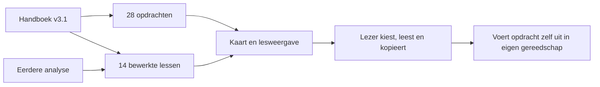
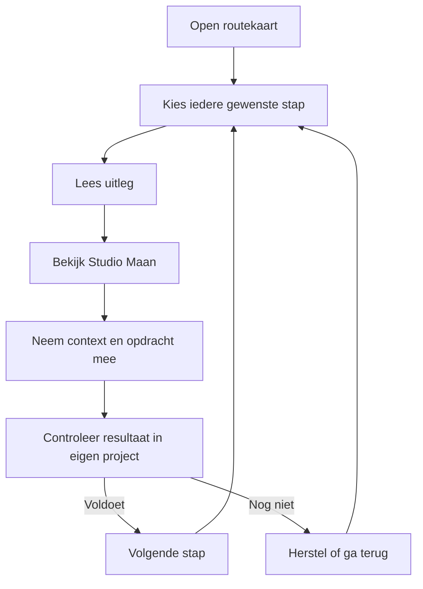

**Lift — plan voor een interactieve leeromgeving**

12 september 2026 · SPOS CORE + BUILD als hoofdroute, RESEARCH en PRODUCT als inhoudelijke hulpmiddelen · Complexiteit L.

**Productbesluit.** Lift leert iemand zonder programmeerachtergrond hoe een idee een werkende website wordt. De primaire handeling is een stap kiezen en begrijpen wat daar te doen is. Een interactieve routekaart vormt het hart. De gebruiker hoeft geen account te maken of stappen te ontgrendelen. De site voert zelf geen AI-opdrachten, publicaties of marktcontacten uit: zij maakt de leerling in staat die bewust in de juiste omgeving uit te voeren.

**Bronnen en waarnemingen.** Het handboek versie 3.1 is in de vorige taak volledig gelezen. De analyse bevat acht verbeterpunten. Beide worden hergebruikt. Advey.ai is op 12 september bekeken via officiële website-inhoud en een screenshot: lichte ijsblauwe ondergrond, zeer donkere blauwe tekst en knoppen, ruime typografie, afgeronde actieknoppen, licht raster en zachte objectschaduwen. De inhoudelijke en commerciële claims van Advey worden niet overgenomen. Voorbeeldprojecten en gegenereerde kunst worden als illustratie gebruikt; geen fictieve klantresultaten.

**Ontwerpthese.** Gewichtloosheid betekent hier ruimte om te leren, overzicht en een idee dat vorm krijgt. Lichtblauw en wit vormen de ruimte; marineblauw zorgt voor leesbaarheid; een klein perzikkleurig accent markeert het idee en de eerste actie. Zwevende papieren en glazen objecten zijn originele illustraties. Bewegende elementen zijn decoratief en stoppen bij reduced motion. Geen achtergrondvideo, zware 3D-engine of druk sterrenveld. Het schema zelf blijft een begrijpelijke gebruikersinterface.

**Aannames die getoetst moeten worden.** [AFGELEID] Een visuele route met vrije toegang verlaagt oriëntatieproblemen ten opzichte van een lang lineair document. [AFGELEID] Eén herkenbaar voorbeeld vermindert de benodigde vertaalslag tussen stappen. Beide zijn ontwerphypothesen; bruikbaarheid met echte beginners wordt niet als gemeten gepresenteerd. Als gebruikers de kaart niet begrijpen, is een equivalente lijstweergave beschikbaar. Als de ruimtemetafoor onduidelijk is, blijven gewone Nederlandse stapnamen leidend.

**Wat de eerste volledige versie bevat**

| Onderdeel | Gedrag en resultaat |
|---|---|
| Routekaart | Vijf fasen en alle veertien stappen; elke stap direct aanklikbaar. Functionele verbindingslijnen geven de volgorde weer. |
| Stappenlijst | Dezelfde broninhoud in een eenvoudig lineair overzicht; alternatief voor de kaart op kleine schermen of persoonlijke voorkeur. |
| Stapdetail | Altijd dezelfde oriëntatie: fase, stapnummer, doel, benodigde input, taak, zichtbaar resultaat en vervolgstap. |
| Vier lesonderdelen | Uitleg, Voorbeeld, Opdracht en Controle als toegankelijke tabs; vorige/volgende stap en vaste stapnavigatie. |
| Doorlopend voorbeeld | Studio Maan, een fictieve keramiekstudio die workshopaanvragen wil ontvangen. Alle veertien stappen gebruiken dezelfde casus. |
| Visuele uitleg | Routekaart, mini-flows per stap, voorbeeldscherm en twee originele gewichtloze illustraties. |
| Opdrachten | Alle 28 genummerde opdrachten uit het handboek beschikbaar, met omgeving, voorwaarden en benodigde context. |
| Gereedschappen | Officiële links, rol, gebruiksmoment en onderscheid tussen noodzakelijk en afhankelijk van het project. |
| SPOS-uitleg | Vijf concrete controlevragen, verschil tussen kader en uitvoering en startcontrole zonder een niet-beschikbare installatie te verzinnen. |
| Naslagwerk | Origineel handboek downloadbaar; verdieping blijft beschikbaar zonder beginners met historische audits te belasten. |
| Basisdocumentatie | Bronmapping, architectuur, gebruiksmodel, startinstructie, risico's, validatie en herstelroute. |

**Bewust buiten de eerste versie.** Geen accounts, cloudopslag van leerlingwerk, betalingsfunctie, automatische AI-uitvoering, analytics of mails. De opdracht is leren en navigeren. Geen fictieve voortgangsscore die suggereert dat iemands project technisch geverifieerd is. Eventuele controles in de les beschrijven wat de leerling in zijn eigen project moet aantonen.

**Informatiearchitectuur en routes**

| Route | Inhoud |
|---|---|
| #route | Visuele routekaart; lijst als gelijkwaardig alternatief. |
| #stap/1 t/m #stap/14 | Veertien lessen; vorige/volgende navigatie; alle stappen blijven vrij toegankelijk. |
| #voorbeeld | Overzicht van Studio Maan en samenhang van het project; doorverwijzingen naar relevante lessen. |
| #tools | Gereedschappen met concrete functie en officiële links. |
| #spos | Praktische uitleg en het controleren van de beschikbare SPOS-instructies. |
| #opdrachten | Alle 28 opdrachten, gekoppeld aan lessen en documentatie. |
| downloads/handboek.md | Ongewijzigde bron als naslagwerk. |

Hashroutes zijn voor deze statische leersite voldoende. Ze bieden directe leslinks, browser-terug en verversen zonder serverrouter. Een onbekende route krijgt een begrijpelijke melding met een link naar het overzicht. Een onbekend of buiten bereik liggend stapnummer wordt niet stilzwijgend als geldige les behandeld.

**Didactisch contract per les**

Iedere les bevat: herkenbaar probleem, concrete doelzin, benodigde bestanden, drie of vier handelingen, een mini-flow, een volledig ingevuld casusvoorbeeld, gerelateerde opdrachten, zichtbare controlecriteria, een veelgemaakte fout met hersteladvies en een volgende stap. Begrippen worden bij eerste gebruik uitgelegd of gekoppeld aan de gereedschappen/SPOS-uitleg. Een prompt is een opdracht aan AI, een flow is de route van de gebruiker en lokaal betekent op de eigen computer.

**De inhoudelijke route**

| Stap | Fase | Kernresultaat | Procesbron | Opdrachten |
|---|---|---|---|---|
| 1 Idee concreet | Begrijpen | Projectbrief met doelgroep, probleem en eerste resultaat | P01–P03 | 01 |
| 2 Onderzoek | Begrijpen | Probleembeeld met bronnen en onzekerheden | P04–P05 | 02 |
| 3 Aanbod en toets | Begrijpen | Propositie, uitgevoerde kleine toets en besluit | P06–P08 | 03–04 |
| 4 Gebruikersroute | Ontwerpen | Stappen, uitzonderingen en uitkomst | P09–P10 | 05 |
| 5 Pagina's en inhoud | Ontwerpen | Scherminventaris en complete teksten | P11–P12 | 06, 25 |
| 6 Visueel ontwerp | Ontwerpen | Beoordeelde visuele richting | P13–P14 | 07–08 |
| 7 Bouw voorbereiden | Bouwen | Geordend dossier, bouwplan, architectuur en startpad | P15–P17 | 09–10, 26 |
| 8 Complete route | Bouwen | Eén taak van invoer tot werkelijke uitkomst | P19 | 11 |
| 9 Lokaal gebruiken | Bouwen | Zelfstandig starten, stoppen en hervatten op Windows | P16, P18 | 12–13 |
| 10 Zelf testen | Verbeteren | Waarneming, registratie en gerichte hertest | P20–P21 | 14–15 |
| 11 Release controleren | Verbeteren | Geteste kernroutes en zichtbaar open werk | P22 | 16–18, 28 |
| 12 Live zetten | Lanceren | Controleerbare liveversie met herstelafspraak | P23–P25 | 19–20 |
| 13 Eerste gebruikers | Lanceren | Marktcontactplan en concrete leersignalen | P26–P27 | 21–22 |
| 14 Verder groeien | Lanceren | Hervatbaar dossier en volgende verbetering | P28 | 23–24, 27 |

**Verwerking van de eerdere analyse.** Stap 3 maakt onderscheid tussen een toets bedenken, uitvoeren en op basis daarvan kiezen. Stap 7 vereist een werkende ontwikkelomgeving vóór de technische controle van stap 8; stap 9 legt de zelfstandige Windows-starter uit. De SPOS-pagina geeft een laadinstructie die afhankelijkheid van de werkelijk beschikbare bron eerlijk benoemt. Elke opdracht krijgt een contextkaart. Er komt één concrete casus en een klein dossier voor die casus. De oorspronkelijke geschiedenis en auditcijfers worden niet als bewijs voor het leerproduct gepresenteerd. De bron blijft ongewijzigd downloadbaar.

**Visuele compositie**

De hoofdpagina krijgt een compacte introductie met originele zwevende kunst, gevolgd door de routekaart als belangrijkste inhoud. De kaart bestaat op desktop uit vijf fasen met verbonden stapkaarten. Schaduwen zijn zacht, lijnen subtiel en stapnummers zichtbaar. Op mobiel worden fasen onder elkaar geplaatst. Een eenvoudige lijst is steeds beschikbaar.

Lespagina's gebruiken een rustige inhoudskolom met een vaste overzichtsnavigatie ernaast. Het actieve onderdeel krijgt een duidelijke donkere selectie. De tekst krijgt voldoende regelafstand en beperkte regellengte. Een voorbeeld wordt vormgegeven als echt lesmateriaal: ingevulde brief, stappenstroom, schermmodel of testbevinding, met het label fictief voorbeeld. Donkere promptpanelen onderscheiden kopieerbare opdrachten van gewone uitleg. Grote afgeronde knoppen combineren een duidelijke tekst met een klein richtingsicoon.

Typografie: een geometrische leesbare sans-serif met plaatselijk een zachtere display-accentstijl indien die goed bij de referentie past. Hoofdtekst minimaal 16 px, gewone labels minimaal 14 px. Interactieve elementen hebben toetsenbordfocus en een comfortabele aanraakmaat. Kleur is nooit de enige aanwijzing voor selectie of status.

**Architectuur en build gate**

Observatie: de werkmap bevatte het handboek en de bestaande analyse, geen applicatie. Daarom wordt een afgebakende nieuwe site in site/ gemaakt. Een statische HTML/CSS/JavaScript-applicatie volstaat. Er zijn geen servergegevens, geheimen, integraties of AI-calls nodig. Dit vermijdt een backend die geen gebruikersprobleem oplost.

| Bestand/onderdeel | Verantwoordelijkheid |
|---|---|
| dist/index.html | Semantische schil, navigatie, inhoudsdoel, metadata en foutfallback |
| dist/styles.css | Ontwerptokens, responsieve lay-out, focus en reduced motion |
| dist/content.js | Eén canonieke bron voor lessen, fasen, casus en begrippen |
| dist/prompts.js | Uit het handboek geëxtraheerde 28 opdrachten; aanvullende omgeving/context staat in app.js |
| dist/app.js | Hashrouting, kaart/lijst, lesonderdelen en kopieerfeedback |
| dist/assets/ | Originele illustraties en favicon; systeemlettertypen vragen geen externe fontdienst |
| dist/downloads/ | Ongewijzigd handboek |
| scripts/ | Reproduceerbare extractie en structurele controle |
| docs/ | Inhoudsindex, productwerking, architectuur en QA |
| .openai/hosting.json | Sites-projectidentiteit en statische publicatiemap |

**Gegevenscontracten.** Les: id 1–14, fase 0–4, titel, doel, input, taken, output, flowlabels, voorbeeld, criteria, valkuil, prompt-ID's, bronverwijzingen. Opdracht: id 1–28, titel en oorspronkelijke tekst, gekoppeld aan aanvullende omgeving en benodigde input. Er is geen vrije gebruikersinvoer in HTML. Tekst wordt via gecontroleerde rendering en escaping geplaatst. Onbekende routes krijgen een begrijpelijke foutweergave; ontbrekende opdrachtkoppelingen blokkeren de bronvalidatie vóór publicatie.

**Zes SPOS-foutcategorieën**

| Categorie | Risico | Maatregel en controle |
|---|---|---|
| Invoer | Ongeldig stapnummer, onbekende hash, tekst als markup | Strikte router, veilige tekstverwerking, vriendelijke foutweergave; grensgevallen controleren. |
| Gelijktijdigheid | Snel navigeren of herhaald kopiëren | Synchrone centrale routebron; kopieerfeedback per handeling; geen dubbele writes. |
| Externe afhankelijkheden | Tool niet beschikbaar; clipboard geweigerd | Officiële links met duidelijke verantwoordelijkheid; systeemlettertypen en lokale beeldassets; selecteerbare opdracht als kopiëren niet lukt. |
| Integriteit | Ontbrekende les, opdracht of afbeelding; bronverschil | Validator op unieke ID's, alle koppelingen, 14/28 dekking, assetpaden; bronhash vastleggen. |
| Middelen | Te zware afbeeldingen of animaties | Twee passende afbeeldingen, vaste afmetingen, lazy loading waar relevant, uitsluitend lichte CSS-transforms, reduced motion. |
| Publicatie | Incomplete map of foutieve versie online | Valideer exacte statische map, commit bron, publiceer privaat via Sites, controleer terminale deployuitkomst; eerdere versie beschikbaar voor herstel. |

**Acceptatie en verificatie.** Alle veertien lessen en 28 opdrachten moeten bestaan. Iedere stap moet bereikbaar zijn via kaart, overzicht en vorige/volgende waar toepasselijk. Iedere les moet alle vier onderdelen hebben. Bronextractie wordt op volledigheid gecontroleerd. JavaScript krijgt een syntaxiscontrole; routegrenzen en contentkoppelingen worden programmatisch gecontroleerd. Lokale HTTP-requests controleren entrypoint en assets. Browserinteractie en visuele QA worden alleen uitgevoerd als de gebruiker daar expliciet om vraagt volgens de Sites-werkwijze; zonder die uitvoering worden ze niet als getest gemeld. De referentiesite is uitsluitend voor stijlanalyse bekeken.

**Kosten en observability.** Geen per-gebruiker AI-calls, backend of database. De site bevat geen eigen tracking. Uitgaven voor externe tools in een leerlingproject worden niet geschat als feit of automatisch aangegaan. Clientfouten krijgen een bruikbare melding; build- en verificatie-uitkomsten worden lokaal bewaard. Sites verzorgt hosting en zijn eigen toegangslaag; de eerste publicatie blijft privé voor de eigenaar.

**Uitvoeringsvolgorde.** Eerst het plan en de herkenbare routekaart, ondertussen de twee kunstassets. Daarna de eerste lokale preview. Vervolgens alle lessen, casus, opdrachten, tools, SPOS-uitleg en mobiele aanpassingen. Dan assetintegratie, documentatie en gerichte validatie. Tot slot private publicatie van de complete versie. Er worden geen extra goedkeuringsrondes ingevoerd voor de al opgedragen bouw.
