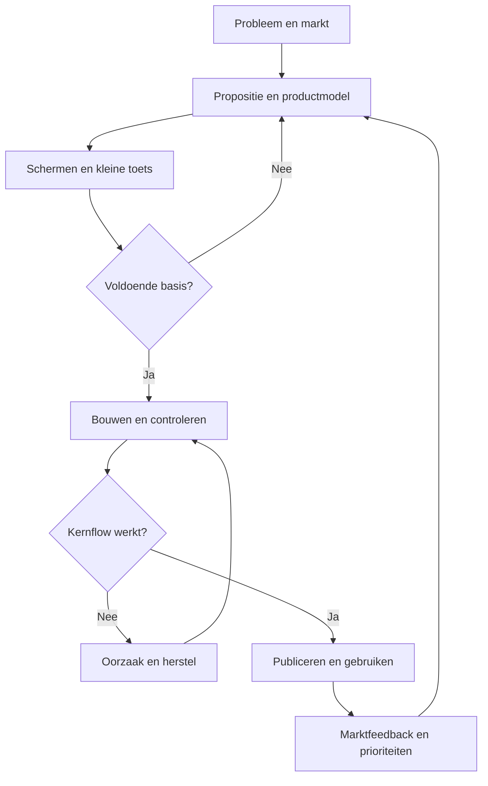
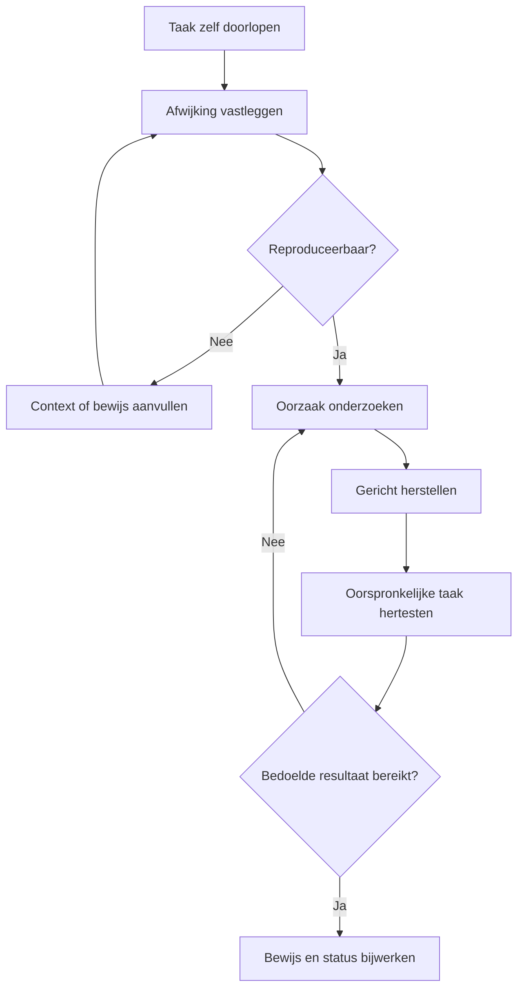
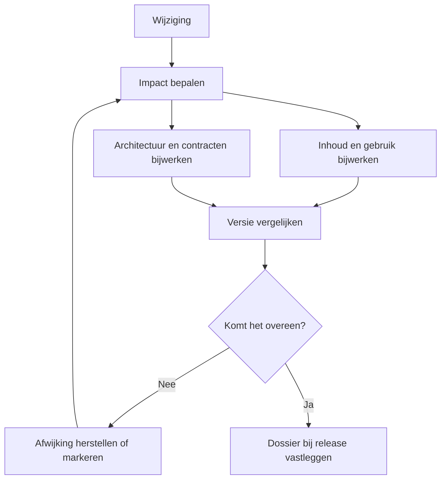
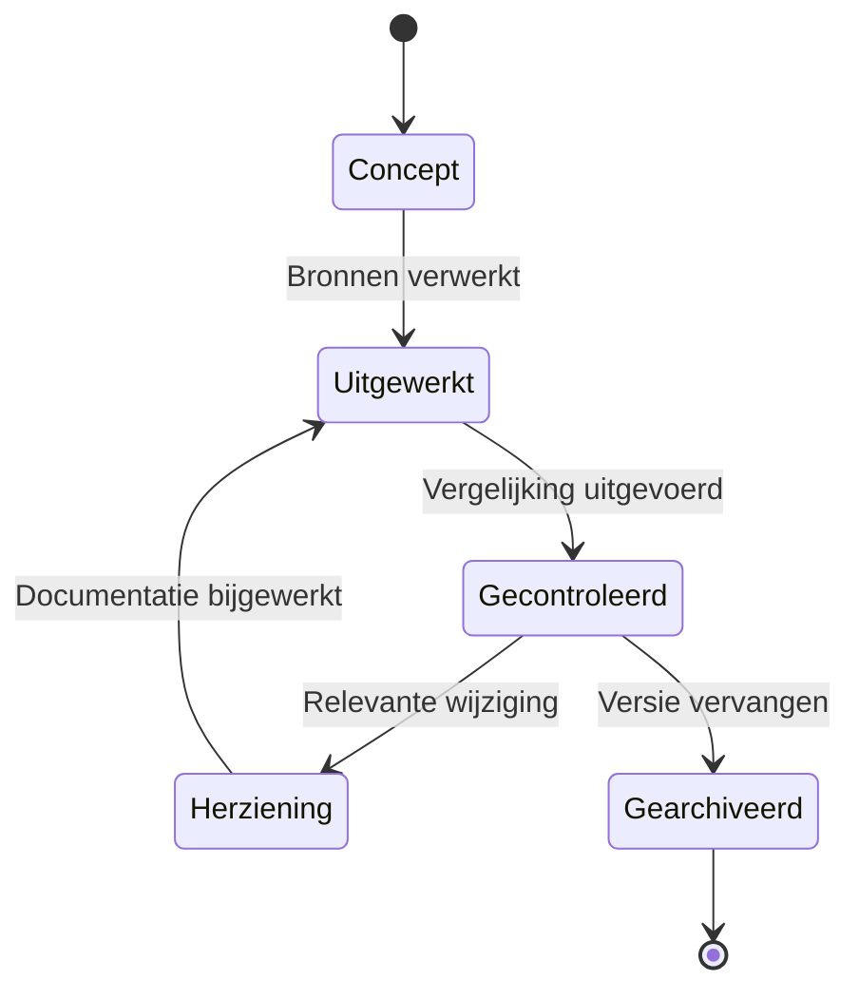

# VIBE Lift — Digitale gewichtloosheid

**Van idee naar een werkende website of app**  
Lezerseditie 1.1 · Gebaseerd op de werkwijze van Mark van Asten · 12 september 2026

Deze editie is redactioneel aangepast voor VIBE Lift. De uitleg en opdrachten zijn zelfstandig bruikbaar met je eigen AI-omgeving. De historische verantwoording beschrijft de oorspronkelijke bron; zij is geen nieuwe toets van een werkend product.

Een idee wordt bruikbaar wanneer je het kunt uitleggen, laten zien en uitproberen. In mijn werkwijze verbind ik die drie dingen. Ik onderzoek voor wie ik iets maak, werk het aanbod uit, laat processen en schermen ontwerpen en geef AI gerichte opdrachten om het te bouwen. Vervolgens open ik het resultaat zelf in de browser, doorloop ik de stappen en laat ik verbeteren wat nog niet klopt.

Dit document legt uit hoe je die werkwijze kunt volgen. Je hoeft vooraf geen programmeur te zijn. Je moet wel keuzes maken, resultaten beoordelen en blijven vragen of wat er staat overeenkomt met wat je bedoelde. AI helpt bij het uitwerken en uitvoeren; jij bepaalt het doel en beoordeelt de uitkomst.

## Zo lees je dit document

**Deel A is de handleiding voor de eindgebruiker.** Je doorloopt veertien begrijpelijke stappen, met directe links, kopieerbare opdrachten en een duidelijk resultaat per stap. Dit deel is de basis voor de toekomstige uitlegsite.

**Deel B is het volledige naslagwerk.** Daar staan de 28 gedetailleerde processtappen, gedragsanalyse, architectuurafspraken, kwaliteitscontroles, invulmodellen en bronnen. Die verdieping blijft beschikbaar zonder dat een beginnende lezer haar eerst hoeft te doorgronden.

De opdrachten in Deel A zijn opnieuw geformuleerd op basis van mijn beschreven werkwijze en aangevuld om ze uitvoerbaar te maken. Het zijn **kopieerbare werkinstructies, geen letterlijke citaten uit oude gesprekken**. Vul tekst tussen vierkante haken in voordat je een opdracht gebruikt. Een stap beschrijft hoe je het werk aanpakt; zij bewijst niet dat elke controle in alle eerdere trajecten is uitgevoerd.

### Kies je ingang

| Waar sta je? | Begin hier |
|---|---|
| Ik heb een idee, maar nog geen duidelijk aanbod. | [Stap 1: maak je idee concreet](#stap-1-maak-je-idee-concreet). |
| Ik weet wat ik wil maken en wil het ontwerpen. | [Stap 4: teken de route van de gebruiker](#stap-4-teken-de-route-van-de-gebruiker). |
| Ik heb een ontwerp en wil gaan bouwen. | [Stap 7: draag alles over aan Antigravity](#stap-7-draag-alles-over-aan-antigravity). |
| Ik wil de website op mijn eigen computer zien werken. | [Stap 9: start lokaal met een BAT-bestand](#stap-9-start-lokaal-met-een-bat-bestand). |
| Er staat al iets, maar het werkt of voelt nog niet goed. | [Stap 10: gebruik het zelf en leg vast wat er gebeurt](#stap-10-gebruik-het-zelf-en-leg-vast-wat-er-gebeurt). |
| Ik wil alle documentatie en architectuur vastleggen. | [Documenteer de hele site](#documenteer-de-hele-site-van-tekst-tot-architectuur). |
| Ik wil weten hoe we hier een uitlegsite van maken. | [Bouwbrief voor de uitlegsite](#bouwbrief-voor-de-uitlegsite). |

## Deel A — De werkwijze stap voor stap

### Hoe je overzicht houdt

Deze werkwijze helpt je opdrachten te structureren en resultaten te controleren. Houd het doel vast, onderscheid bronnen van aannames, benut bestaande onderdelen en controleer of iets werkelijk werkt.

Voor de lezer komt dat bij iedere stap neer op vijf vragen:

1. **Wat willen we bereiken?** Een concreet resultaat voor een herkenbare gebruiker.
2. **Wat weten we al?** Beschikbare documenten, onderzoek, ontwerpen en werkende onderdelen.
3. **Wat moet er gebeuren?** Een afgebakende opdracht met de juiste context.
4. **Hoe zien we dat het klopt?** Een controle die past bij het resultaat.
5. **Wat nemen we mee?** De bestanden, besluiten en open punten voor de volgende stap.

Bij onderzoek gaat de controle over bewijs. Bij ontwerp over begrijpelijkheid en volledigheid. Bij bouw over werking. Bij marktintroductie over echte reacties en gebruik. Iedere controle is dus verbonden aan een handeling en een zichtbaar resultaat. De technische en historische versieverantwoording staat in Deel B, hoofdstuk 10.4.

### De route in één oogopslag

| Fase | Stappen | Wat je na deze fase hebt |
|---|---|---|
| Begrijpen | 1–3 | Een onderbouwd probleem, een gekozen doelgroep en een helder aanbod. |
| Ontwerpen | 4–6 | Een gebruikersroute, schermen en een samenhangend ontwerp. |
| Bouwen | 7–9 | Een eerste werkende versie die je lokaal kunt openen. |
| Verbeteren | 10–11 | Geteste gebruikersroutes en gecontroleerde verbeteringen. |
| Naar de markt | 12–14 | Een gepubliceerde versie, een aanpak voor eerste gebruikers en een hervatbaar werkdossier. |

Je mag teruggaan. Als een scherm het aanbod niet duidelijk maakt, pas je de inhoud aan. Als een test laat zien dat een proces onlogisch is, verander je de route. De volgorde helpt je vooruit, maar nieuwe informatie mag eerdere keuzes verbeteren.

### De gereedschappen die je onderweg gebruikt

| Gereedschap | Waarvoor open je het? | Directe link |
|---|---|---|
| Google Stitch | De schermen en visuele richting uitwerken. | [Open Stitch](https://stitch.withgoogle.com/). |
| Google Antigravity | Werken aan de projectbestanden en de implementatie laten uitvoeren. | [Antigravity](https://antigravity.google/) · [Download](https://antigravity.google/download) · [Aan de slag](https://antigravity.google/docs/getting-started). |
| Node.js | De lokale JavaScript-omgeving installeren als je project die nodig heeft. | [Download Node.js](https://nodejs.org/en/download). |
| Git en GitHub | Wijzigingen bewaren en de code op afstand vastleggen. | [Git voor Windows](https://git-scm.com/install/windows) · [GitHub-uitleg](https://docs.github.com/en/get-started/using-github/hello-world). |
| Docker Desktop | Lokale diensten draaien wanneer de gekozen projectopzet containers gebruikt. | [Docker voor Windows](https://docs.docker.com/desktop/setup/install/windows-install/). |
| Playwright | Browserhandelingen vastleggen en gebruikersroutes testen. | [Handelingen opnemen](https://playwright.dev/docs/codegen) · [Testverloop bekijken](https://playwright.dev/docs/trace-viewer). |
| Railway | De applicatie publiceren volgens de gekozen hostingopzet. | [Railway-documentatie](https://docs.railway.com/). |

**Hostingkeuze:** in deze werkwijze gebruiken we Railway. Je kunt ook een andere hostingprovider gebruiken; pas dan de deploymentconfiguratie en beheerinstructies aan de gekozen provider aan.

Deze officiële ingangen zijn op 12 september 2026 geraadpleegd. Het zijn gereedschappen uit de beschreven keten; je hoeft ze niet allemaal te gebruiken. Laat de bouwomgeving eerst vaststellen wat jouw project nodig heeft. De actuele Antigravity-documentatie onderscheidt meerdere producten, waaronder een IDE. Kies de omgeving die bij je lokale werk past; de historische schermindeling kan afwijken van de huidige. [Officiële introductie en installatie-uitleg](https://codelabs.developers.google.com/getting-started-google-antigravity).

Een AI-gesprek gebruik je bij de eerste stappen om onderzoek, documenten en opdrachten uit te werken. Bewaar de definitieve uitkomsten als bestanden. Zo gaat de context mee wanneer je van gesprek naar ontwerp en vervolgens naar de bouwomgeving gaat.

## Stap 1: Maak je idee concreet

**Je doel:** kunnen uitleggen voor wie je iets maakt, welk probleem je oplost en wat iemand ermee moet kunnen doen.

Ik begin vaak met een brede, gesproken gedachte. Daar kunnen doelgroep, functies, vormgeving en commerciële ideeën door elkaar lopen. De eerste handeling is die gedachte ordenen. Dat voorkomt dat een vroeg genoemd detail de hele oplossing gaat bepalen.

**Wat je doet**

1. Schrijf of spreek je idee uit in gewone taal.
2. Voeg bestaande aantekeningen of documenten toe.
3. Laat het onderscheid maken tussen probleem, oplossing, aannames en vragen.
4. Lees de samenvatting terug en corrigeer wat niet jouw bedoeling is.
5. Bewaar de uitkomst als projectbrief.

**Opdracht 01 — Van losse gedachte naar projectbrief**

```text
Werk vanuit het doel, gebruik de meegegeven bronnen en controleer de uitkomst. Zet mijn idee en de bijgevoegde informatie om in een heldere
projectbrief. Beschrijf doelgroep, probleem, huidige werkwijze, gewenste
uitkomst, eerste scope en succescriteria. Scheid wat ik expliciet heb gezegd
van jouw aannames. Benoem tegenstrijdigheden en ontbrekende informatie.
Werk uit wat al duidelijk is en stel alleen vragen die een wezenlijke keuze
blokkeren. Lever een leesbaar Markdown-bestand op dat ik kan gebruiken bij
onderzoek, ontwerp en bouw.

Mijn idee: [beschrijving]
Beschikbare bronnen: [bestanden]
```

**Wat je overhoudt:** `projectbrief.md`. Je kunt het idee in enkele zinnen uitleggen, en iemand anders begrijpt wat het beoogde resultaat is. **Verdieping:** P01–P03 in Deel B.

## Stap 2: Onderzoek de markt en de huidige oplossingen

**Je doel:** begrijpen of het probleem herkenbaar is, wie het ervaart en hoe mensen het nu oplossen.

Ik laat een markt niet alleen beschrijven op basis van verkooppagina’s. Waar relevant zoek ik ook naar echte schermen, handleidingen, werkinstructies en release notes. Die laten beter zien hoe een oplossing in het dagelijks gebruik werkt. Een zelfgemaakte reconstructie moet als reconstructie herkenbaar blijven.

**Wat je doet**

1. Kies een eerste doelgroep om te onderzoeken.
2. Verzamel oplossingen, alternatieven en de huidige handmatige werkwijze.
3. Vergelijk wat ze aantoonbaar doen en wat onduidelijk blijft.
4. Zoek ook informatie die jouw idee minder aantrekkelijk maakt.
5. Vertaal bevindingen naar keuzes voor je eigen aanbod.

**Opdracht 02 — Onderzoek met bewijs**

```text
Onderzoek het probleem en de markt voor [doelgroep/probleem].
Gebruik actuele primaire bronnen waar mogelijk. Bekijk ook openbare
handleidingen, werkinstructies, release notes en echte schermbeelden.
Vergelijk doelgroep, proces, functies, beperkingen en aantoonbare verschillen.
Maak zichtbaar wat bevestigd is, wat afgeleid is en wat onbekend blijft.
Verzin geen schermen, klantenaantallen, prijzen of productmogelijkheden.
Geef bij iedere belangrijke conclusie de bron en datum. Zoek tegenbewijs
voor mijn uitgangspunt. Eindig met de consequenties voor mijn propositie.
```

**Controle:** openen de bronlinks, zijn de bedoelde afbeeldingen echt opgenomen en volgt de conclusie uit het gevonden materiaal? **Wat je overhoudt:** `onderzoek.md` met een bronnenregister. **Verdieping:** P04–P05.

## Stap 3: Maak van het idee een propositie

**Je doel:** een aanbod formuleren waarvan de juiste persoon begrijpt waarom het relevant is.

Een propositie beschrijft de samenhang tussen doelgroep, probleem, oplossing en resultaat. Ik verbind die al vroeg aan de toekomstige site: welke belofte doen we, welke uitleg is nodig en welke volgende stap vragen we van een bezoeker?

**Opdracht 03 — Werk het aanbod uit**

```text
Gebruik de projectbrief en het onderzoek om een volledige propositie te maken.
Beschrijf voor wie het aanbod bedoeld is, welk probleem het oplost, de
gewenste uitkomst, de werking, het onderscheid en de grenzen. Maak een
korte kernboodschap en een uitgebreidere uitleg. Geef aan welk bewijs de
belofte ondersteunt en welk bewijs nog ontbreekt. Werk een eerste aanbod,
logische vervolgstap en mogelijke latere uitbreiding uit. Verzin geen
resultaten, klanten, prijzen of garanties. Lever propositie.md op.
```

**Opdracht 04 — Toets de belangrijkste aanname**

```text
Bepaal welke onbewezen aanname deze propositie het meest kwetsbaar maakt.
Ontwerp een kleine praktijktoets: met wie spreken we, wat laten we zien,
welke vraag of handeling testen we en welke uitkomst verandert onze keuze?
Maak een gespreksleidraad en een eenvoudig resultatenoverzicht. Scheid
interesse in het idee van werkelijk gebruik of bereidheid om te betalen.
```

**Controle:** een lezer begrijpt het probleem, het aanbod en de vervolgstap zonder uitleg van de maker. De praktijktoets kan ook tot aanpassen of stoppen leiden. **Wat je overhoudt:** een propositie en een toetsbare keuze voor het eerste aanbod. **Verdieping:** P06–P08.

## Stap 4: Teken de route van de gebruiker

**Je doel:** weten welke stappen iemand doorloopt voordat je losse schermen gaat tekenen.

Denk aan een bezoeker die informatie leest, een demonstratie opent, zich aanmeldt en vervolgens zijn eerste taak uitvoert. Beschrijf ook wat er gebeurt als invoer ontbreekt, iemand teruggaat of een handeling mislukt. Bij een eenvoudige informatieve site is deze route korter dan bij een applicatie met accounts en gegevens.

**Opdracht 05 — Maak processen en schema’s**

```text
Vertaal de propositie naar gebruikersrollen en complete gebruikersroutes.
Beschrijf per route het startpunt, doel, stappen, beslissingen, gegevens,
rechten en eindresultaat. Neem teruggaan, annuleren, ontbrekende gegevens,
fouten en herstel mee. Geef ieder proces een herkenbaar ID en teken waar
nuttig een compact schema. Scheid de volledige productvisie van wat in de
eerste versie komt. Lever flows.md op en benoem open beslissingen.
```

**Controle:** iedere stap heeft een duidelijke vervolgstap of afronding. Voor elke rol is duidelijk wat deze wel en niet mag doen. **Wat je overhoudt:** gebruikersroutes en eenvoudige processchema’s. **Verdieping:** P09–P10.

## Stap 5: Bepaal alle pagina’s en schermen

**Je doel:** een overzicht hebben van alles wat ontworpen moet worden, inclusief kleinere vensters en bijzondere situaties.

Ik vraag nadrukkelijk om de volledige inventaris: pagina’s, schermen, menu’s, formulieren, pop-ups en panelen die opzij openen. Vervolgens bepalen we wat de eerste versie nodig heeft. Daardoor verdwijnen latere onderdelen niet uit beeld en blijft de eerste bouwopdracht behapbaar.

**Opdracht 06 — Maak de scherminventaris**

```text
Maak op basis van de propositie en flows een volledige scherminventaris.
Neem pagina's, navigatie, formulieren, modals, drawers en overlays mee.
Beschrijf per scherm: ID, doel, gebruikersrol, inhoud, acties, invoer,
validatie, vervolgstappen en gedrag op mobiel. Werk relevante toestanden
uit: laden, leeg, gevuld, fout, succes en onvoldoende rechten.
Koppel schermen aan processen en maak zichtbaar wat nu wordt gebouwd,
wat later komt en waar nog een beslissing nodig is. Lever schermen.md
plus een dekkingsmatrix op. Laat geen proces zonder scherm of afhandeling.
```

**Controle:** je kunt elke gebruikersroute aanwijzen in de inventaris. **Wat je overhoudt:** `schermen.md`, een paginastructuur en een dekkingsmatrix. Leg daarnaast alle letterlijke paginainhoud, gedeelde teksten en taalvarianten vast volgens opdracht 25 en hoofdstuk 11.3. **Verdieping:** P11–P12.

## Stap 6: Maak het ontwerp zichtbaar in Stitch

**Je doel:** zien hoe de inhoud en de gebruikersroutes samenkomen in een samenhangend ontwerp.

Open [Google Stitch](https://stitch.withgoogle.com/). Geef de propositie, scherminventaris en visuele uitgangspunten mee. Laat eerst een herkenbare richting uitwerken en beoordeel die. Daarna volgt de rest van de schermen. Zo kun je kleuren, typografie, witruimte en de werking van knoppen bewust beoordelen.

**Opdracht 07 — Laat de Stitch-opdracht maken**

```text
Maak een complete kopieerbare opdracht voor Stitch op basis van de
bijgevoegde propositie, flows en scherminventaris. Beschrijf doelgroep,
uitstraling, inhoudshiërarchie, navigatie, componenten, kleuren, typografie,
witruimte en mobiel gedrag. Gebruik de bestaande merkafspraken als die
er zijn. Markeer ontbrekende keuzes. Neem per scherm de belangrijkste
inhoud, acties en toestanden mee. Verzin geen functies, integraties,
prijzen, testimonials of complianceclaims. Lever de Stitch-prompt als
bestand op en behoud de koppeling met de scherm-ID's.
```

**Opdracht 08 — Stuur het ontwerp bij in Stitch**

```text
Werk deze schermen verder uit binnen dezelfde visuele richting: [scherm-ID's].
Maak de belangrijkste handeling per scherm direct herkenbaar. Verbeter
leesbaarheid, hiërarchie, afstanden en de samenhang van knoppen en velden.
Houd componenten consistent en werk de mobiele variant uit. Behoud de
inhoud en functies uit de specificatie. Mijn concrete feedback: [feedback].
```

**Controle:** kun je zonder uitleg zien waar je begint en wat je moet doen? Kloppen de schermen onderling? Bewaar beschikbare ontwerpen, exports en afbeeldingen met een herkenbare versie. Beschikbare exportopties moeten in de gebruikte Stitch-omgeving worden gecontroleerd. **Wat je overhoudt:** een beoordeeld ontwerp en visuele afspraken. **Verdieping:** P13–P14.

## Stap 7: Draag alles over aan Antigravity

**Je doel:** zorgen dat de bouwomgeving de inhoud, het ontwerp en de bestaande techniek samen begrijpt.

Open [Antigravity](https://antigravity.google/) en de juiste projectmap. Voeg de definitieve documenten en ontwerpbestanden toe. Laat eerst controleren wat er al bestaat. Mijn overdracht draait om samenhang: de marketingsite, een eventuele demo en een bestaande inlogomgeving moeten aansluiten op dezelfde propositie en gebruikersroute.

**Opdracht 09 — Lees eerst het project en maak het bouwplan**

```text
Werk vanuit het doel, gebruik de meegegeven bronnen en controleer de uitkomst. Lees de projectbrief, propositie, flows, schermspecificaties,
ontwerpbestanden en bestaande code in deze projectmap. Maak een overzicht
van wat aanwezig is, ontbreekt of elkaar tegenspreekt. Onderzoek eerst wat
je kunt uitbreiden, hergebruiken of aanpassen. Onderbouw nieuwe onderdelen.
Maak daarna een bouwplan met kleine controleerbare stappen, afhankelijkheden
en acceptatiecriteria. Verbind iedere stap aan de relevante scherm- en
proces-ID's. Behoud bestaande werking. Schrijf besluiten en open punten weg
in het projectdossier. Voer de afgesproken eerste bouwstap uit zodra de
benodigde keuzes duidelijk zijn. Werk vóór implementatie het toepasselijke
architectuurdossier uit volgens opdracht 26 en hoofdstuk 11.
```

**Opdracht 10 — Verbind site, demo en portaal**

```text
Controleer hoe de openbare site, demo en bestaande inlogomgeving op elkaar
aansluiten. Gebruik de aanwezige routes, talen, vormgeving en authenticatie.
Maak de overgang voor een bezoeker logisch en herkenbaar. Controleer CTA's,
terugkeerlinks, taalkeuze en de relevante informatiepagina's. Voeg alleen
bestaande of expliciet gespecificeerde functies toe. Test de hele route van
openbare pagina tot de eerste bruikbare handeling na inloggen.
```

**Controle:** de agent benoemt de echte bestanden en onderdelen die hij heeft gelezen. Een bestandsnaam noemen is op zichzelf nog geen bewijs van begrip; beoordeel de gevonden verschillen en keuzes. **Wat je overhoudt:** `bouwplan.md` en een samenhangend overdrachtsdossier. **Verdieping:** P15–P17.

**Documentatiecontrole vóór de bouw:** werk opdracht 26 uit voor de gekozen kernflow. Leg de beoogde architectuur, interfaces, gegevens, toegangsgrenzen en belangrijke besluiten vast. Koppel de relevante Mermaid-schema’s. Beschrijf bestaande en geplande onderdelen afzonderlijk; zie hoofdstuk 11.4–11.6.

## Stap 8: Laat één complete route bouwen

**Je doel:** vroeg iets hebben dat je van begin tot eind kunt gebruiken.

Een complete route kan klein zijn: een bezoeker vult een formulier in, krijgt begrijpelijke feedback en de informatie komt op de bedoelde plek terecht. Bij een grotere applicatie kan het gaan om inloggen, een item aanmaken, opslaan en terugvinden. Kies een route die de belangrijkste werking zichtbaar maakt.

**Opdracht 11 — Bouw de eerste werkende route**

```text
Implementeer de eerste complete gebruikersroute uit het bouwplan: [route-ID].
Werk de benodigde schermen, validatie, rechten en gegevensverwerking uit.
Gebruik bestaande componenten en de vastgelegde ontwerpafspraken. Neem
laden, lege resultaten, fouten en herstel mee waar ze relevant zijn.
Maak testdata herkenbaar en vermeld iedere nog gesimuleerde koppeling.
Controleer de route van begin tot eind. Rapporteer wat werkt, wat is getest,
welke onderdelen nog ontbreken en hoe ik het resultaat zelf kan openen.
```

**Controle:** de belangrijkste handeling levert het bedoelde resultaat op, ook na verversen als gegevens bewaard moeten blijven. **Wat je overhoudt:** een kleine, samenhangende eerste versie. **Verdieping:** P19.

## Stap 9: Start lokaal met een BAT-bestand

**Je doel:** de website of app op je eigen Windows-computer kunnen starten en in de browser bekijken.

*Lokaal* betekent dat de ontwikkelversie op jouw computer draait. Het browseradres begint vaak met `http://localhost:` gevolgd door een poortnummer. Die poort wijst naar de juiste lokale dienst. De projectopzet bepaalt welk nummer wordt gebruikt.

Een `.bat`-bestand is een Windows-startbestand. Je dubbelklikt erop en het voert de afgesproken startstappen uit. In mijn werkwijze hoort deze praktische handeling nadrukkelijk bij de oplevering: ik wil het resultaat zelf kunnen openen, bekijken en gebruiken.

**Opdracht 12 — Maak de lokale starter**

```text
Werk vanuit het doel, gebruik de meegegeven bronnen en controleer de uitkomst. Maak dit project op mijn Windows-computer met één dubbelklik
lokaal startbaar en zichtbaar in mijn browser. Inspecteer eerst de bestaande
projectstructuur, README, package scripts, lockfiles, omgevingsconfiguratie,
backend, eventuele Docker-opzet en het bestaande poortregister.

Maak of verbeter start_local.bat in de hoofdmap. Hergebruik een bestaande
starter waar mogelijk. Laat die vanuit zijn eigen map werken, ook als het
pad spaties bevat. Gebruik de bij dit project horende tools en versies.
Gebruik zo nodig een duidelijk benoemd PowerShell-hulpscript.

De starter moet:
1. Controleren welke vereisten en configuratie ontbreken en dat begrijpelijk
   melden. Geheimen blijven buiten scripts, logs en Git.
2. Alleen de voor dit project benodigde diensten starten. Als Docker nodig
   is, controleer beschikbaarheid en wacht begrensd op gereedheid.
3. De afgesproken poorten gebruiken. Controleer bij een bezette poort of
   daar dit project draait. Beëindig geen onbekende of andere processen.
4. Backend en frontend in de juiste volgorde starten en met echte controles
   vaststellen wanneer ze klaar zijn. Alleen een vaste wachttijd is niet genoeg.
5. De juiste lokale URL openen zodra de toepassing beschikbaar is. Open bij
   opnieuw starten geen dubbele servers. Maak hergebruik expliciet zichtbaar.
6. Bij problemen de fout en de volgende herstelstap leesbaar tonen. Bewaar
   bruikbare logs en voorkom dat een foutvenster direct verdwijnt.
7. Een duidelijke stop- en herstartinstructie geven. Ruim alleen processen op
   die aantoonbaar bij deze startsessie of dit project horen.

Leg vast in LOKAAL_STARTEN.md: eenmalige installatie, configuratie zonder
geheime waarden, bestandslocatie, dubbelklikroute, browser-URL, testaccount
of testdata indien nodig, stoppen, herstarten en veelvoorkomende problemen.

Controleer op Windows: eerste start, tweede start, stoppen en herstarten,
ontbrekende vereiste, bezette poort en een dienst die niet gereed komt.
Controleer daarnaast één echte gebruikershandeling in de geopende browser.
Geef de werkelijk uitgevoerde controles en uitkomsten. Als je deze Windows-
omgeving niet kunt bedienen, markeer die controles als NIET UITGEVOERD en
lever concrete stappen waarmee ik ze zelf kan controleren.
```

**Zo gebruik je het opgeleverde startbestand**

1. Open de projectmap in Windows Verkenner.
2. Lees bij de eerste start `LOKAAL_STARTEN.md` en volg de projectspecifieke installatie-instructies.
3. Dubbelklik op `start_local.bat`.
4. Lees de status in het geopende venster. Wacht op de melding dat de toepassing gereed is.
5. Bekijk de geopende browser en controleer het getoonde adres.
6. Voer één echte handeling uit: bijvoorbeeld navigeren, invullen en opslaan.
7. Stop het project volgens de meegeleverde instructie wanneer je klaar bent.

**Als het niet werkt**

| Wat je ziet | Wat je teruggeeft aan de bouwomgeving |
|---|---|
| Het venster verdwijnt direct. | Vraag de fout zichtbaar te houden en de starter vanuit een open opdrachtvenster te onderzoeken. |
| De browser zegt dat de site onbereikbaar is. | Geef de URL en de laatste startmeldingen; laat proces, poort en gereedheidscontrole vergelijken. |
| Er opent een ander project. | Laat de poorttoewijzing en de identiteit van het proces onderzoeken. |
| De pagina verschijnt, maar gegevens laden niet. | Laat frontend, backend, instellingen en de mislukte netwerkverzoeken gezamenlijk controleren. |
| Het werkt eenmalig, maar een tweede start geeft fouten. | Laat de tweede start en de opruiming van eigen processen reproduceren. |

**Opdracht 13 — Laat mij het nu zien**

```text
Start de huidige versie via het opgeleverde lokale startbestand. Controleer
welk project op welke URL draait. Open de browser als je die toegang hebt
en doorloop [gebruikersroute]. Geef mij het exacte lokale adres, wat ik moet
zien, welke handeling ik kan proberen en hoe ik stop. Claim alleen dat het
werkt als de start en de handeling daadwerkelijk zijn gecontroleerd.
```

**Wat je overhoudt:** een starter die bij jouw project past en een korte gebruikersinstructie. De opdracht hierboven laat die bestanden maken; dit handboek zelf bevat geen op jouw pc uitgevoerde starter. **Verdieping:** P16, P18 en hoofdstuk 5.2–5.3. De Windows-commandosyntaxis kan worden nagezocht bij [Microsoft Learn](https://learn.microsoft.com/en-us/windows-server/administration/windows-commands/call).

## Stap 10: Gebruik het zelf en leg vast wat er gebeurt

**Je doel:** fouten vinden tijdens echt gebruik en de bouwomgeving genoeg informatie geven om ze te onderzoeken.

Ik wil zelf door het scherm gaan en beoordelen of knoppen, invoer en overgangen logisch werken. In mijn beschreven aanpak laat ik browserhandelingen registreren en voer ik die terug naar de ontwikkelomgeving. Het beoogde voordeel is dat ik minder uit mijn hoofd hoef te reconstrueren wat ik deed.

Playwright biedt hulpmiddelen om handelingen op te nemen en testverloop te bekijken. Een opname wordt pas een herstelproces wanneer de projectinrichting registratie, analyse, wijziging en hertest met elkaar verbindt. [Test generator](https://playwright.dev/docs/codegen) · [Trace viewer](https://playwright.dev/docs/trace-viewer).

**Opdracht 14 — Richt mijn testsessie in**

```text
Richt voor dit project een lokale browsersessie in waarin ik zelf een
gebruikersroute kan doorlopen. Leg met passende hulpmiddelen de handelingen,
relevante fouten en timing vast. Gebruik waar passend Playwright, console-
en netwerkregistratie. Controleer vooraf of de registratie werkt en waar
de bestanden terechtkomen. Gebruik testdata en voorkom dat wachtwoorden,
sessiesleutels of onnodige persoonsgegevens in gedeelde registraties belanden.
Leg uit hoe ik de sessie start en stop en hoe jij de registratie terugvindt.
```

**Opdracht 15 — Onderzoek mijn zojuist doorlopen route**

```text
Ik heb zojuist [route] doorlopen. Dit viel mij op: [korte waarneming].
Bekijk de registratie van deze sessie en vergelijk die met de bedoelde flow.
Benoem reproduceerbare problemen met bewijs, verwacht gedrag en werkelijk
gedrag. Onderzoek de oorzaak in de relevante lagen. Herstel de problemen
binnen de afgesproken scope en herhaal daarna dezelfde route. Vermeld wat
is opgelost, wat opnieuw is getest en wat nog niet kon worden vastgesteld.
```

**Controle:** een fout is pas afgerond als dezelfde route opnieuw is gecontroleerd. **Wat je overhoudt:** een registratie, onderbouwde bevindingen en een hertest. **Verdieping:** P20–P21.

## Stap 11: Controleer werking én gebruiksgemak

**Je doel:** weten of de oplossing klopt en prettig te gebruiken is.

Ik beoordeel visuele kwaliteit apart. Een scherm kan technisch werken en toch druk, onduidelijk of onrustig aanvoelen. Daarom vraag ik aandacht voor volgorde, afstanden, knoppen, leesbaarheid en de samenhang van het geheel. Daarnaast laat ik controleren wat onder het scherm gebeurt: gegevens, rechten en foutafhandeling.

**Opdracht 16 — Maak de interface rustiger en natuurlijker**

```text
Beoordeel systematisch de bestaande interface op hiërarchie, leesbaarheid, witruimte,
knoppen, formulieren, navigatie, feedback en consistentie. Bekijk de echte
schermen op mobiel en desktop. Leg per bevinding uit welk gebruikersprobleem
je ziet. Maak een geprioriteerd verbeterplan en voer de afgesproken
verbeteringen uit. Behoud de functies. Vergelijk voor en na en controleer
dat de belangrijkste gebruikersroutes blijven werken.
```

**Opdracht 17 — Test de hele keten**

```text
Controleer de afgesproken release tegen de proces-, scherm- en
acceptatiecriteria. Test de relevante rollen, normale routes, foutpaden,
rechten en gegevensverwerking. Combineer browsercontroles met controles
van API en opslag waar die bestaan. Gebruik een passende reeks schermmaten.
Koppel iedere bevinding en test aan een eis en versie. Scheid geslaagd,
gefaald, geblokkeerd en niet getest. Een hoog aantal tests is geen bewijs
van volledige dekking. Los releaseblokkers op en hertest de gewijzigde routes.
```

**Opdracht 18 — Maak testen opnieuw uitvoerbaar**

```text
Maak of verbeter run_local_test.bat voor de afgesproken lokale controles.
Gebruik de bestaande testomgeving en voorkom verwarring met de ontwikkel-
of productieomgeving. Controleer vereisten en testdata, geef duidelijke
resultaten en een foutcode bij mislukking. Bewaar rapporten op een vaste plek.
Documenteer welke dekking het script wel en niet heeft en hoe ik het gebruik.
```

**Controle:** essentiële routes zijn aantoonbaar getest; open problemen hebben een duidelijke impact en vervolgstap. **Wat je overhoudt:** een releasebesluit met testbewijs én de documentatie-releasecheck uit opdracht 28. Controleer dat pagina-inhoud, gebruikerswerking, architectuur en schema’s de te publiceren versie beschrijven. **Verdieping:** P22 en hoofdstuk 6.

## Stap 12: Bereid publicatie voor en controleer de liveversie

**Je doel:** de gecontroleerde versie beschikbaar maken en vaststellen dat zij ook buiten je eigen computer werkt.

Voor publicatie controleer ik ook bestanden en media. Grote originele foto’s horen in een bewuste opslagopzet; de site gebruikt geschikte webvarianten. Codewijzigingen moeten terug te vinden zijn. Daarna wordt de versie volgens de gekozen hostingopzet gepubliceerd en opnieuw geopend.

**Opdracht 19 — Maak bestanden en media publicatieklaar**

```text
Controleer welke bestanden gepubliceerd en in Git opgenomen worden.
Maak passende webvarianten van afbeeldingen met behoud van de originelen.
Controleer afmetingen, bestandsgrootte, kwaliteit en werkende verwijzingen.
Houd geheime configuratie, lokale logs, testauthenticatie en onnodige grote
bronbestanden buiten commits. Controleer al gevolgde bestanden afzonderlijk;
alleen .gitignore aanpassen verwijdert bestaande Git-inhoud niet.
Lever een overzicht van wijzigingen en resterende aandachtspunten.
```

**Opdracht 20 — Leg de versie vast en publiceer**

```text
Controleer de wijzigingen, teststatus en doelomgeving voor deze release.
Leg de afgesproken versie vast in Git en controleer de bedoelde remote.
Bereid publicatie voor op de gekozen hostingomgeving: [omgeving]. Gebruik
de actuele projectconfiguratie en officiële documentatie. Controleer build,
startcommando, instellingen, gegevensopslag en herstelmogelijkheid voor zover
relevant. Publiceer binnen de gegeven opdracht en toegangsrechten. Controleer
daarna de echte live-URL, kernroutes, media, formulieren en eventuele login.
Rapporteer welke versie live staat en welke livecontroles werkelijk zijn gedaan.
```

**Controle:** het juiste domein toont de bedoelde versie en de belangrijkste handeling werkt daar. **Wat je overhoudt:** een live-URL en een controleerbare release. **Verdieping:** P23–P25.

## Stap 13: Breng het aanbod naar de eerste gebruikers

**Je doel:** zorgen dat de juiste mensen het aanbod begrijpen, proberen en daadwerkelijk gebruiken.

Een live site is het begin van marktintroductie. Ik verbind de oorspronkelijke doelgroepkeuze aan positionering, vindbaarheid, benadering en activatie. De eerste gebruikservaring moet waarmaken wat de site belooft.

**Opdracht 21 — Maak het introductieplan**

```text
Maak vanuit de propositie een concreet marktintroductieplan. Kies het eerste
segment, de boodschap, de geschikte kanalen, de contactroute en de eerste
activatiestap. Werk content, vindbaarheid, een eventuele demo en onboarding
uit. Maak een haalbare actielijst met eigenaar, volgorde en meetpunt.
Scheid bereik, interesse, aanmelding, actief gebruik en betaald gebruik.
Geef aan welke signalen aanleiding zijn om aanbod of doelgroep bij te stellen.
Bereid eventuele berichten voor; versturen gebeurt binnen expliciete opdracht.
```

**Opdracht 22 — Controleer belofte en eerste ervaring**

```text
Doorloop het traject van eerste kennismaking tot de eerste bruikbare uitkomst.
Vergelijk de belofte op de site met demo, aanmelding, onboarding en product.
Benoem onduidelijke verwachtingen, onnodige stappen en ontbrekende uitleg.
Stel verbeteringen voor en bepaal welke gebeurtenissen we moeten meten om
te zien waar mensen afhaken. Gebruik passende instellingen voor gegevens
verzamelen en verifieer die bij de daadwerkelijke implementatie.
```

**Controle:** je weet wie je wilt bereiken, welke eerste waarde iemand moet ervaren en hoe je daarover leert. **Wat je overhoudt:** een introductieplan en concrete leerpunten. **Verdieping:** P26–P27.

## Stap 14: Bewaar de stand en werk gericht verder

**Je doel:** morgen kunnen doorgaan zonder het hele project opnieuw te hoeven uitleggen.

Ik wil besluiten, bestanden, testresultaten en open werk buiten losse gesprekken bewaren. Dat helpt bij wisselen van sessie of tool en bij het herstellen van een probleem. Het dossier laat zien wat het product moet doen én wat er al werkelijk is uitgevoerd.

**Opdracht 23 — Sluit de werksessie af**

```text
Werk het projectdossier bij. Leg vast wat is gewijzigd, welke versie geldt,
welke controles zijn uitgevoerd, wat nog blokkeert en wat de volgende
concrete stap is. Werk project_state.json en de relevante specificaties bij
als die onderdeel zijn van deze opzet. Scheid gemeten tijd van schattingen.
Controleer of wijzigingen en noodzakelijke bestanden op de afgesproken
manier bewaard zijn. Controleer ook de wijzigingsimpact op alle teksten,
pagina’s, handleidingen, architectuur, contracten en Mermaid-schema’s. Werk
de geraakte onderdelen bij en leg document- en codeversie samen vast.
Laat geheimen buiten openbare statusinformatie.
```

**Opdracht 24 — Hervat een bestaand project**

```text
Lees eerst de projectstatus, recente wijzigingen, open bevindingen en
leidende documenten. Controleer die informatie tegen de aanwezige code
en bestanden. Benoem verschillen. Hervat de eerstvolgende uitvoerbare
stap binnen de afgesproken scope en controleer het resultaat. Schrijf
nieuwe besluiten en de bijgewerkte status weer terug in het dossier.
```

**Controle:** een volgende sessie kan aanwijzen wat klaar is, wat ontbreekt en waar het bewijs staat. **Wat je overhoudt:** een actueel dossier en een concrete volgende stap. Het dossier bevat de volledige site- en architectuurdocumentatie volgens hoofdstuk 11; een statusbestand alleen is onvoldoende. **Verdieping:** P28 en hoofdstuk 7.

## Documenteer de hele site, van tekst tot architectuur

**Dit loopt door alle veertien stappen heen.** Bij een nieuwe site leg je eerst vast wat je wilt maken. Tijdens het bouwen werk je dat bij. Bij oplevering beschrijft het dossier wat daadwerkelijk is gebouwd, welke controles zijn gedaan en wat nog openstaat.

Het dossier moet bruikbaar zijn voor iemand die de site wil gebruiken, inhoud wil aanpassen of de techniek moet onderhouden. Daarom bevat het zowel de letterlijke paginainhoud als de werking achter het scherm.

| Wat je vastlegt | Wat iemand ermee moet kunnen |
|---|---|
| Alle pagina’s, routes en navigatie | Zien welke pagina’s bestaan en hoe je er komt. |
| Alle teksten en talen | De precieze inhoud terugvinden, inclusief knoppen en meldingen. |
| Schermen, formulieren en bijzondere situaties | Begrijpen wat er bij iedere handeling gebeurt. |
| Gebruikershandleidingen per rol | De dagelijkse taken zelfstandig uitvoeren. |
| Mermaid-schema’s | De navigatie, processen, gegevens en systeemonderdelen begrijpen. |
| Architectuur en technische besluiten | Weten hoe de site is opgebouwd en waarom keuzes zijn gemaakt. |
| Beheer, publicatie, testen en herstel | De site verantwoord aanpassen, controleren en onderhouden. |

**Architectuur** betekent hier de samenhang van de oplossing: welke onderdelen er zijn, waarvoor ze verantwoordelijk zijn, hoe gegevens ertussen bewegen en waar bijvoorbeeld toegang en opslag worden geregeld. Een lijst met gebruikte technologieën is daarvoor niet voldoende.

### Wanneer werk je welke documentatie bij?

1. **Bij de propositie:** leg doel, doelgroep, eisen en grenzen vast.
2. **Bij het ontwerp:** schrijf alle pagina’s en teksten uit en verbind ze met schermen, rollen en routes.
3. **Vóór de bouw:** beschrijf de beoogde architectuur, gegevensafspraken en belangrijke keuzes.
4. **Bij iedere wijziging:** pas de geraakte teksten, instructies, schema’s en technische beschrijving aan.
5. **Vóór publicatie:** vergelijk het dossier met de gebouwde versie en registreer afwijkingen.
6. **Na publicatie:** controleer de liveversie en werk beheer- en gebruikersinstructies bij.

Een eenvoudige site mag dit in enkele bestanden bundelen. Bij een grotere applicatie splits je het op. Wat telt is dat alle toepasselijke informatie aanwezig en terug te vinden is.

### Opdracht 25 — Documenteer alle pagina’s en alle teksten

```text
Documenteer de volledige site in de huidige projectmap.
Lees eerst de bestaande documentatie en inventariseer alle routes,
navigatie, pagina's, gedeelde componenten, contentbestanden, vertalingen,
formulieren en berichten. Neem relevante CMS-content mee als die toegankelijk
is; registreer ontoegankelijke inhoud als ontbrekende onderzoeksdekking.

Maak een volledig paginaregister en schrijf per pagina de daadwerkelijke
teksten uit: metadata, koppen, secties, alinea's, links, CTA's, veldlabels,
hulpteksten, validatiefouten, bevestigingen, lege toestanden en overige
meldingen. Neem header, footer, menu's, pop-ups, zijpanelen, alt-teksten en
relevante e-mail- en notificatietemplates mee. Leg alle aanwezige talen vast.
Documenteer dynamische teksten als template met variabelen en bron; kopieer
geen privégegevens van echte gebruikers naar het documentatiedossier.

Koppel iedere tekst en pagina aan een stabiel ID, route en bronlocatie.
Scheid ontworpen, geïmplementeerd en gecontroleerd gedrag. Markeer concepten,
placeholders en ontbrekende inhoud. Gebruik herbruikbare tekstonderdelen
met één leidende bron en controleer de volledige samengestelde paginatekst.
Lever leesbare Markdown-bestanden en een dekkingsmatrix op. Alleen een lijst
paginanamen of een samenvatting van teksten is niet voldoende.
```

### Opdracht 26 — Documenteer de volledige architectuur van je project

```text
Beschrijf de architectuur en controleer de beschrijving tegen de aanwezige onderdelen. Onderzoek bestaande code, configuratie, gegevensschema's, routes,
koppelingen, documentatie en toegankelijke runtime. Breid het bestaande
dossier uit. Beschrijf beoogde en aangetroffen architectuur afzonderlijk.

Werk uit: systeemcontext, onderdelen en verantwoordelijkheden, frontend,
backend, gegevensopslag, bestandsopslag, interfaces, authenticatie, rechten,
trust boundaries, bedrijfsregels, omgevingen, configuratie, deployment,
logging, monitoring, prestaties, kosten, foutafhandeling, herstel en relevante
afhankelijkheden. Documenteer API- en datacontracten, statussen, null-waarden,
time-outs, retrybeleid en bescherming tegen dubbele uitvoering waar relevant.
Leg betekenisvolle besluiten vast met reden, alternatieven en gevolgen.

Maak leesbare Mermaid-schema's voor de relevante systeem-, gegevens- en
uitvoeringsrelaties. Koppel beschrijvingen en schema's aan concrete bronnen
en versie. Controleer scheiding van verantwoordelijkheden, centrale afhandeling
van externe diensten en hergebruik van logica en configuratie. Onderzoek de
volgende foutcategorieën: ongeldige invoer, gelijktijdige handelingen, uitval
van externe diensten, gegevensintegriteit, limieten en publicatiefouten.
Koppel risico's aan maatregelen en verificatie.

Markeer niet-toepasselijke onderwerpen met reden en onbekende onderdelen als
onbekend. Verzin geen componenten, garanties, metingen of geslaagde controles.
Lever ARCHITECTURE.md met gekoppelde detaildocumenten, besluitenregister,
diagramregister en open punten. Benoem wat alleen is gelezen en wat werkelijk
is uitgevoerd. Wijzig productcode alleen binnen een afzonderlijk gegeven
bouw- of herstelopdracht.
```

### Opdracht 27 — Maak gebruikersdocumentatie en Mermaid-schema’s

```text
Maak of actualiseer
/docs/APPLICATION_USER_OPERATING_MODEL.md en de bijbehorende gebruikers-
en beheerdershandleidingen. Beschrijf de volledige toepasselijke werking:
rollen, toegang, onboarding, dagelijkse taken, objecten, acties, formulieren,
gegevens, statussen, berichten, instellingen en uitzonderingen.
Koppel elke gebruikershandeling aan pagina, scherm, component en relevante
API of gegevensopslag. Neem acceptatiecriteria en open productvragen op.

Maak echte Mermaid-code voor navigatie, kernprocessen, toestanden,
gegevensrelaties en technische interacties waar die bestaan. Geef ieder
schema een ID, doel, status en bron. Houd schema's leesbaar en splits grote
schema's op. Controleer syntax en gerenderde leesbaarheid als de omgeving
dat ondersteunt. Markeer niet-uitgevoerde rendering expliciet.
Een generiek voorbeeld mag niet als schema van de gebouwde site worden getoond.
```

### Opdracht 28 — Controleer en synchroniseer documentatie bij oplevering

```text
Beoordeel systematisch het dossier tegen de actuele siteversie. Begin bij de volledige
inventaris van routes, teksten, talen, rollen, flows, onderdelen en koppelingen.
Vergelijk die met documentatie, Mermaid-schema's en testbewijs. Controleer ook
omgekeerd of ieder beschreven onderdeel werkelijk bestaat of herkenbaar als
ontwerp of toekomstig onderdeel is gemarkeerd.

Werk alle geraakte documentatie bij. Registreer afwijkingen met AUD-ID,
bewijs, impact, prioriteit, eigenaar en hertest. Controleer verwijzingen en
leesbaarheid. Leg documentversie, codeversie, omgeving, controledatum en niet
onderzochte onderdelen vast. Geef per toepasselijk dossieronderdeel de status:
VOLLEDIG, DEELS, ONTBREEKT of GEBLOKKEERD; motiveer N.V.T. afzonderlijk.
Maak geen totaalscore die een ontbrekend essentieel onderdeel verbergt.
Lever de bijgewerkte bestanden en een documentatie-releasecheck op.
```

**Klaar betekent:** een volgende gebruiker of bouwer kan het product begrijpen en de beschreven handelingen volgen. Voor de release is vastgelegd welke versie het dossier beschrijft en welke onderdelen nog onvoldoende zijn onderzocht. Zie hoofdstuk 11 in Deel B voor het volledige documentatiecontract.


## Wat je zelf blijft doen

Mijn aandeel zit vooral in richting geven en beoordelen. Ik breng de context in, kies wat relevant is, zie waar een scherm niet natuurlijk aanvoelt en controleer of het opgeleverde bestand echt bevat wat ik heb gevraagd. Wanneer iets ontbreekt, geef ik gerichte feedback en laat ik de uitkomst opnieuw beoordelen.

| Jij doet | AI helpt met | Samen beoordeel je |
|---|---|---|
| Het probleem en de bedoeling uitleggen. | Ordenen, onderzoeken en opties uitwerken. | Of de probleemkeuze onderbouwd is. |
| Het aanbod en de prioriteiten kiezen. | Propositie, processen en specificaties uitschrijven. | Of de eerste versie genoeg waarde biedt. |
| Ontwerpen bekijken en feedback geven. | Varianten en samenhangende schermen uitwerken. | Of een gebruiker de route begrijpt. |
| Zelf door het product gaan. | Bouwen, registreren, analyseren en herstellen. | Of de hele handeling werkt. |
| Besluiten nemen over publicatie en marktbenadering. | Voorbereiden, uitvoeren binnen de opdracht en meten. | Of mensen de beloofde waarde ervaren. |

Een terugkerende les uit mijn opdrachten is dat je het resultaat zelf moet openen. Een beschrijving van toegevoegde afbeeldingen vervangt de afbeeldingen niet. Een melding dat de site werkt vervangt de browsercontrole niet. Een reparatie wordt overtuigend wanneer dezelfde handeling opnieuw slaagt.

## Begrippen in gewone taal

| Begrip | Betekenis in deze handleiding |
|---|---|
| Propositie | Voor wie je iets maakt, welk probleem je oplost en waarom dat aanbod relevant is. |
| Flow of gebruikersroute | De stappen die iemand doorloopt om een doel te bereiken. |
| Prompt | De opdracht en context die je aan AI meegeeft. |
| Prototype | Een vroege uitwerking om vorm en gebruik te beoordelen; werking kan nog beperkt zijn. |
| Frontend | Het deel van de toepassing waarmee de gebruiker in de browser werkt. |
| Backend | Het deel dat bijvoorbeeld gegevens verwerkt, rechten controleert en opslag aanstuurt. |
| API | De afgesproken manier waarop softwareonderdelen gegevens en opdrachten uitwisselen. |
| Lokaal en localhost | De ontwikkelomgeving op je eigen computer en het adres waarmee je haar bereikt. |
| Poort | Een nummer waarmee je de juiste lokale dienst aanspreekt. |
| BAT-bestand | Een Windows-bestand dat een reeks opdrachten uitvoert, bijvoorbeeld om je project te starten. |
| Repository | De verzameling projectbestanden met versiegeschiedenis. |
| Deployen | Een versie beschikbaar maken in een hostingomgeving. |
| Hertest | Dezelfde controle opnieuw uitvoeren nadat er iets is aangepast. |
| Markdown of MD | Een tekstbestand met eenvoudige opmaak voor koppen, tabellen, links en codeblokken. |

## Bouwbrief voor de uitlegsite

### Het doel van de site

De bezoeker moet begrijpen hoe ik van een idee naar een bruikbare website of app werk en vervolgens zelf een volgende stap kunnen zetten. De site legt de samenhang uit en maakt de opdrachten bruikbaar. Zij hoeft geen kennis van programmeren te veronderstellen.

**Voorstel voor de introductietekst**

> Van een eerste idee naar iets dat je kunt gebruiken. Ik laat zien hoe ik onderzoek, propositie, ontwerp en bouwen met AI verbind. Je volgt de stappen, bekijkt welke gereedschappen ik gebruik en vindt opdrachten die je zelf kunt toepassen. Bij iedere stap controleer je wat het resultaat moet zijn.

### Pagina’s en inhoud

| Pagina | Wat de bezoeker hier vindt | Gewenste volgende handeling |
|---|---|---|
| Start | De aanpak in gewone taal en de vijf fasen. | Kies waar je staat of start bij stap 1. |
| De werkwijze | Overzicht van de veertien stappen en hun resultaten. | Open de passende stap. |
| Een pagina per stap | Uitleg, handelingen, gereedschap, opdracht en controle. | Kopieer de opdracht en voer de stap uit. |
| Gereedschappen | Officiële links met uitleg waarom en wanneer je een tool gebruikt. | Open de relevante tool of installatie-uitleg. |
| Lokaal bekijken | Extra duidelijke uitleg over de BAT-starter en probleemoplossing. | Laat de starter maken en open je project. |
| Opdrachten | De 28 opdrachten, gegroepeerd per fase en documentatietaak. | Kopieer een opdracht met de benodigde context. |
| De werkwijze | De vijf controlevragen en praktische voorbeelden. | Pas de controle toe op je huidige resultaat. |
| Documentatie en architectuur | Alle site-inhoud, gebruikerswerking, schema’s, technische samenhang en opdrachten 25–28. | Maak of actualiseer het websitedossier. |
| Naslagwerk | De verdiepende processtappen, modellen en verantwoording. | Zoek een detail of download dit MD-bestand. |

### Vast patroon voor iedere stappagina

1. Een titel met een handeling: bijvoorbeeld “Maak je idee concreet”.
2. Een korte uitleg van het doel en waarom deze stap helpt.
3. “Dit heb je nodig” met de input uit de vorige stappen.
4. Een kort, genummerd stappenplan.
5. “Open het gereedschap” met de officiële link, indien relevant.
6. Een volledig leesbare opdracht met een kopieerknop.
7. “Hieraan zie je dat het klaar is” met een concrete controle.
8. Het bestand of resultaat dat je bewaart.
9. Vorige stap, volgende stap en een link naar verdieping.

De kopieerfunctie moet de volledige opdracht kopiëren, inclusief noodzakelijke contextvelden. Laat de bezoeker weten welke velden hij eerst moet invullen. Controleer navigatie, kopiëren, links en leesbaarheid op mobiel. Een voortgangsfunctie is een mogelijke latere uitbreiding; bepaal eerst of die nodig is en of daarvoor opslag of een account gewenst is.

### Redactionele afspraken

- Gebruik “ik” voor mijn werkwijze en “je” voor wat de bezoeker doet.
- Houd de hoofdtekst toegankelijk; plaats configuratie en architectuur onder verdieping.
- Leg een technisch woord bij eerste gebruik uit.
- Neem projectnamen, herkenbare klantgegevens en onbewezen resultaatclaims niet over.
- Gebruik echte, gecontroleerde voorbeelden zodra die beschikbaar zijn. Label illustraties en fictieve voorbeelden duidelijk.
- Toon links bij de stap waar ze nodig zijn, naast het centrale gereedschappenoverzicht.
- Laat de uitlegsite dezelfde kwaliteitscontrole doorlopen: inhoud, mobiel gebruik, knoppen, links en daadwerkelijke werking.

### Opdracht om deze uitlegsite later te ontwerpen en bouwen

```text
Gebruik dit Markdown-document als inhoudelijke bron voor een Nederlandstalige
uitlegsite over mijn werkwijze van idee tot markt met AI.
Maak Deel A leidend voor de leesroute. Gebruik Deel B als doorzoekbare of
geordende verdieping. Behoud de betekenis, alle 14 stappen, de 28 opdrachten,
de tool-links en de lokale BAT-werkwijze. Maak technische details toegankelijk
zonder ze in de introductie te stapelen. Verzin geen projecten, resultaten,
ervaringen, klantquotes of werking die niet uit de bron blijkt.

Werk eerst informatiearchitectuur, pagina-inhoud, navigatie en schermen uit.
Maak daarna de ontwerpopdracht voor Stitch en het overdrachtsdossier voor
Antigravity. Bouw volgens de beoordeelde richting. Gebruik rustige typografie,
heldere hiërarchie, ruime afstanden en herkenbare vorige/volgende navigatie.
Voorzie opdrachten van werkende kopieerknoppen. Laat mij de site lokaal
openen via een passend start_local.bat-bestand. Controleer de stappenroute,
links, kopieerfunctie, mobiele weergave en de download van het handboek.
Leg uitgevoerde controles, onderbouwing en resterende punten vast. Lever ook het
volledige documentatiedossier volgens hoofdstuk 11 op: alle pagina’s en teksten,
gebruikerswerking, architectuur, Mermaid-bronnen en beheerinstructies. Werk
het dossier bij iedere wijziging bij en controleer het tegen de opgeleverde versie.
```

## Aanvullende technische links

Deze documentatie is bedoeld voor de bouwer die de bestaande opzet moet begrijpen. Het is geen voorschrift om alle genoemde technieken te combineren. Kies en controleer versies in het concrete project.

| Onderwerp | Officiële documentatie |
|---|---|
| TypeScript | [Typen en taalgebruik](https://www.typescriptlang.org/docs/). |
| React | [Werken met componenten](https://react.dev/learn). |
| Next.js | [Frameworkdocumentatie](https://nextjs.org/docs). |
| Vite | [Projectopzet en ontwikkelomgeving](https://vite.dev/guide/). |
| Tailwind CSS | [Installatie en documentatie](https://tailwindcss.com/docs). |
| Lucide | [Iconen gebruiken](https://lucide.dev/guide/). |
| next-intl | [Meertaligheid inrichten](https://next-intl.dev/docs/getting-started). |
| FastAPI | [Backend en API-documentatie](https://fastapi.tiangolo.com/). |
| DuckDB | [Documentatie-ingang](https://duckdb.org/docs/). |

De ingangen hierboven zijn geraadpleegd; daarmee zijn geen compatibiliteit van versies of concrete projectconfiguraties getest. De links naar Antigravity en Stitch vervangen de minder gerichte verwijzingen in de oorspronkelijke bijlage.

---

# Deel B — Volledig procesnaslagwerk en verantwoording

Dit deel bewaart de gedetailleerde methode. De veertien stappen uit Deel A vormen de leesroute; P01–P28 hieronder splitsen die route verder uit voor uitvoering en controle. De procesnummering en broncodes in dit naslagwerk staan op zichzelf.

## Proceshandboek voor onderzoek, propositie, ontwerp, AI ondersteunde bouw en marktintroductie

**Auteursperspectief:** Mark van Asten  
**Versie:** 3.1  
**Datum:** 12 september 2026  
**Doel:** mijn werkwijze nauwkeurig vastleggen, overdraagbaar maken en gebruiken als inhoudelijke basis voor een uitlegsite.  
**Vorm:** één zelfstandig Markdown-document, zonder herkenbare verwijzingen naar uitgevoerde projecten.  
**Status:** reconstructie van gedocumenteerde werkwijze en beschreven handelingen, aangevuld met expliciet gemarkeerde procesverbeteringen. Geen nieuwe technische certificering van de onderliggende systemen.

## Leeswijzer

Dit document beschrijft zowel **hoe ik werk** als **hoe iemand die aanpak stap voor stap kan uitvoeren**. De veertien lezersstappen uit Deel A vatten deze uitvoering samen. De oorspronkelijke tien ontwikkelfasen blijven volledig herkenbaar, maar zijn uitgebreid met het gedrag tussen die fasen: vragen stellen, aanscherpen, bewijs controleren, fouten terugvoeren, opnieuw beoordelen en voortgang vastleggen.

De hoofdlijn is: ik onderzoek een probleem, kies een doelgroep en aanbod, structureer de oplossing, maak haar zichtbaar in schermen en vertaal die keuzes naar gerichte bouwopdrachten. Ik beoordeel het resultaat tijdens het gebruik en laat afwijkingen onderzoeken en herstellen. Publicatie, marktbenadering en leren uit gebruik horen bij dezelfde keten.

De processtappen hieronder zijn instructies voor herhaling. Ze betekenen niet dat iedere controle in ieder eerder traject aantoonbaar is uitgevoerd. Waar de geschiedenis alleen een opdracht of voornemen toont, blijft dat onderscheid staan.

### Herkomstlabels

| Label | Betekenis |
|---|---|
| **GEBRUIKERSUITSPRAAK** | Ik heb de handeling, ervaring of voorkeur zelf beschreven. Dit bewijst de mededeling, niet automatisch de technische uitvoering. |
| **OPDRACHT** | Ik heb expliciet gevraagd om deze stap, deze dekking of dit resultaat. Voltooiing moet afzonderlijk worden vastgesteld. |
| **DOCUMENTATIE** | Een geraadpleegd document beschrijft de inrichting of werkwijze. Onderliggende code of runtime kan nog ongecontroleerd zijn. |
| **AFGELEID** | Een patroon dat uit meerdere uitingen of documenten wordt afgeleid. Geen vaststaande persoonlijkheidseigenschap. |
| **AANVULLING** | Een voorgestelde verbetering die de methode uitvoerbaarder, vollediger of beter controleerbaar maakt. |
| **ONBEKEND** | Het beschikbare materiaal is onvoldoende om de status vast te stellen. |

Broncodes zoals **B01** verwijzen naar het projectneutrale bronregister in hoofdstuk 10. Een eerder AI-antwoord of een eerdere versie van dit handboek telt niet als onafhankelijk bewijs. De aangeleverde audit en de eerder gelezen kopie daarvan vormen één bronfamilie.

### Inhoud van het naslagwerk

1. De kern en ontwikkeling van mijn werkwijze
2. Analyse van mijn gedrag en handelingen
3. Het procesoverzicht en de verantwoordelijkheden
4. De volledige werkwijze in 28 processtappen
5. Technische inrichting en grenzen van de tooling
6. Vaste controlelussen en beslisregels
7. Het overdrachtsdossier en invulmodellen
8. Vertaling naar een uitlegsite
9. Dekkingsmatrix en aanvullingen
10. Bronnen, onzekerheden en kwaliteitscontrole
11. Het volledige documentatiecontract
12. Audit en verwerking van de documentatie-uitbreiding

## 1. De kern en ontwikkeling van mijn werkwijze

### 1.1 Wat de aanpak bijeenhoudt

Ik gebruik AI gedurende de hele ontwikkeling, maar de inhoudelijke richting komt niet vanzelf uit de tools. Mijn aandeel zit in het formuleren van het probleem, het combineren van zakelijke en technische vragen, het beoordelen van de uitkomst en het steeds concreter maken van wat goed moet zijn. Dat blijkt uit opdrachten voor onderzoek, proposities, scherminventarisaties, prompts en controles. **OPDRACHT / GEBRUIKERSUITSPRAAK — B02, B03, B06, B10, B11.**

De onderscheidende samenhang is **AFGELEID**:

- Ik beweeg van breed onderzoek naar een afgebakend aanbod.
- Ik laat het aanbod vertalen naar processen, objecten, rollen en schermen.
- Ik gebruik documenten en prompts als overdracht tussen analyse, ontwerp en bouw.
- Ik beoordeel zowel functionele werking als visuele samenhang.
- Ik vraag opnieuw om onderzoek of reparatie wanneer de feitelijke oplevering niet aansluit.
- Ik probeer herhaalde handelingen te standaardiseren met scripts, statusbestanden en kwaliteitskaders.

Dit is een werkwijze met terugkoppeling. Een nieuwe bevinding kan een eerdere keuze veranderen. De methode moet die verandering verwerken in alle afhankelijke documenten, schermen en code.

### 1.2 Ontwikkeling over de maanden

Dit overzicht laat accenten in het teruggevonden materiaal zien. Het is geen bewijs dat een handeling pas in de genoemde maand voor het eerst voorkwam.

| Periode | Zichtbaar accent | Betekenis voor het proces | Status en bron |
|---|---|---|---|
| Januari 2026 | Propositie, inhoudsstructuur en bouwbriefing worden in samenhang gevraagd. | Het inhoudelijke model gaat vooraf aan een bouwopdracht. | OPDRACHT, teruggevonden context, B03 |
| Februari 2026 | Doelgroepsegmentatie, eerste aanbod, gefaseerde introductie en bewijscontrole krijgen nadruk. | Marktkeuze en onderbouwing worden onderdeel van de productopzet. | OPDRACHT, B04 en B05 |
| Maart 2026 | Ik beschrijf een gemaakt Stitch-ontwerp en vraag hoe dit naar Antigravity kan worden overgedragen; ook juridische randvoorwaarden worden onderzocht. | Het knelpunt verschuift naar de overdracht van zichtbaar ontwerp naar werkende software. | GEBRUIKERSUITSPRAAK / OPDRACHT, B06 en B07 |
| April 2026 | Bewaren van versies, evidence trails en grenzen van de gesloten IDE worden expliciet. | Kwaliteitsinstructies worden onderscheiden van technische afdwinging; reproduceerbaarheid krijgt meer gewicht. | OPDRACHT / GEBRUIKERSUITSPRAAK, B08 en B09 |
| Juli 2026 | Alle rollen, schermen, overlays, acties, data en testlagen moeten in een dekkingsmodel passen. | De documentatie moet een volledige productbeschrijving worden, met aantoonbare dekking. | OPDRACHT, B10 en B11 |
| September 2026 | Ik controleer ontbrekende beelden, bekritiseer visuele drukte, beschrijf registratie tijdens klikken en vraag verbetering van te grote mediabestanden. | De aandacht ligt zichtbaar bij de feitelijke gebruikerservaring, de kwaliteit van artefacten en het beheer van de bouwketen. | OPDRACHT / GEBRUIKERSUITSPRAAK, B12–B15 |

Voor mei, juni en augustus is in deze synthese geen afzonderlijke gedragsontwikkeling vastgesteld. Beschikbare leveranciersberichten of een abonnement zijn geen bewijs van mijn uitvoering.

### 1.3 Vijf hoofdfasen boven de technische cyclus

De eerder vastgelegde formulering **Understand → Shape → Prove → Build → Evolve** is een bruikbare samenvatting. **DOCUMENTATIE — B16.**

| Hoofdfase | Vraag | Concrete uitkomst |
|---|---|---|
| Understand | Wat is het probleem, voor wie en in welke context? | Onderzoeksbeeld, doelgroep en prioritaire onzekerheden. |
| Shape | Wat is de oplossing en hoe moet die werken? | Propositie, scope, proces, data, content en ontwerp. |
| Prove | Welke onzekerheid moet eerst klein worden getoetst? | Prototype, technische proef of gebruikersfeedback met conclusie. |
| Build | Hoe realiseren en controleren we de gekozen werking? | Gebouwde kernflows met uitvoeringsbewijs. |
| Evolve | Wat leren we uit gebruik en marktcontact? | Gerichte verbeteringen en een volgende investeringsbeslissing. |

**AANVULLING:** behandel Prove als een herhaalde activiteit. Een technische proef kan al vóór een volledig schermontwerp nodig zijn. Een markttoets kan vóór de volledige applicatie plaatsvinden. Prove is geen verplicht groot project op zichzelf.

## 2. Analyse van mijn gedrag en handelingen

### 2.1 Ik begin geregeld met een brede, gesproken briefing

Mijn zichtbare berichten bevatten ideeën, voorbeelden, randvoorwaarden en correcties binnen één formulering. Vervolgens vraag ik om daar een bruikbaar document of een goede prompt van te maken. **GEBRUIKERSUITSPRAAK / OPDRACHT — B02, B14, B15.**

**AFGELEID:** ik gebruik de assistent mede als structuurgever: losse gedachten worden geordend tot een uitvoerbare opdracht. De ruwe formulering is nog geen complete specificatie. De bedoeling, de expliciete eisen en de open keuzes moeten eerst uit elkaar worden gehaald.

**Procesgevolg:** begin met een compacte reconstructie van de bedoeling. Bewaar mijn concrete eisen en verwijder alleen herhaling of onduidelijke formulering. Maak geen nieuwe productbeslissing omdat een uitgesproken zin grammaticaal onvolledig is.

### 2.2 Ik werk via opeenvolgende aanscherpingen

Ik vraag eerst om onderzoek of een opzet, daarna om verdieping, vervolgens om volledigheid of een ander opleverformaat. Een concrete reeks is het vragen naar schermen, het constateren dat ze niet in het resultaat zitten, het aanwijzen van aanvullende brontypen en het verzoek alles opnieuw in de bestanden te verwerken. **OPDRACHT — B12.**

**AFGELEID:** een eerste resultaat dient vaak als denk- en toetsmateriaal. Mijn vervolgvragen maken de kwaliteitslat en scope explicieter. Een goede samenwerking verwerkt die correcties cumulatief: de laatste instructie vervangt niet automatisch alle eerdere eisen.

**AANVULLING:** houd een eisenregister bij met status en wijzigingsreden. Zo worden aanscherpingen geen reeks losse prompts die elkaar gedeeltelijk tegenspreken.

### 2.3 Ik controleer het concrete artefact

Ik neem geen genoegen met een tekstuele mededeling dat screenshots zijn toegevoegd wanneer ik ze niet terugzie. Ik vraag ook of afbeeldingen beter in een PDF kunnen worden geplaatst, terwijl een spreadsheet als index behouden blijft. **OPDRACHT / GEBRUIKERSUITSPRAAK — B12.**

**AFGELEID:** voor mij is de vorm van de levering onderdeel van de werking. Een verwijzing naar een afbeelding is iets anders dan een zichtbare afbeelding. Een beschreven test is iets anders dan een uitgevoerd testresultaat.

**Procesgevolg:** open het eindbestand of de werkende flow en controleer de beloofde inhoud daarin. Een succesvolle export of upload bewijst alleen dat het bestand is gemaakt of opgeslagen.

### 2.4 Ik wil brede dekking vóórdat onderdelen verdwijnen

De opdrachten uit juli vragen om alle pagina’s, rollen, flows, modals, drawers, overlays, objecten, acties en acceptatiecriteria, inclusief onderscheid tussen eerste versie en latere uitbreiding. **OPDRACHT — B10.**

**AFGELEID:** ik wil zicht op het geheel om bewuste keuzes te kunnen maken. Dat betekent niet dat alles tegelijk gebouwd moet worden. Een volledige inventarisatie en een beperkte eerste release zijn verenigbaar.

**AANVULLING:** gebruik twee statussen naast elkaar: `onderzocht/ontworpen` en `in deze release/bewust later`. Dan wordt prioriteren geen stilzwijgend vergeten.

### 2.5 Ik kijk naar de ervaring, ook als de functie bestaat

Ik benoem visuele drukte, knoppen, afstanden, usability en een gebrek aan een natuurlijke of samenhangende uitstraling. **OPDRACHT — B13.**

**AFGELEID:** mijn acceptatie heeft een functionele en een visuele laag. Een klikbare knop voldoet nog niet wanneer het scherm onduidelijk is of de interface als losse onderdelen aanvoelt.

**Procesgevolg:** toets taakuitvoering en visuele kwaliteit apart. Vertaal woorden als mooi, rustig en natuurlijk naar observeerbare ontwerpcriteria; laat de agent niet alleen willekeurige kleuren of randen veranderen.

### 2.6 Ik gebruik audits om verder te komen

Ik vraag om audits, heraudits, concrete verbeterplannen en herstel. Ook betwist ik te stellige of flatterende uitspraken en vraag ik om realisme en bewijs. **OPDRACHT — B05, B08, B12, B13.**

**AFGELEID:** controle is voor mij een middel om het product beter te maken. Het moet leiden tot een concrete beslissing, reparatie of duidelijke beperking. Meer audittekst zonder verwerking helpt niet.

**AANVULLING:** sluit iedere bevinding af met eigenaar, prioriteit, actie, verificatie en status. Herhaal de audit gericht op de gewijzigde onderdelen en relevante gevolgen.

### 2.7 Ik probeer feedback tijdens het werken te automatiseren

Ik heb beschreven dat ik tijdens het doorklikken problemen laat vastleggen, waarna ik in de ontwikkelomgeving vraag of dezelfde problemen zijn herkend en kunnen worden opgelost. **GEBRUIKERSUITSPRAAK — B14.**

**AFGELEID:** ik wil minder handmatig registreren en een kortere route van waarneming naar herstel. De beschreven koppeling is hier niet opnieuw functioneel getest.

**Procesgevolg:** de registratie moet een taak, stappen, tijdstip, omgeving en verwacht resultaat bevatten. De agent vergelijkt die verwachting met de registratie; een automatische foutdetector kan mijn bedoeling niet zelfstandig bewijzen.

### 2.8 Ik wil dat een werkwijze opnieuw toepasbaar wordt

De bijlage beschrijft centrale poortregistratie, lokale starters, statusbestanden en synchronisatie. In deze opdracht vraag ik expliciet de methode los van projecten vast te leggen voor uitleg aan anderen. **DOCUMENTATIE / OPDRACHT — B01 en B02.**

**AFGELEID:** ik probeer kennis uit losse bouwervaringen om te zetten in een herhaalbare manier van werken. De volgende stap is niet meer documenten verzamelen, maar bepalen welke actuele informatie bij elke sessie leidend is.

### 2.9 Spanningen die de methode moet opvangen

Dit zijn procesrisico’s, geen diagnoses of bewezen negatieve eigenschappen.

| Zichtbaar patroon | Sterke kant | Mogelijk risico, AFGELEID | Procesantwoord, AANVULLING |
|---|---|---|---|
| Herhaald vragen om volledige dekking | Minder verborgen gaten. | De scope blijft groeien zonder releasemoment. | Volledige inventaris, beperkte release en expliciete parkeerplaats. |
| Nieuwe ideeën toevoegen tijdens beoordeling | Snelle inhoudelijke verbetering. | Ontwerp, documenten en code lopen uiteen. | Wijzigingslog met impactanalyse. |
| Veel verschillende opdrachten en tools | Elke taak kan passend worden uitgevoerd. | Context gaat verloren tussen omgevingen. | Eén actueel overdrachtsdossier en vaste startinstructie. |
| Veel nadruk op audits | Afwijkingen komen aan het licht. | Opnieuw beoordelen vervangt het oplossen. | Bevinding pas sluiten na herstel en gerichte hertest. |
| Sterke visuele kwaliteitswens | Aandacht voor echte bruikbaarheid. | Eindeloos verfijnen zonder gebruikersbewijs. | Visuele criteria combineren met echte taakobservatie. |
| Automatisering van bouw en herstel | Minder herhaalwerk. | Een foutieve automatische wijziging krijgt te veel bereik. | Afgebakende taken, versiebeheer en gecontroleerde hertest. |

### 2.10 Lessen uit beschreven frictie

- **Grote mediabestanden:** ik meldde dat grote foto’s in Git terecht waren gekomen en vroeg om geschikte webvarianten, met behoud van originelen buiten commits. Dit rechtvaardigt een controle vóór de commit. Het bewijst niet wat de repository nu bevat. **B15.**
- **Ontbrekende beelden:** ik constateerde dat de output niet de beloofde echte schermbeelden bevatte. Dit rechtvaardigt visuele verificatie van het eindbestand. **B12.**
- **Verlies van lokale mappen:** een teruggevonden gesprek bevat mijn mededeling dat lokale projectmappen per ongeluk waren verwijderd en dat reconstructie uit chats vastliep. Dit is een gebruikersmededeling, geen hier onderzochte incidentoorzaak. De procesles is dat chats geen complete back-up van een bouwomgeving zijn. **B17.**
- **Te sterke auditclaims:** een document kan zich volledig geverifieerd noemen terwijl de bewijsbestanden in deze sessie ontbreken. Daarom moeten beschrijving en actuele verificatie gescheiden blijven. **B01.**

## 3. Het procesoverzicht en de verantwoordelijkheden

### 3.1 De volledige route

| Groep | Stappen | Hoofdresultaat |
|---|---|---|
| Kaderen en onderzoeken | P01–P05 | Duidelijke opdracht, bestaand materiaal, doelgroep en bewijsbeeld. |
| Propositie en productmodel | P06–P10 | Aanbod, toetsplan, scope, rollen, data en processen. |
| Content en ontwerp | P11–P14 | Paginastructuur, schermen, ontwerpafspraken en prototype. |
| Overdracht en technische bouw | P15–P19 | Uitvoerbare opdrachten, werkplek, architectuur en werkende flows. |
| Controleren en herstellen | P20–P22 | Vastgelegde feedback, herstel en gecontroleerde releasestatus. |
| Publiceren en in de markt brengen | P23–P27 | Beheerde assets, versiebeheer, live product, marktcontact en leren. |
| Continuïteit | P28 | Actuele status, overdracht, herstart en herstelbaarheid. |

De nummering helpt bij documentatie. Git, statusbeheer, risicoafweging en commerciële toetsing lopen ook tijdens eerdere stappen mee.



### 3.2 Wie doet wat

De rollen hieronder zijn verantwoordelijkheden. Ze hoeven niet door verschillende mensen te worden ingevuld en vormen geen claim dat een volledig team aanwezig is.

| Rol | Verantwoordelijkheid |
|---|---|
| Initiatiefnemer en producteigenaar | Probleem, doelgroep, grenzen, prioriteiten, gewenste ervaring en acceptatie bepalen. In mijn eigen werkwijze houd ik hier de regie. |
| Onderzoekende assistent | Bronnen verzamelen, bevindingen structureren, aannames en tegenbewijs zichtbaar houden. |
| Ontwerprol | Flows, schermen, toestanden en visuele afspraken uitwerken. |
| Bouwende agent of ontwikkelaar | Bestaande code onderzoeken, de afgebakende wijziging maken en werking aantonen. |
| Controlerende rol | Resultaat vergelijken met eisen en bewijs; niet alleen de bouwsamenvatting herhalen. |
| Operationeel eigenaar | Release, kosten, ondersteuning, monitoring en herstel beheren. |
| Beoogde gebruiker | Laten zien of het probleem en de oplossing in de praktijk aansluiten. |

**AANVULLING:** als meerdere agents worden ingezet, verdeel werk op duidelijk afgebakende onderdelen, met afgesproken bestanden en overdracht. Parallel werken is een keuze bij onafhankelijk werk, geen automatisch kenmerk van elke fase. Een tweede agent is bovendien geen onafhankelijke feitenbron.

### 3.3 Wat iedere stap moet opleveren

Iedere processtap bevat dezelfde elementen: doel, ingang, concrete handelingen, taakverdeling, output en een doorgangscriterium. De handelingen zijn een genormaliseerde uitvoeringsinstructie. Nieuwe technische details of extra controles zijn als aanvulling aangeduid; de herkomstregel maakt duidelijk welke basis historisch zichtbaar is.

Een stap kan vier uitkomsten hebben: **doorgaan**, **herstellen**, **bewust parkeren** of **stoppen**. Ontbrekende informatie mag niet stilzwijgend veranderen in een positieve uitkomst.

## 4. De volledige werkwijze in 28 processtappen

### P01 — De ruwe gedachte omzetten in een duidelijke opdracht

**Doel:** vastleggen wat ik daadwerkelijk wil bereiken.  
**Herkomst:** OPDRACHT / GEBRUIKERSUITSPRAAK, B02; de vaste structuur is AANVULLING.  
**Ingang:** gesproken of geschreven idee, aanleiding en beschikbare voorbeelden.

1. Schrijf het gewenste resultaat in gewone taal op.
2. Scheid de aanleiding, doelgroep, ideeën voor functies en harde randvoorwaarden.
3. Benoem het soort resultaat: onderzoek, propositie, ontwerp, website, webapp of uitbreiding.
4. Haal concrete uitsluitingen uit de briefing en bewaar die letterlijk in het eisenregister.
5. Noteer tegenstrijdige of ontbrekende beslissingen; stel alleen de vragen die de uitvoering wezenlijk veranderen.
6. Leg het gewenste opleverformaat en gebruik vast. Een document voor een bouwagent heeft andere detailbehoeften dan introductietekst voor bezoekers.

**Mijn rol:** bedoeling en grenzen corrigeren. **Assistent:** structureren en onduidelijkheden teruggeven.  
**Output:** projectbrief met doel, scope, niet-doelen, doelgroep, output en open vragen.  
**Doorgaan als:** iemand de opdracht kan navertellen zonder aanvullende productkeuzes te verzinnen. Anders terug naar de briefing.

### P02 — Bestaand materiaal en actuele stand verzamelen

**Doel:** voortbouwen op wat al bestaat.  
**Herkomst:** DOCUMENTATIE / OPDRACHT, B01, B08, B10.  
**Ingang:** projectbrief, bestaande documenten, ontwerpen, bestanden en eventueel repository.

1. Inventariseer bronnen, proposities, ontwerpbestanden, exports, prompts, code en eerdere besluiten.
2. Bepaal welke versie actueel is en welke bestanden alleen historisch materiaal zijn.
3. Scheid wat bedoeld is, wat beschreven is en wat werkelijk in de code of interface zichtbaar is.
4. Controleer bestaande herbruikbare onderdelen voordat je iets nieuws laat maken.
5. **AANVULLING:** maak een register met bestandsnaam, versie, doel, status en afhankelijkheden.
6. Bewaar origineel bewijs; maak afgeleiden voor extractie, samenvatting of bewerking.

**Mijn rol:** aangeven welke eerdere keuzes nog gelden. **Assistent:** inventariseren en afwijkingen signaleren.  
**Output:** bron- en artefactregister, actuele baseline en lijst conflicten.  
**Doorgaan als:** de leidende documenten bekend zijn. Een oud chatantwoord mag een recenter vastgesteld document niet ongemerkt overrulen.

### P03 — Het probleem en de huidige werkwijze onderzoeken

**Doel:** begrijpen welk gebruikersprobleem de oplossing moet dragen.  
**Herkomst:** OPDRACHT / DOCUMENTATIE, B03, B04, B16.  
**Ingang:** projectbrief en onderzoeksbronnen.

1. Beschrijf wat de gebruiker nu doet, met welke hulpmiddelen en welk gewenst resultaat.
2. Benoem overdrachten, wachttijd, handwerk, fouten, herhaalde invoer en onduidelijke beslissingen.
3. Maak onderscheid tussen gebruiker, beslisser, betaler, beheerder en eventueel externe partij.
4. Vraag welke uitzonderingen veel moeite kosten en wat er misgaat als een stap faalt.
5. **AANVULLING:** toets het probleembeeld aan gesprekken of observaties bij de beoogde doelgroep.
6. Noteer wat feitelijk bekend is en welke veronderstellingen nog een toets nodig hebben.

**Mijn rol:** zakelijke context en relevantie beoordelen. **Assistent:** probleemstructuur en vragen uitwerken.  
**Output:** beschrijving van de huidige situatie, belangrijkste knelpunten en gewenste uitkomst.  
**Doorgaan als:** het probleem concreter is dan een algemene wens om AI te gebruiken of een nieuwe site te hebben.

### P04 — Markt en eerste doelgroep afbakenen

**Doel:** kiezen voor wie ik als eerste bouw en via welke route die groep bereikbaar is.  
**Herkomst:** OPDRACHT, B04.  
**Ingang:** probleembeeld, marktdata, bestaand netwerk en alternatieven.

1. Deel de markt op in bruikbare segmenten, bijvoorbeeld naar omvang, proces, koopmotief of werkwijze.
2. Breng per segment gebruiker, beslisser, betaler en gebruikssituatie in kaart.
3. Onderzoek bestaande oplossingen en redenen om wel of niet te veranderen.
4. Beschrijf hoe het segment te bereiken is: direct contact, content, partners of een ander passend kanaal.
5. Kies het eerste segment op basis van probleemdruk, bereikbaarheid en haalbaarheid; markeer ontbrekend bewijs.
6. **AANVULLING:** maak expliciet welke segmenten later komen en welke aanpassing zij zouden vragen.

**Mijn rol:** de focus kiezen. **Assistent:** segmentatie en vergelijkingsmateriaal leveren.  
**Output:** doelgroepkeuze, onderbouwing en eerste benaderingshypothese.  
**Doorgaan als:** de doelgroep voldoende specifiek is om aanbod, taal en eerste gebruikersflow op af te stemmen.

### P05 — Alternatieven en werkelijke schermen onderzoeken

**Doel:** leren van hoe bestaande oplossingen werken en welke gaten overblijven.  
**Herkomst:** OPDRACHT, B12.  
**Ingang:** spelerslijst, publieke productinformatie en toegankelijke documentatie.

1. Begin bij officiële productpagina’s en beschrijvingen van de workflow.
2. Zoek vervolgens handleidingen, werkinstructies, release notes, demo’s en ondersteunende documenten.
3. Leg per bron datum, productversie, context en toegangsvorm vast waar beschikbaar.
4. Verzamel echte schermafbeeldingen en koppel ze aan een handeling of processtap.
5. Scheid werkelijk waargenomen schermen, handleidingbeelden en eigen reconstructies.
6. Vergelijk op taak, benodigde invoer, feedback, foutafhandeling en uitkomst; kopieer geen interface zonder te begrijpen waarom die bestaat.
7. Controleer het eindbestand visueel. Een link of afbeeldingstitel is geen ingebed schermbeeld.

**Mijn rol:** ontbrekende dekking en relevante vergelijkingspunten aanwijzen. **Assistent:** bronnen en beelden verwerken.  
**Output:** vergelijkingsmatrix en een beeldboek waar relevant, met een index naar bewijs.  
**Doorgaan als:** duidelijk is wat echt is gezien en wat onbekend blijft. Geen extra platformtoegang aanvragen als de opdracht tot publieke bronnen beperkt is.

### P06 — De propositie en het eerste aanbod formuleren

**Doel:** het probleem vertalen naar een begrijpelijke en onderscheidende belofte.  
**Herkomst:** OPDRACHT / DOCUMENTATIE, B03, B04, B16.  
**Ingang:** doelgroepkeuze, probleembeeld en alternatievenonderzoek.

1. Formuleer doelgroep, probleem, gewenste uitkomst en aanpak in één samenhangende uitleg.
2. Benoem waarom deze aanpak aantrekkelijk is ten opzichte van de huidige situatie.
3. Scheid de eerste betaalde of bruikbare waarde van latere uitbreidingen.
4. Werk aanbod, verdienmodel en belangrijke leveringskosten uit; markeer aannames.
5. Koppel iedere claim aan bewijs of benoem haar als te toetsen hypothese.
6. Maak een korte pitch en een uitgebreidere propositie die dezelfde boodschap dragen.

**Mijn rol:** kiezen wat ik wil aanbieden en beloven. **Assistent:** alternatieven formuleren en inconsistenties zichtbaar maken.  
**Output:** propositiedocument met eerste aanbod, onderscheid, bewijs en grenzen.  
**Doorgaan als:** een beoogde gebruiker kan begrijpen wat hij krijgt, waarom dat helpt en wat de volgende stap is.

### P07 — Onzekerheden en een kleine bewijsstap bepalen

**Doel:** voorkomen dat de grootste onzekerheid pas na veel bouw zichtbaar wordt.  
**Herkomst:** DOCUMENTATIE, B16; expliciete uitvoeringsvorm is AANVULLING.  
**Ingang:** propositie en open vragen.

1. Zet de belangrijkste onzekerheden op een rij: behoefte, begrip, betaalbereidheid, data, integratie, AI-kwaliteit of gebruik.
2. Kies welke onzekerheid het plan het sterkst kan laten mislukken.
3. Bepaal een kleine toets: gesprek, klikbaar prototype, technische proef of test met representatieve gegevens.
4. Leg vóór uitvoering vast welk signaal tot doorgaan, aanpassen of stoppen leidt.
5. Voer de toets uit en bewaar de uitkomst, inclusief tegenvallende signalen.
6. Werk propositie, scope of techniek bij op basis van het resultaat.

**Mijn rol:** relevantie en gevolgen beoordelen. **Assistent/bouwer:** toets voorbereiden en resultaten vastleggen.  
**Output:** kort toetsverslag met hypothese, methode, resultaat en besluit.  
**Doorgaan als:** de gekozen onzekerheid voldoende is verkleind voor de volgende investering. Een mooi prototype op zichzelf bewijst geen vraag uit de markt.

### P08 — De volledige scope inventariseren en de release kiezen

**Doel:** niets stilzwijgend vergeten en toch gericht kunnen opleveren.  
**Herkomst:** OPDRACHT, B10.  
**Ingang:** propositie, productideeën en toetsresultaten.

1. Inventariseer modules, rollen, pagina’s, modals, drawers, overlays, acties en gegevens.
2. Koppel elk onderdeel aan een gebruikerstaak of verplicht productgedrag.
3. Beschrijf wat in de eerste versie hoort, wat later komt en wat buiten scope valt.
4. **AANVULLING:** geef eisen een stabiele code en leg afhankelijkheden vast.
5. Maak een dekkingsmatrix die onderzoek, ontwerp, bouw en test afzonderlijk laat zien.
6. Verwerk nieuwe wensen als expliciete scopewijziging met gevolg voor planning en acceptatie.

**Mijn rol:** prioriteit en eerste release vaststellen. **Assistent:** compleet overzicht en impact leveren.  
**Output:** scope- en releasematrix, inclusief bewust uitgestelde onderdelen.  
**Doorgaan als:** de eerste versie een betekenisvolle taak volledig kan ondersteunen; een grote inventaris mag niet worden verward met een belofte om alles direct te bouwen.

### P09 — Rollen, objecten en gegevens modelleren

**Doel:** bepalen wie wat doet en welke informatie daarbij nodig is.  
**Herkomst:** OPDRACHT / DOCUMENTATIE, B01, B10, B11.  
**Ingang:** scope, huidige proces en productdoel.

1. Benoem de gebruikersrollen en de grenzen van hun toegang.
2. Definieer kernobjecten en belangrijke velden in gewone taal.
3. Leg relaties vast: wie is eigenaar, wat hoort bij elkaar en wat is verplicht?
4. Beschrijf welke gegevens worden aangemaakt, gelezen, gewijzigd, gearchiveerd of verwijderd.
5. Noteer per gegevensgroep gevoeligheid, herkomst en gebruiksdoel.
6. **AANVULLING:** bepaal bewaartermijn, herstelbehoefte en gedrag bij conflicterende wijzigingen waar relevant.

**Mijn rol:** businesslogica en rolverdeling beoordelen. **Assistent/architect:** object- en rechtenmodel uitwerken.  
**Output:** datamodel, begrippenlijst en rechtenmatrix.  
**Doorgaan als:** een kernactie niet meer afhankelijk is van een onbesliste eigenaar, rol of gegevensbetekenis.

### P10 — Gebruikersflows, statussen en uitzonderingen uitwerken

**Doel:** beschrijven hoe een taak van begin tot resultaat loopt.  
**Herkomst:** OPDRACHT, B10 en B11.  
**Ingang:** rollen, objecten, scope en gewenste uitkomsten.

1. Beschrijf trigger, actor, startvoorwaarden en beginpunt.
2. Werk de stappen uit vanaf toegang en onboarding tot dagelijks gebruik en afronding waar van toepassing.
3. Noteer per stap de gebruikersactie, systeemactie, gegevenswijziging en zichtbare feedback.
4. Maak statussen en toegestane overgangen expliciet.
5. Beschrijf afbreken, teruggaan, opnieuw proberen en het hervatten van onaf werk.
6. Werk fouten uit zoals ontbrekende data, onvoldoende rechten, netwerkuitval en een mislukte koppeling.
7. Koppel iedere stap aan een scherm of andere interactie.

**Mijn rol:** de logica doorlopen en onwerkbare stappen signaleren. **Assistent:** flows en uitzonderingen documenteren.  
**Output:** flowspecificaties met een succespad en relevante foutpaden.  
**Doorgaan als:** duidelijk is wat de gebruiker na de laatste actie ziet en wat het systeem heeft vastgelegd.

### P11 — Content, verhaal en paginastructuur maken

**Doel:** de propositie vertalen naar begrijpelijke informatie en een volgende stap.  
**Herkomst:** DOCUMENTATIE / OPDRACHT, B01, B03, B16.  
**Ingang:** propositie, doelgroep, routes en bewijs.

1. Bepaal de functie van iedere publieke pagina en ieder belangrijk applicatiescherm.
2. Maak een sitemap met hoofdnavigatie, detailpagina’s en ondersteunende informatie.
3. Werk de informatievolgorde uit: herkenning, uitkomst, werking, bewijs en actie.
4. Leg per pagina titel, hoofdtekst, secties, CTA, beelden en ontbrekende inhoud vast.
5. Gebruik waar passend de eerder beschreven verhaallijn Desire → Evidence → Understanding → Conversion; het is een hulpmiddel, geen verplichte indeling.
6. Bepaal welke inhoud vertaald moet worden en hoe varianten consistent blijven.
7. **AANVULLING:** maak voor iedere claim duidelijk wie haar kan onderbouwen en goedkeuren.
8. Schrijf alle daadwerkelijke teksten uit, inclusief labels, meldingen, gedeelde onderdelen en dynamische templates; volg het contract in 11.3.
9. Koppel pagina- en tekst-ID’s aan bronlocatie, taal, scherm en versie. Maak de volledige samengestelde paginatekst controleerbaar.

**Mijn rol:** toon, relevantie en belofte beoordelen. **Assistent:** content structureren en schrijven.  
**Output:** volledig pagina- en tekstregister, sitemap, metadata, gedeelde content, taalvarianten en open tekstvragen volgens 11.3.  
**Doorgaan als:** iedere pagina een duidelijke taak heeft en de inhoud aansluit op de productwerking.

### P12 — Alle schermen en toestanden inventariseren

**Doel:** voorkomen dat het ontwerp alleen de ideale hoofdpagina’s toont.  
**Herkomst:** OPDRACHT, B10.  
**Ingang:** flows, rollen, content en objectmodel.

1. Maak een lijst van pagina’s, modals, drawers, overlays en herbruikbare interacties.
2. Koppel ieder scherm aan rol, route, flow en gegevens.
3. Beschrijf per scherm doel, invoer, acties, uitvoer en doorverwijzing.
4. Voeg lege, laad-, fout-, succes- en beperkte-toegangstoestanden toe waar relevant.
5. Inventariseer formulieren, velden, validatie en meldingen.
6. Benoem de mobiele weergave en gedrag bij lange teksten of veel gegevens.
7. Controleer de schermlijst tegen de scope- en flowmatrix.

**Mijn rol:** ontbrekende gebruiksmomenten signaleren. **Assistent/ontwerper:** dekking en specificaties maken.  
**Output:** schermregister en schermspecificaties.  
**Doorgaan als:** elk onderdeel uit de release is gekoppeld aan een interactie of een expliciet niet-visuele systeemhandeling.

### P13 — Ontwerpsysteem en Stitch-ontwerp uitwerken

**Doel:** een consistente visuele taal en bruikbare schermen krijgen.  
**Herkomst:** GEBRUIKERSUITSPRAAK / DOCUMENTATIE / OPDRACHT, B01, B06, B13.  
**Ingang:** propositie, schermregister, content en eventuele stijlafspraken.

1. Formuleer de gewenste uitstraling in concrete ontwerpkeuzes.
2. Leg kleuren, typografie, spacing, afrondingen, schaduwen en iconografie vast.
3. Definieer componenten en hun toestanden.
4. Gebruik de ontwerpopdracht om schermen in Stitch of de gekozen ontwerpomgeving uit te werken.
5. Beoordeel informatiehiërarchie, drukte, afstanden, knoppen, contrast en herkenbaarheid van acties.
6. Verwerk correcties in gedeelde componenten en tokens, niet uitsluitend in één screenshot.
7. Exporteer beschikbare beelden en assets; noteer welke gedragsdetails niet in de export zitten.

**Mijn rol:** de ervaring en visuele samenhang beoordelen. **Ontwerprol:** vertalen naar consistente specificaties.  
**Output:** ontwerpbeelden, assets en `DESIGN_SYSTEM.md` of een gelijkwaardig onderdeel in het dossier.  
**Doorgaan als:** de schermen samen één product vormen en hun werking uitvoerbaar is beschreven. Toolversies of exportmogelijkheden moeten bij daadwerkelijk gebruik worden gecontroleerd.

### P14 — Het ontwerp langs de taak en werkelijkheid toetsen

**Doel:** beoordelen of het ontwerp de gewenste taak ondersteunt.  
**Herkomst:** OPDRACHT, B13; systematische toetsvorm is AANVULLING.  
**Ingang:** kernschermen, flow en realistische voorbeeldinhoud.

1. Loop de taak vanaf het begin door zonder ontbrekende stappen zelf aan te vullen.
2. Controleer of iedere actie een duidelijk gevolg heeft.
3. Test lange teksten, lege informatie en foutmeldingen.
4. Bekijk mobiel, toetsenbordfocus, leesbaarheid en bereikbaarheid van acties.
5. Leg visuele bevindingen los van functionele bevindingen vast.
6. Laat waar mogelijk een beoogde gebruiker de flow proberen.
7. Pas de flow of propositie aan als het probleem daar zit; herstel niet alleen de vorm.

**Mijn rol:** taak en ervaring beoordelen. **Ontwerper/assistent:** bevindingen verwerken.  
**Output:** bijgewerkt ontwerp met open punten en besluit.  
**Doorgaan als:** de kernflow navolgbaar is en onbesliste productkeuzes herkenbaar zijn vóór de overdracht.

### P15 — Prompts en het overdrachtspakket opstellen

**Doel:** de volgende uitvoerder voldoende context en concrete grenzen geven.  
**Herkomst:** OPDRACHT / DOCUMENTATIE, B06, B10 en B11.  
**Ingang:** actuele propositie, scope, flows, schermspecificaties en ontwerpbestanden.

1. Kies één duidelijk doel voor de opdracht: onderzoeken, ontwerpen, bouwen, controleren of herstellen.
2. Verwijs naar de actuele bronbestanden en benoem welke beslissingen leidend zijn.
3. Beschrijf de gewenste wijziging en welke onderdelen buiten de taak vallen.
4. Laat de agent eerst bestaande functionaliteit en code onderzoeken.
5. Geef de verwachte output: concrete bestanden, schermen, wijziging of rapportage.
6. Formuleer acceptatiecriteria en verlang onderscheid tussen uitgevoerd, niet uitgevoerd en geblokkeerd.
7. Laat onzekerheden en conflicten melden voordat de agent ze met eigen productkeuzes invult.
8. **AANVULLING:** registreer promptversie en gebruikte documentversies bij de taak.

**Mijn rol:** opdracht en prioriteit vaststellen. **Assistent:** uitvoerbare prompt en overdracht schrijven.  
**Output:** taakprompt plus een compact pakket met de benodigde bronnen.  
**Doorgaan als:** de bouwer de taak kan uitvoeren zonder de productlogica uit losse screenshots of oude chats te reconstrueren.

### P16 — De projectomgeving en poorten voorbereiden

**Doel:** weten waar de toepassing draait en conflicten tussen lokale projecten voorkomen.  
**Herkomst:** DOCUMENTATIE, B01. De controles hieronder operationaliseren die beschreven inrichting.  
**Ingang:** projectmap, bestaande configuratie, gekozen lokale diensten en poortregister.

1. Open de juiste projectmap in Antigravity en lees de lokale instructies en projectstatus.
2. Controleer welke processen en poorten voor dit project zijn vastgelegd.
3. Raadpleeg de centrale registratie voordat een nieuwe lokale service wordt gestart.
4. Reserveer of hergebruik de afgesproken ontwikkel-, backend- en testpoorten; controleer daadwerkelijke beschikbaarheid.
5. Werk applicatieconfiguratie, browser-URL, testconfiguratie en eventuele proxyinstellingen consequent bij.
6. **AANVULLING:** controleer ook gegevensopslag, accounts en credentials van de testomgeving. Alleen een andere poort is onvoldoende isolatie.
7. Leg vereiste omgevingsvariabelen vast zonder geheime waarden in de documentatie te zetten.

**Mijn rol:** juiste project en gewenste omgeving kiezen. **Bouwagent:** configuratie controleren en vastleggen.  
**Output:** eenduidige lokale opzet met poorten, diensten en instellingen.  
**Doorgaan als:** duidelijk is welke omgeving wordt geopend en bestaande projecten niet worden verstoord.

### P17 — Architectuur en gegevenscontracten vastleggen

**Doel:** de gewenste werking vertalen naar een passende technische verdeling.  
**Herkomst:** DOCUMENTATIE / OPDRACHT, B01, B09–B11.  
**Ingang:** scope, datamodel, flows, bestaande code en relevante technische onzekerheden.

1. Onderzoek eerst wat de bestaande architectuur al ondersteunt.
2. Beschrijf de verantwoordelijkheid van frontend, backend, database, bestanden en externe diensten.
3. Bepaal per kernactie waar validatie, verwerking, autorisatie en opslag plaatsvinden.
4. Definieer invoer, uitvoer, verplichte velden, null-waarden, fouten en statussen voor koppelingen.
5. Leg herbruikbare typen, constanten en componentgrenzen vast.
6. **AANVULLING:** beschrijf time-outs, retries, dubbele uitvoering en achtergrondtaken waar ze relevant zijn.
7. Noteer welke data en bewerkingen de vertrouwde applicatielaag mogen verlaten.
8. Kies alleen extra infrastructuur wanneer de kernflows die nodig maken.
9. Werk alle toepasselijke architectuuronderwerpen en de zes foutcategorieën uit volgens 11.4; motiveer N.V.T. en benoem ontbrekende bronnen.
10. Leg architectuurbesluiten vast en koppel de componenten, gegevens, omgevingen en kritieke interacties aan onderhouden Mermaid-schema’s.
11. Houd de beoogde architectuur, aangetroffen implementatie en werkelijk uitgevoerde controles afzonderlijk zichtbaar.

**Mijn rol:** productgevolgen en kostenafweging begrijpen en kiezen. **Architect/bouwagent:** technische oplossing en alternatieven uitwerken.  
**Output:** toepasselijk architectuurdossier volgens 11.4, inclusief beoogde en aangetroffen toestand, contracten, besluiten, Mermaid-schema’s, failure modes en bewijsstatus.  
**Doorgaan als:** de eerste kernflow technisch uitvoerbaar is en kritieke aannames zijn getoetst of expliciet begrensd.

### P18 — Lokaal starten en hervatten eenvoudig maken

**Doel:** de omgeving voorspelbaar openen om snel te kunnen beoordelen.  
**Herkomst:** DOCUMENTATIE, B01; robuuste controles zijn AANVULLING.  
**Ingang:** projectconfiguratie, afhankelijkheden, services en poortregistratie.

1. Beschrijf het startcommando en maak waar passend een lokaal startscript.
2. Controleer vereiste tooling, configuratie en afhankelijkheden vóór het starten.
3. Start containers of andere services alleen wanneer het project ze gebruikt.
4. Wacht op een expliciete gereedheidscontrole van de benodigde service.
5. Start de applicatie op de geregistreerde poort.
6. Open de juiste browserpagina wanneer de applicatie beschikbaar is.
7. Geef een concrete foutmelding als starten mislukt; vermijd eindeloos wachten zonder diagnose.
8. Documenteer stoppen, opnieuw starten en het herstellen van een onvolledige start.

**Mijn rol:** de omgeving gebruiken en onverwacht gedrag melden. **Bouwagent:** startpad maken en uitvoeren.  
**Output:** startscript, korte instructie en vastgelegde startcontrole.  
**Doorgaan als:** het startpad daadwerkelijk is uitgevoerd. De aanwezigheid van `start_local.bat` is geen bewijs dat het script foutloos werkt.

### P19 — Een complete kernflow implementeren

**Doel:** de eerste betekenisvolle taak werkend maken.  
**Herkomst:** DOCUMENTATIE / OPDRACHT, B01, B10 en B11. De smalle oplevervolgorde is AANVULLING.  
**Ingang:** bouwprompt, ontwerp, gegevenscontracten en werkende ontwikkelomgeving.

1. Bouw of hergebruik de gedeelde navigatie en componenten die de flow nodig heeft.
2. Sluit invoer aan op werkelijke verwerking en opslag waar dit vereist is.
3. Implementeer toestanden voor laden, fout, succes en ontbrekende gegevens.
4. Voeg toegangscontroles toe op de plek waar gegevens worden gelezen of gewijzigd.
5. Controleer of status en gegevens na herladen of opnieuw openen nog correct zijn.
6. Label demo-inhoud, mocks en niet-aangesloten functies expliciet.
7. Werk meertaligheid en relevante dynamische onderdelen mee af; vertaal geen losse labels terwijl foutmeldingen achterblijven.
8. Leg wijzigingen in samenhangende versies vast en werk de dekkingsmatrix bij.

**Mijn rol:** de gebouwde taak zelf doorlopen. **Bouwagent:** implementeren en technische werking aantonen.  
**Output:** één complete werkende flow met bekende beperkingen.  
**Doorgaan als:** het resultaat voldoet aan de afgesproken taak, niet alleen aan een visuele vergelijking met het ontwerp.

### P20 — Tijdens gebruik waarnemingen vastleggen

**Doel:** de route van een waargenomen probleem naar onderzoek kort maken.  
**Herkomst:** GEBRUIKERSUITSPRAAK, B14; registratievelden en privacygrenzen zijn AANVULLING.  
**Ingang:** een werkende testomgeving en een afgebakende gebruikerstaak.

1. Leg taak, rol, beginconditie, omgeving en versie vast.
2. Start de beschikbare browser- of testregistratie en controleer dat deze werkelijk loopt.
3. Doorloop de taak zelf zoals een gebruiker dat zou doen.
4. Noteer waar verwacht en werkelijk gedrag verschillen, ook wanneer er geen technische foutmelding is.
5. Bewaar relevante consolefouten, mislukte verzoeken, zichtbare toestanden en reproduceerstappen voor zover de tooling dit ondersteunt.
6. Stop de registratie en controleer of de benodigde informatie aanwezig is.
7. Geef de ontwikkelagent de registratie én het verwachte resultaat.
8. Beperk gevoelige gegevens en leg bewaartermijn en toegang tot registraties vast.

**Mijn rol:** waarnemen en de bedoeling aangeven. **Agent:** registratie interpreteren en afwijkingen herleiden.  
**Output:** reproduceerbare bevinding, niet alleen een opmerking dat een knop niet werkt.  
**Doorgaan als:** de onderzoeker het probleem kan reconstrueren of precies kan aangeven welk gegeven ontbreekt.

### P21 — Oorzaak vinden, herstellen en opnieuw controleren

**Doel:** een fout gericht oplossen zonder andere werking te beschadigen.  
**Herkomst:** OPDRACHT / GEBRUIKERSUITSPRAAK, B12–B14; vaste herstelcyclus is AANVULLING.  
**Ingang:** bevinding, bewijs, verwachting en betrokken bestanden.

1. Reproduceer de fout of stel vast waarom dat niet kan.
2. Onderzoek of de oorzaak in specificatie, data, rechten, interface, verwerking of omgeving zit.
3. Maak onderscheid tussen bewezen oorzaak en hypothese.
4. Kies een gerichte wijziging die past bij de bestaande architectuur.
5. Werk de specificatie mee bij als de oorspronkelijke productkeuze is veranderd.
6. Voer exact de oorspronkelijke scenario’s opnieuw uit.
7. Controleer relevante aangrenzende werking, zoals andere rollen of schermen die hetzelfde component gebruiken.
8. Sluit de bevinding alleen met uitvoeringsbewijs; anders blijft zij open, gedeeltelijk opgelost of geblokkeerd.

**Mijn rol:** controleren of de bedoelde ervaring hersteld is. **Bouwagent:** oorzaak onderzoeken, repareren en hertesten.  
**Output:** wijziging, hertest en actuele status.  
**Doorgaan als:** zowel de fout als het bedoelde gebruikersresultaat is gecontroleerd. Het verdwijnen van een melding is geen voldoende sluitingscriterium.

### P22 — De release integraal controleren

**Doel:** vaststellen welke werking aantoonbaar gereed is.  
**Herkomst:** OPDRACHT, B11; omvang per release begrenzen is AANVULLING.  
**Ingang:** gebouwde release, eisenmatrix en testomgeving.

1. Controleer installatie/start, beschikbare lint- en typechecks en de productiebuild waar relevant.
2. Test alle voor de release vastgestelde kernroutes, rollen en flows.
3. Gebruik browserchecks voor interactie en een passende tweede laag voor verwerking, API of gegevensintegriteit.
4. Controleer de keten van frontend via verwerking en opslag terug naar zichtbare feedback.
5. Test kritieke fouten, onvoldoende rechten, lege gegevens en herstelpaden.
6. Beoordeel mobiele weergave, toegankelijkheid, content en visuele samenhang.
7. Controleer externe koppelingen met herkenbare omgeving en testdata.
8. Rapporteer `PASS`, `FAIL`, `PARTIAL`, `BLOCKED` of `NOT_TESTED` met bewijs per controle.
9. Geef een releasebesluit met expliciete open risico’s en eigenaar.

Controleer vóór het releasebesluit ook opdracht 28 en 11.7–11.9: volledige site-inhoud, functionele documentatie, architectuur en diagrammen moeten de gekozen release beschrijven. Leg ontoegankelijke bronnen en afwijkingen vast; essentiële ontbrekende gebruiks- of herstelkennis blokkeert overdracht.

**Mijn rol:** acceptatie en productkwaliteit beoordelen. **Controlerende rol:** controles uitvoeren en bewijs leveren.  
**Output:** releaserapport en resterende backlog.  
**Doorgaan als:** er geen open blokkade voor het beoogde gebruik bestaat. Een hoog gemiddeld resultaat heft een kritieke mislukte controle niet op.

### P23 — Media en andere bestanden geschikt maken voor publicatie

**Doel:** beeldkwaliteit behouden zonder onnodige opslag, downloadlast en repositorygroei.  
**Herkomst:** OPDRACHT / GEBRUIKERSUITSPRAAK, B15. De vaste publicatiecontrole is AANVULLING.  
**Ingang:** originele beelden, webassets en bestandsinventaris.

1. Inventariseer welke bestanden de site daadwerkelijk gebruikt.
2. Bewaar waardevolle originelen apart en duurzaam, buiten de gewone publicatiestroom.
3. Maak webvarianten passend bij de weergavegrootte en functie van het beeld.
4. Controleer scherpte, uitsnede, transparantie en mobiele weergave.
5. Werk verwijzingen en eventueel responsive beeldgedrag bij.
6. Controleer wat Git volgt en wat bij een build wordt meegenomen.
7. Leg vast of grote bestanden alleen uit de huidige versie moeten verdwijnen of ook historische opschoning vragen.
8. Controleer credits, gebruiksrechten en privacy bij publiceerbare media waar relevant.

**Mijn rol:** visuele kwaliteit en behoud van originelen bepalen. **Bouwagent:** varianten en verwijzingen verwerken.  
**Output:** geschikte webassets en expliciete scheiding van bron- en publicatiebestanden.  
**Doorgaan als:** de site de bedoelde varianten gebruikt en de commit- en buildinhoud is gecontroleerd.

### P24 — Versiebeheer en remote opslag controleren

**Doel:** wijzigingen navolgbaar en code herstelbaar houden.  
**Herkomst:** DOCUMENTATIE, B01; continu toepassen en herstelcontrole zijn AANVULLING.  
**Ingang:** wijzigingen, repository en beoogde remote.

1. Inspecteer de gewijzigde bestanden vóór de commit.
2. Sluit dependencies, tijdelijke buildresultaten, geheimen, gevoelige testbestanden en niet-publiceerbare originelen uit.
3. Controleer apart of uitgesloten bestanden al gevolgd worden; een nieuwe `.gitignore` verwijdert ze niet automatisch.
4. Maak een samenhangende commit met een begrijpelijke beschrijving.
5. Controleer de juiste remote en branch voordat wijzigingen worden gepusht.
6. Verifieer de pushstatus en leg vast welke codeversie bij een test of release hoort.
7. Maak geschiedeniswijzigingen, verwijderacties en geheime-sleutelincidenten een afzonderlijk hersteltraject.
8. Leg vast welke data en assets buiten Git een eigen back-up nodig hebben.

**Mijn rol:** de beoogde publicatie of overdracht autoriseren binnen de opdracht. **Bouwagent:** wijzigingen en versiebeheer zorgvuldig uitvoeren.  
**Output:** navolgbare codeversie en bekende remote status.  
**Doorgaan als:** de bedoelde bestanden zijn vastgelegd; lokale commits en een geslaagde remote push blijven afzonderlijke statussen.

### P25 — Publiceren en live werking verifiëren

**Doel:** de bedoelde versie beschikbaar maken en daar de werking controleren.  
**Herkomst:** DOCUMENTATIE, B01; expliciete live acceptatie en terugval zijn AANVULLING.  
**Ingang:** releasebesluit, codeversie, hostingconfiguratie en benodigde instellingen.

1. Controleer hosting, buildopdracht, startopdracht, opslag en runtimevereisten.
2. Controleer productie-instellingen en geheimen buiten de repository.
3. Publiceer de bedoelde versie via de vastgestelde deploymentroute.
4. Controleer deploymentstatus, relevante logs en servicegereedheid.
5. Open de echte live URL en doorloop de belangrijkste taak opnieuw.
6. Controleer formulieren, koppelingen, navigatie, mobiele weergave en relevante taalvarianten.
7. Leg de live versie, open beperkingen en herstelroute vast.
8. Controleer bij gegevenswijzigingen ook hoe code en dataversie samen kunnen worden hersteld.

**Mijn rol:** beoogde release en zichtbare uitkomst beoordelen. **Operationele rol/bouwagent:** deployment en live controles.  
**Output:** live release met verificatie en herstelafspraken.  
**Doorgaan als:** de productietaak werkt, niet alleen de homepage. Een healthcheck op de hoofdroute bewijst geen volledige transactieketen.

### P26 — Vindbaarheid, aanbod en eerste marktcontact organiseren

**Doel:** de juiste mensen naar een begrijpelijk aanbod en eerste waarde leiden.  
**Herkomst:** OPDRACHT / DOCUMENTATIE, B04, B16 en B18. De vaste uitvoering hieronder is deels AANVULLING.  
**Ingang:** eerste segment, propositie, live product en kanaalkeuze.

1. Kies één concrete actie voor de bezoeker: gesprek, aanvraag, proefstart of aankoop.
2. Zorg dat pagina’s en bewijs aansluiten op de vragen en bezwaren van het segment.
3. Controleer relevante SEO-basis: bereikbare inhoud, paginatitels, hoofdstructuur, canonieke URL’s, sitemap, robotsinstellingen en interne links.
4. Leg meetpunten vast voor relevante aanvragen, starts en het eerste succesmoment; test de registratie.
5. Maak het eerste benaderings- en contentplan met eigenaar, boodschap, kanaal en opvolging.
6. Voer toegestane marktcontacten en pilots uit, en leg reactie en bezwaar vast.
7. Verbind de belofte op de website aan onboarding en gebruik; herstel breuken tussen beide.
8. Noteer prijs- en betaalbereidheidshypotheses totdat echte uitkomsten beschikbaar zijn.

**Mijn rol:** aanbod, kanaal en gesprekken sturen. **Assistent:** onderzoek, content en analyse; verzending alleen binnen gegeven toestemming.  
**Output:** eerste markttoets, werkende meetpunten en opvolgacties.  
**Doorgaan als:** er praktijkinformatie over begrip en waarde is; verkeer alleen bewijst geen productvraag.

### P27 — Gebruik, kosten en feedback naar verbeteringen vertalen

**Doel:** bepalen welke volgende investering daadwerkelijk zin heeft.  
**Herkomst:** DOCUMENTATIE, B16; operationele meetcyclus is AANVULLING.  
**Ingang:** gebruiksdata, gesprekken, bugs, supportvragen en kosten.

1. Verzamel signalen over taakafronding, herhaald gebruik en redenen om af te haken.
2. Leg problemen naast de oorspronkelijke propositie en aannames.
3. Onderzoek of een afwijking voortkomt uit doelgroep, boodschap, onboarding, productwerking of techniek.
4. Volg kosten die relevant zijn voor levering: hosting, opslag, koppelingen, AI-verbruik en ondersteuning.
5. Prioriteer een concrete verbetering op waarde, risico, afhankelijkheden en benodigde inspanning.
6. Leg vooraf vast welk effect de wijziging moet hebben.
7. Bouw, controleer en meet opnieuw zonder eerdere lessen te verliezen.
8. Breid doelgroep of aanbod pas uit wanneer de kernwaarde daarvoor voldoende basis biedt.

**Mijn rol:** kiezen wat eerst komt. **Assistent/operationele rol:** signalen structureren en opties onderbouwen.  
**Output:** prioriteiten met meetbaar of observeerbaar doel.  
**Doorgaan als:** duidelijk is waarom de volgende wijziging nodig is; anders eerst de onzekerheid onderzoeken.

### P28 — Status, overdracht en herstelbaarheid borgen

**Doel:** het werk kunnen hervatten zonder afhankelijk te zijn van het geheugen van één sessie.  
**Herkomst:** DOCUMENTATIE, B01; herstelgerichte uitbreiding mede gebaseerd op GEBRUIKERSUITSPRAAK B17.  
**Ingang:** wijzigingen, controles, open besluiten en actuele omgeving.

1. Werk recente wijzigingen, blokkades en eerstvolgende stappen bij.
2. Leg vast welke document-, code- en testversie leidend is.
3. Vermeld wat werkelijk werkt en wat alleen ontworpen, gesimuleerd of beschreven is.
4. Registreer gemeten tijd en kosten apart van schattingen.
5. Synchroniseer de gekozen statusvelden naar een intern overzicht wanneer die inrichting aanwezig is.
6. Scheid interne technische status van publiek deelbare informatie.
7. Controleer dat belangrijke code, data, originelen en instellingen herstelbaar zijn via hun eigen opslagroute.
8. Begin de volgende sessie met deze status en controleer of zij nog overeenkomt met de werkelijke omgeving.

Werk bij iedere relevante wijziging het volledige toepasselijke dossier uit hoofdstuk 11 bij. Vergelijk de documentatie met de gewijzigde code en inhoud en leg beide versies samen vast. De volgende uitvoerder moet naast status ook teksten, werking, architectuur, diagrammen en beheerinstructies kunnen terugvinden.

**Mijn rol:** prioriteit en overdraagbaarheid beoordelen. **Agent:** status en documentatie bijwerken.  
**Output:** hervatbare projectstaat, bekende back-upstatus en concrete vervolgstap.  
**Doorgaan als:** de volgende uitvoerder kan starten zonder oude chats volledig te reconstrueren. Een statusbestand is geen back-up van de bestanden die het beschrijft.

## 5. Technische inrichting en grenzen van de tooling

### 5.1 Toolrollen uit de aangeleverde opzet

Onderstaande producten en bestanden staan in B01 of in de genoemde gebruikerscontext. Dit is een beschrijving van hun rol in de vastgelegde aanpak, geen advies dat de genoemde versies vandaag de juiste keuze zijn en geen nieuwe controle dat alles geïnstalleerd is.

| Onderdeel | Rol in de werkwijze | Verificatie die bij uitvoering nodig is |
|---|---|---|
| Word, Markdown en tekstbestanden | Propositie, bronmateriaal en specificaties vastleggen. | De juiste versie lezen; tabellen en relaties behouden bij extractie. |
| Python-extracties en registraties | Inhoud uit documenten halen en registers samenstellen. | Bron en afgeleide vergelijken; ontbrekende inhoud signaleren. |
| Stitch | Propositie en ontwerpopdracht naar visuele schermen vertalen. | Export en ontbrekend gedrag controleren. |
| Antigravity | Projectcontext lezen, code wijzigen en lokale taken uitvoeren binnen beschikbare mogelijkheden. | Juiste workspace, rechten, instructies en werkelijke uitvoer controleren. |
| MCP-servers en plugins | Toegang tot aanvullende diensten of tools. | Vaststellen welke koppeling werkelijk bestaat, welke rechten gelden en welke actie zij mag uitvoeren. |
| TypeScript | Gedeelde typen en programmeercontracten. | Typechecks plus runtimevalidatie voor externe invoer. |
| React, Next.js en Vite | Interfaces en toepassingsstructuur; B01 noemt ook Next.js 15 en React 19. | Bestaande stack en projectversies inspecteren; geen standaardmigratie afleiden. |
| Tailwind, Lucide en vertaalhulpmiddelen | Ontwerptokens, iconen en meertalige interface. | Consistentie, toegankelijkheid en vertaaldekking controleren. |
| FastAPI, DuckDB en Turborepo | In B01 genoemde backend-, analyse- en codeorganisatieopties. | Alleen toepassen waar de taak en bestaande architectuur dit vragen. |
| Docker Desktop en containers | Benodigde lokale services starten. | Werkelijke gereedheid, volumes en testisolatie controleren. |
| Windows batchscripts en PowerShell | Herhaalbare lokale start en testtaken. | Script uitvoeren, fouten en stopgedrag controleren. |
| Playwright | Browserinteractie, E2E-controles en testbewijs. | Versie, omgeving, scenario’s en resultaten vastleggen. |
| Git en GitHub | Lokale versiegeschiedenis en remote codeopslag. | Commitinhoud, branch, remote en pushstatus controleren. |
| Railway | Applicatie of website beschikbaar maken. | Juiste configuratie, build, runtime en live werking controleren. |
| Analytics en cookiemanager | Meten van websitegebruik met toepasselijke instellingen. | Werkelijk netwerkgedrag en instellingen controleren; de aanwezigheid ervan bewijst geen compliance. |

### 5.2 Centrale poortregistratie

**DOCUMENTATIE — B01:** de bron beschrijft een centraal poortregister met lokale afspraken voor ontwikkel-, backend- en testdiensten. De concrete bestandsnaam is in deze lezerseditie weggelaten.

Het procesdoel is consistentie tussen service, browser, proxy en testconfiguratie. De exacte projecttoewijzingen zijn uit dit handboek verwijderd. De nummerreeksen zijn lokale afspraken, geen door Antigravity of het web opgelegde standaard.

**AANVULLING:** reserveer een poort pas na controle op werkelijk gebruik en registreer eigenaar, dienst, omgeving en status. Wanneer meerdere processen kunnen reserveren, moet die reservering technisch op conflicten worden gecontroleerd. Een JSON-bestand voorkomt op zichzelf geen gelijktijdige dubbele reservering.

### 5.3 Startscripts en servicegereedheid

**DOCUMENTATIE — B01:** namen als `start_local.bat`, `start.bat` en `run_local_test.bat` worden genoemd. De beschreven starter kan Docker activeren, containers starten, wachten, de browser openen en een ontwikkelcommando starten.

**AANVULLING:** maak starten controleerbaar als een keten van voorwaarden. Een vaste timeout bewijst alleen dat tijd is verstreken. Gereedheid moet blijken uit een geschikte controle. Meld welk onderdeel faalt en voorkom dat een script zonder noodzaak vreemde processen beëindigt of bestaande data verwijdert.

### 5.4 Browserauthenticatie en testbestanden

**DOCUMENTATIE — B01:** `global.auth.setup.ts` en `storageState.json` worden genoemd als manier om testauthenticatie te hergebruiken. Ook noemt de bron checks op kleine mobiele schermen tot grote desktops.

**AANVULLING:** behandel opgeslagen browserauthenticatie als gevoelig. Gebruik testaccounts, passende toegang en uitsluiting uit openbare commits. Controleer of verlopen sessies, uitloggen en verkeerde rollen apart worden getest. Hergebruik van een sessie mag defecte loginlogica niet verbergen.

Een specifieke schermbreedte of veel viewports is geen bewijs van volledige responsiviteit. Toets de inhoud en interactie op de gekozen relevante formaten, inclusief toetsenbordbediening en leesbaarheid.

### 5.5 Projectstatus en synchronisatie

**DOCUMENTATIE — B01:** `project_state.json` bevat onder meer `recent_changes`, `current_blockers`, `next_steps` en velden voor bestede en geschatte tijd. Een `sync_portfolio.py` verwerkt de projectstatus naar een centraal overzicht.

**AANVULLING:** gebruik tijdvelden niet als objectief bewijs van besparing zonder meting en vergelijkingsbasis. Een ingeschatte traditionele inspanning is een schatting. Houd intern en publiek deelbare velden apart, zodat geen blokkades, credentials, klantgegevens of vertrouwelijke codepaden automatisch naar een openbare site gaan.

Synchronisatie moet een herkenbare uitkomst hebben. Als zij mislukt, blijft de lokale status bewaard en wordt zichtbaar dat het centrale overzicht achterloopt. Automatisch synchroniseren is niet hetzelfde als toestemming voor openbaar publiceren.

### 5.6 Wat werkinstructies wel en niet doen

**OPDRACHT / DOCUMENTATIE — B05, B08, B09 en B19:** De werkinstructies worden gebruikt om feiten, aannames, uitvoering en onzekerheid uit elkaar te houden; bestaande onderdelen eerst te onderzoeken; de juiste taaksoort te kiezen; en verificatie onderdeel van de oplevering te maken.

| Laag | Wat daar thuishoort |
|---|---|
| Instructies en skills | Werkwijze, grenzen, rapportage, brongebruik en controle-eisen. |
| Agentomgeving | Werkelijk beschikbare tools, toegangsrechten en uitvoerbare acties. |
| Applicatiecode en runtime | Validatie, autorisatie, logging, retrybeleid, kostenlimieten en technische stopmechanismen. |
| Menselijke productregie | Doel, prioriteit, acceptatie en keuzes met grote gevolgen. |

Een prompt kan geen verborgen IDE-engine aanpassen. In een teruggevonden gesprek heb ik deze grens zelf expliciet gemaakt. Token-level controls, decoding hooks en een eigen stream-kill-switch mogen niet als geïnstalleerde IDE-functionaliteit worden beschreven zonder die feitelijke mogelijkheid. **GEBRUIKERSUITSPRAAK — B09.**

**AANVULLING:** gebruik bij lange opdrachten afgebakende deelresultaten en een compacte actuele status. Als output herhaalt of ontspoort, hervat vanaf de vastgelegde taak en stand; stuur niet eindeloos dezelfde lange tekst terug de keten in.

### 5.7 AI in het bouwproces en AI in het product

Dit zijn twee verschillende toepassingen. Een website kan met AI worden gebouwd zonder zelf een AI-functie aan te bieden. Een product met AI vraagt daarnaast om kwaliteitstoetsing van de gegenereerde of geclassificeerde uitkomst.

**DOCUMENTATIE — B16; uitwerking AANVULLING:** beschrijf per productfunctie welke invoer het model krijgt, welke uitkomst bruikbaar is, welke fouten onaanvaardbaar zijn en wanneer menselijke beoordeling nodig is. Gebruik representatieve testgevallen, inclusief onbekende of ontbrekende informatie. Bewaar model-, prompt- en gegevensversie bij evaluaties waar relevant.

Bronverwijzingen, confidence-aanduidingen en een menselijke reviewmogelijkheid maken een AI-uitkomst niet automatisch juist. Controleer afzonderlijk of verwijzingen kloppen, onzekerheid terecht is aangegeven en de reviewer de benodigde informatie werkelijk krijgt.

### 5.8 Juridische, privacy- en beveiligingsvragen

**OPDRACHT — B07:** ik heb gevraagd de propositie én technische oplossing te toetsen op toepasselijke juridische en datagerelateerde grenzen, zonder verzonnen regels. Dat gedrag hoort al bij onderzoek en ontwerp, niet pas bij publicatie.

**AANVULLING:** leg per relevante verwerking het doel, de gegevens, betrokken partijen, toegang, externe doorgifte en verwijdering vast. Beoordeel gegevensrechten en gebruiksvoorwaarden vóór het overnemen van externe data. Laat bij de uitvoering de dan toepasselijke regels en contracten verifiëren. Dit handboek geeft geen juridisch oordeel over een concreet product.

Beveiliging wordt vertaald naar aantoonbaar gedrag: server-side toegangscontroles, gescheiden accounts, veilige omgang met geheimen, beperkte logging en gecontroleerde afhankelijkheden. Een certificerings- of complianceclaim vraagt eigen bewijs; een cookiebanner of instructiebestand is daarvoor onvoldoende.

### 5.9 Deploymentconfiguratie en technische claims

**DOCUMENTATIE — B01:** de bron noemt `railway.json`, een NIXPACKS-buildroute, healthchecks en herstartbeleid. Deze configuraties zijn hier niet als actuele platformstandaard bevestigd.

**AANVULLING:** leid de deployroute af uit de werkelijke repository en hostinginstellingen. Controleer of de applicatie statisch kan worden gepubliceerd of een server, worker of database nodig heeft. Een homepagecheck, succesvolle build of automatisch herstartbeleid bewijst niet dat de gebruikersflow en gegevensintegriteit werken.

## 6. Vaste controlelussen en beslisregels

### 6.1 De lus van aanscherping

1. Ik formuleer een opdracht met een verwacht resultaat.
2. De assistent levert een concreet tussenresultaat.
3. Ik vergelijk dat resultaat met mijn bedoeling en eerdere eisen.
4. Ik wijs ontbrekende onderdelen, verkeerde interpretaties of een onbruikbaar formaat aan.
5. De assistent verwerkt de correctie in het product én de leidende specificatie.
6. De gewijzigde output wordt opnieuw gecontroleerd.

**AFGELEID uit B10, B12 en B13:** dit is een terugkerende structuur in de samenwerking. De verbetering zit in het cumulatief bewaren van beslissingen. Een correctie op een spreadsheet moet ook doorwerken in het bijbehorende beeldboek als beide dezelfde inhoud presenteren.

### 6.2 De lus van scherm naar herstel



De lus moet ook werken voor een verkeerde UX-keuze zonder consolefout. Niet elk probleem is een technische exception; een gebruiker kan vastlopen in een technisch werkend proces.

### 6.3 De lus van ontbrekend bewijs

1. Identificeer de claim of het beloofde artefact.
2. Controleer wat het eindresultaat werkelijk bevat.
3. Zoek de oorspronkelijke bron of uitvoeringsregistratie.
4. Voeg het ontbrekende bewijs toe wanneer het beschikbaar is.
5. Als het niet beschikbaar is, corrigeer de claim en behoud de onzekerheid.
6. Werk alle afhankelijke conclusies bij.

Deze lus voorkomt dat een herhaalde AI-bewering als bevestiging wordt behandeld. Een tweede samenvatting van dezelfde bron is geen tweede bewijsbron.

### 6.4 Wijzigingen door het hele product laten werken

**AANVULLING:** beoordeel bij een nieuwe keuze de gevolgen voor propositie, scope, rollen, flows, schermen, content, data, code, tests, documentatie en marktbelofte. Niet ieder onderdeel verandert, maar de afweging wordt expliciet.

| Wijziging | Minimaal controleren |
|---|---|
| Andere doelgroep | Taal, aanbod, onboarding, kanaal en belangrijkste taak. |
| Andere processtap | Statusovergangen, schermen, datavelden, notificaties en tests. |
| Andere knop of component | Andere schermen die dit component gebruiken en toetsenbordgedrag. |
| Ander dataveld | Validatie, opslag, bestaande data, exports en API-contracten. |
| Andere koppeling | Authenticatie, fouten, kosten, testdata en fallback. |
| Andere hosting of startwijze | Configuratie, poorten, build, live controle en herstel. |

### 6.5 Wanneer verdergaan en wanneer stoppen

| Situatie | Besluit |
|---|---|
| De taak is uitgevoerd en passend gecontroleerd. | Ga door en bewaar het bewijs. |
| Het resultaat wijkt af van de vastgestelde bedoeling. | Herstel of herzie expliciet de beslissing. |
| Benodigde toegang of bron ontbreekt. | Label als geblokkeerd; verzin geen positief resultaat. |
| Nieuwe wens is waardevol maar niet nodig voor de release. | Parkeer met reden en afhankelijkheden. |
| De kernhypothese wordt door praktijkinformatie ontkracht. | Pas doelgroep, aanbod of oplossing aan; overweeg stoppen. |
| Een controle is niet van toepassing op deze oplossing. | Leg de inhoudelijke reden vast. |

### 6.6 Passende diepgang per type product

| Type | Nadruk | Alleen toevoegen wanneer nodig |
|---|---|---|
| Informatieve website | Propositie, content, visuele samenhang, vindbaarheid, contactroute en media. | Accounts, database, ingewikkelde agentinrichting. |
| Webapp met gebruikersdata | Rollen, complete flows, opslag, validatie, rechten, herstel en support. | Achtergrondworkers en aparte services zonder taakbehoefte. |
| Product met AI of externe verwerking | Datacontracten, evaluaties, herkomst, kosten en gedrag bij uitval. | Automatisch beslissen zonder voldoende betrouwbaarheid en begrenzing. |
| Uitgebreid platform | Modulair ontwerp, afhankelijkheden, centrale status en integratietests. | Organisatorische of technische lagen die nog geen probleem oplossen. |

Volledigheid betekent alle relevante onderdelen behandelen. Zij betekent niet ieder technisch patroon op ieder project toepassen.

## 7. Het overdrachtsdossier en invulmodellen

### 7.1 Eén actueel dossier

**OPDRACHT — B10 en B11; compacte indeling AANVULLING:** de actuele productkennis moet buiten losse chats terug te vinden zijn. Voor een kleine website kunnen de onderstaande onderwerpen in enkele bestanden worden gebundeld. Een grotere applicatie kan ze opsplitsen.

| Bestand of onderdeel | Minimale inhoud | Bijwerken wanneer |
|---|---|---|
| `PROJECT_BRIEF.md` | Doel, doelgroep, probleem, grenzen en eerste versie. | Richting of scope wijzigt. |
| `RESEARCH.md` | Vragen, bronnen, bevindingen, tegenbewijs en onzekerheden. | Nieuwe informatie een keuze beïnvloedt. |
| `PROPOSITION.md` | Belofte, aanbod, onderscheid, bewijs en marktbenadering. | Aanbod of boodschap verandert. |
| `SCOPE_AND_COVERAGE.md` | Eisen, modules, releasekeuze en dekking. | Iets wordt toegevoegd, gebouwd, getest of uitgesteld. |
| `USER_FLOWS.md` | Rollen, stappen, statussen, uitzonderingen en uitkomsten. | Gedrag of rolverdeling verandert. |
| `DATA_MODEL.md` | Objecten, velden, relaties, rechten en gegevensdoelen. | Gegevens of toegang veranderen. |
| `CONTENT.md` | Sitemap, teksten, CTA’s, beeldgebruik, SEO en vertalingen. | Pagina-inhoud verandert. |
| `SCREEN_SPECS.md` | Schermen, overlays, acties, toestanden en flowkoppelingen. | Interactie of scherm verandert. |
| `DESIGN_SYSTEM.md` | Tokens, componenten en responsive afspraken. | Gedeelde vormgeving verandert. |
| `ARCHITECTURE.md` | Componenten, diensten, contracten en technische keuzes. | Technische verdeling verandert. |
| `LOCAL_SETUP.md` | Afhankelijkheden, configuratie, poorten, starten en stoppen. | De omgeving verandert. |
| `DECISIONS.md` | Keuze, reden, alternatieven, datum en gevolgen. | Een wezenlijke beslissing wordt genomen. |
| `QA_AND_RELEASE.md` | Testscope, bewijs, bugs, releasebesluit en live controle. | Er wordt getest, hersteld of gepubliceerd. |
| `OPERATIONS.md` | Kosten, support, monitoring, back-up en herstel. | Operationele afspraken veranderen. |
| `GROWTH_AND_FEEDBACK.md` | Marktacties, meetpunten, reacties en verbeteringen. | Er nieuwe markt- of gebruiksinformatie is. |
| `project_state.json` of gelijkwaardig | Actuele stand, versie, blokkades en eerstvolgende stap. | Iedere betekenisvolle sessie eindigt. |

Hoofdstuk 11 maakt de toepasselijke inhoud van dit dossier verplicht binnen de werkwijze, met volledige site-inhoud, gebruikers- en beheerdocumentatie en architectuur. Bestandsnamen mogen worden hergebruikt; registreer één leidende locatie per onderwerp.

Deze bestandsindeling is een voorstel, geen claim dat alle genoemde bestanden al in de lokale omgeving aanwezig zijn. Hergebruik bestaande namen als die hetzelfde doel goed vervullen.

### 7.2 Invulmodel voor een projectbrief

```markdown
# Projectbrief

## Aanleiding
[Waarom dit initiatief nu relevant is.]

## Gebruiker en probleem
- Gebruiker:
- Beslisser en betaler:
- Huidige werkwijze:
- Concreet probleem:
- Gewenste uitkomst:

## Eerste versie
- Volledige taak die deze versie ondersteunt:
- Binnen scope:
- Buiten scope:
- Bewust later:

## Bewijs en onzekerheid
- Bekende feiten met bron:
- Aannames:
- Grootste onzekerheid:
- Eerstvolgende kleine toets:

## Uitvoering
- Gewenste oplevering:
- Leidende bestanden en versies:
- Randvoorwaarden:
- Acceptatiecriteria:
- Eigenaar van open beslissingen:
```

### 7.3 Invulmodel voor bewijs en onderzoek

| ID | Onderzoeksvraag | Bevinding | Bron en locatie | Datum of versie | Claimtype | Gevolg voor keuze | Open punt |
|---|---|---|---|---|---|---|---|
| BRON-01 | [Vraag] | [Wat is aangetroffen] | [Bestand, sectie of URL] | [Bekend of onbekend] | [Observatie, claim of afleiding] | [Besluit of hypothese] | [Benodigde controle] |

Bij beelden komt daar de classificatie **echt scherm**, **handleidingbeeld**, **marketingvisual** of **reconstructie** bij. Bewaar het bronbeeld naast een eventuele uitsnede of annotatie. Een uitsnede mag de betekenis niet veranderen.

### 7.4 Invulmodel voor een flow en scherm

```markdown
# FLOW-01

Doel:
Actor en rechten:
Startvoorwaarden:
Beginpunt:
Succescriterium:

| Stap | Scherm | Gebruikersactie | Systeemactie | Data of status | Feedback | Foutpad |
|---|---|---|---|---|---|---|
| 1 | [Scherm-ID] | [Actie] | [Verwerking] | [Wijziging] | [Wat zichtbaar is] | [Afhandeling] |

## Schermspecificatie
- Scherm-ID en route:
- Gerelateerde eisen en flows:
- Doel en rol:
- Inhoud en gegevensbron:
- Primaire en secundaire acties:
- Invoervelden en validatie:
- Laden, leeg, fout, succes en beperkte toegang:
- Mobiel en toetsenbordgedrag:
- Componenten en ontwerptokens:
- Open beslissingen:
- Acceptatiecriteria:
```

### 7.5 Invulmodel voor dekkingscontrole

| Eis-ID | Gebruikersdoel | Flow | Scherm of systeemstap | Data/API | Ontwerpstatus | Bouwstatus | Test en bewijs | Release |
|---|---|---|---|---|---|---|---|---|
| EIS-01 | [Doel] | [FLOW-ID] | [ID] | [Contract/object] | [Status] | [Status] | [Test-ID/resultaat] | [Nu/later] |

Een ontbrekende koppeling is een vraag die moet worden opgelost. Bewust niet-visueel gedrag krijgt een systeemstap, zodat het niet uit de matrix valt. Bewust uitgestelde functionaliteit blijft zichtbaar met reden.

### 7.6 Invulmodel voor een bouwopdracht

```markdown
# Bouwopdracht

## Resultaat
Realiseer [afgebakende gebruikerstaak] voor [rol].

## Leidende context
Lees [bestanden en versies]. Gebruik de vastgestelde scope en ontwerpafspraken.
Inspecteer eerst de huidige repository en hergebruik passende onderdelen.

## Grenzen
- Wijzigingsscope:
- Buiten scope:
- Te behouden werking:
- Geheimen, data en toegangsgrenzen:

## Uitvoering
1. Beschrijf de bestaande relevante werking en ontbrekende beslissingen.
2. Maak de gerichte wijziging binnen de bestaande architectuur.
3. Verwerk de benodigde fout-, laad-, lege en succesgevallen.
4. Controleer de keten tot het bedoelde gebruikersresultaat.
5. Werk relevante documentatie en projectstatus bij.

## Acceptatie
- [Observeerbaar criterium]
- [Gegevens- of rechtencriterium waar relevant]
- [Foutscenario waar relevant]

## Oplevering
Rapporteer bestanden, wijzigingen, werkelijk uitgevoerde controles,
resultaten, beperkingen en open punten. Noem niet-uitgevoerde controles
niet geslaagd. Geef aan welke onderdelen nog mocks of demo zijn.
```

Dit model maakt de opdracht concreet zonder een specifieke frameworkversie, modelnaam of toolmogelijkheid te verzinnen. Voeg de geldende projectafspraken en relevante bronbestanden toe.

### 7.7 Invulmodel voor een bevinding en hertest

```markdown
# BEV-01

Type: inhoud / UX / functioneel / data / toegang / omgeving / performance
Prioriteit:
Versie en omgeving:
Rol en beginconditie:
Route of component:

## Reproductie
1. [Stap]
2. [Stap]

Verwacht resultaat:
Werkelijk resultaat:
Bewijs:
Impact:
Vermoedelijke oorzaak:
Bewezen oorzaak, indien vastgesteld:
Gerichte herstelactie:
Betrokken bestanden en afhankelijkheden:

## Hertest
Oorspronkelijk scenario:
Aangrenzende controles:
Uitgevoerd door en datum:
Resultaat:
Bewijs:
Resterende beperking:
Status: OPEN / IN_BEHANDELING / PARTIAL / BLOCKED / CLOSED
```

### 7.8 Invulmodel voor een markttoets

```markdown
# Markttoets

Segment:
Probleemhypothese:
Aanbod en boodschap:
Kanaal:
Gewenste eerste actie:
Eerste betekenisvolle gebruikersuitkomst:
Vooraf gekozen beoordelingscriterium:

## Uitkomst
Werkelijk uitgevoerde contacten of observaties:
Reacties en bezwaren:
Starts en taakafrondingen, indien gemeten:
Betaalbereidheid of betaling, niet met elkaar verwarren:
Kosten en inspanning, gemeten of geschat:
Wat de hypothese ondersteunt:
Wat haar tegenspreekt:
Besluit en eerstvolgende stap:
```

### 7.9 Invulmodel voor sessiestatus

Dit is een **voorgesteld gegevensmodel**, geen kopie van een bestaande configuratie. `null` betekent onbekend of niet gemeten, niet nul.

```json
{
  "updated_at": null,
  "current_phase": null,
  "current_objective": null,
  "code_revision": null,
  "leading_documents": [],
  "recent_changes": [],
  "verified_results": [],
  "not_tested": [],
  "current_blockers": [],
  "open_decisions": [],
  "next_steps": [],
  "measured_time_minutes": null,
  "estimated_time_minutes": null,
  "measured_cost": null,
  "backup_status": "UNKNOWN",
  "public_summary": null
}
```

### 7.10 Vaste sessieroutine

**Begin:** lees status en relevante besluiten, controleer versie en omgeving, kies één concreet resultaat en bepaal hoe je het controleert.

**Tijdens:** houd nieuwe eisen en afwijkingen bij, werk in samenhangende wijzigingen en controleer de uitkomst in het daadwerkelijke product of bestand.

**Einde:** leg vast wat veranderd en gecontroleerd is, wat niet is uitgevoerd, wat blokkeert en wat de volgende stap is. Controleer commit- en opslagstatus waar relevant. Publiceer of verstuur niets alleen omdat een statusroutine dat noemt; de opdracht en gegeven toestemming blijven bepalend.

## 8. Vertaling naar een uitlegsite

### 8.1 Het verhaal voor bezoekers

De site moet de samenhang laten zien: van probleem naar propositie, van propositie naar proces en schermen, van schermen naar bouw en van gebruik naar verbetering. De bezoeker moet steeds begrijpen wat hij zelf moet doen en wat hij aan een assistent of bouwagent kan overlaten.

De publieke uitleg kan in de ik-vorm worden geschreven. De interne bronregistratie en onzekerheidsanalyse blijven onderdeel van dit masterdocument. Publieke tekst mag geen sterker uitvoeringsbewijs suggereren dan hier is vastgesteld.

### 8.2 Een bruikbare indeling

| Pagina | Leerdoel | Materiaal uit dit document |
|---|---|---|
| Mijn aanpak | De hele route en de rol van eigen regie begrijpen. | Hoofdstuk 1 en 3. |
| Van idee naar duidelijke opdracht | Een ruwe gedachte structureren en materiaal verzamelen. | P01–P02 en projectbrief. |
| Onderzoek en doelgroep | Probleem, markt en alternatieven afbakenen. | P03–P05 en bewijsregister. |
| Propositie en eerste versie | Belofte, scope en kleine toets uitwerken. | P06–P08 en markttoets. |
| Processen en gegevens | Rollen, objecten, flows en uitzonderingen beschrijven. | P09–P10 en flowmodel. |
| Schermen en ontwerp | Content, alle toestanden en visuele samenhang maken. | P11–P14 en schermspecificatie. |
| Prompts en overdracht | Een uitvoerbare opdracht schrijven zonder contextverlies. | P15 en bouwopdracht. |
| Bouwen met Antigravity | Werkplek, architectuur, starten en implementatie begrijpen. | P16–P19 en hoofdstuk 5. |
| Testen en verbeteren | Zelf doorlopen, bewijs verzamelen en gericht repareren. | P20–P22 en hoofdstuk 6. |
| Publiceren | Media, versiebeheer en live acceptatie regelen. | P23–P25. |
| In de markt en doorontwikkelen | Eerste gebruikers, vindbaarheid en feedback verbinden. | P26–P27. |
| Overzicht houden | Status, overdracht en herstelbaarheid organiseren. | P28 en sessieroutine. |
| Werkbladen | De invulmodellen zelfstandig gebruiken. | Hoofdstuk 7. |

### 8.3 Vast patroon per uitlegpagina

1. **Waarom deze stap:** het probleem dat je ermee voorkomt of oplost.
2. **Wat je nodig hebt:** de concrete input uit de vorige stap.
3. **Wat jij doet:** keuzes, observaties en beoordeling.
4. **Wat de assistent doet:** structureren, ontwerpen, bouwen of controleren.
5. **Wat je krijgt:** herkenbare output of een invulmodel.
6. **Hoe je controleert:** het criterium voordat je verdergaat.
7. **Als het niet klopt:** naar welke eerdere stap je teruggaat.

Technische verdieping kan uitklapbaar worden gemaakt. Een bezoeker die een eenvoudige site wil bouwen hoeft niet eerst een uitgebreid platformmodel te doorgronden.

### 8.4 Beelden en voorbeelden

Gebruik compacte procesdiagrammen, geannoteerde neutrale schermen, een voorbeeld van een volledige bouwopdracht en een visuele fout-herstelcyclus. Laat waar mogelijk één fictieve oefentaak door de stappen heen lopen. Label die als oefening; maak er geen fictieve succesclaim of klantcase van.

Bij latere screenshots van de werkplek moeten projectnamen, paden, accounts, URL’s, persoonsgegevens en gevoelige gegevens worden verwijderd. Controleer ook bestandsnamen, browserbalken, metadata en verborgen inhoud.

### 8.5 Direct bruikbare introductietekst

> Ik werk van een idee naar een digitaal product in duidelijke stappen. Eerst onderzoek ik voor wie ik iets maak en welk probleem ik wil oplossen. Daarna werk ik de propositie, het proces en de schermen uit. Met die basis stuur ik de bouw aan in Antigravity. Ik doorloop het resultaat zelf, laat fouten onderzoeken en verbeter de oplossing. In deze uitleg laat ik zien hoe ik die stappen met elkaar verbind en welke controles nodig zijn om verder te gaan.

### 8.6 Eerste oefenroute

**AANVULLING:** laat een beginner één kleine taak kiezen met enkele schermen en een duidelijk eindresultaat. Laat hem eerst de projectbrief invullen, daarna een flow en schermspecificatie maken, vervolgens de taak bouwen en controleren. Breid pas uit nadat de hele route eenmaal is doorlopen. Zo leert iemand de samenhang zonder direct alle technische varianten te hoeven implementeren.

## 9. Dekkingsmatrix en aanvullingen

### 9.1 Alle tien fasen van de aangeleverde audit

| Oorspronkelijke fase | Waar verwerkt | Verdieping in deze versie |
|---|---|---|
| 1 Propositie en domeinstructurering | P01–P11 | Probleem, doelgroep, bewijs, aanbod, scope, rollen, data en processen uit elkaar gehaald. |
| 2 UX en wireframing | P11–P14 | Content, alle schermtypen, toestanden, componenten en gebruikersvalidatie. |
| 3 Antigravity-ingestie en poortallocatie | P15–P16; 5.1–5.2 | Actuele context, taakprompt, registratiestatus en omgevingsisolatie. |
| 4 IT-architectuur en data contracts | P09–P10, P17; 5.1, 5.7–5.8 | Verantwoordelijkheden, contracten, externe invoer, AI-evaluatie en datagrenzen. |
| 5 Full-stack implementatie | P19 | Volledige kernflow, werkelijk gedrag, meertaligheid, states en mockstatus. |
| 6 Lokale starters | P18; 5.3 | Gereedheid, foutmelding, stoppen en hervatten. |
| 7 Kwaliteitscontrole en E2E | P20–P22; 5.4, 5.6; hoofdstuk 6 | Eigen waarneming, tweede testlaag, herstel, bewijs en releasebesluit. |
| 8 State tracking en synchronisatie | P28; 5.5; 7.9–7.10 | Versies, beperkingen, gemeten versus geschatte tijd, publiek versus intern en herstelbaarheid. |
| 9 Git en remotes | P23–P24 | Continue versiecontrole, assetbeleid, gevolgde bestanden en afzonderlijke pushstatus. |
| 10 Deployment en hosting | P25; 5.9 | Live kernflow, configuratie, herstel en het verschil tussen healthcheck en echte werking. |

### 9.2 Overige inhoudelijke elementen uit de bijlage

| Element | Verwerking |
|---|---|
| Word/tekst, Python-extracties en registers | P02 en 5.1. |
| Stitch-export, design tokens en Tailwind-mapping | P13, P15 en 5.1. |
| Storytelling en georganiseerd beeldmateriaal | P11 en P23. |
| MCP en plugins | 5.1 en 5.6; werkelijk beschikbare koppelingen blijven een controlepunt. |
| `types.ts`, `constants.ts` en `lib/` als voorbeelden van hergebruik | Vertaald naar typen, constanten en componentgrenzen in P17; bestandsnamen niet verplicht gesteld. |
| Dynamische calculators, audioweergave en CTA-drawers | Functionele interacties vallen onder P12 en P19; geen generieke featureplicht. |
| Meertaligheid en vertaalbestanden | P11, P19, P22 en 5.1. |
| Analytics, consentinstellingen en cookiemanager | P26 en 5.1/5.8; complianceclaim begrensd. |
| Docker, batchscripts en PowerShell | P18 en 5.1/5.3. |
| Opgeslagen browserauthenticatie | 5.4. |
| Kleine mobiele schermen tot grote desktopweergave | P13–P14, P22 en 5.4. |
| Testconfiguratie en connectorchecks | P17, P22 en 5.4; aantallen tests niet als kwaliteitsscore overgenomen. |
| Centrale dashboard- en synchronisatierol | P28 en 5.2/5.5. |
| Tijdregistratie en veronderstelde besparing | P27–P28 en 5.5; meten en schatten gescheiden. |
| Hostingconfiguratie, pre-rendering, CDN, healthchecks en herstartbeleid | P25 en 5.9. |
| Projectnamen, accountnamen, specifieke projectpaden, aantallen nodes en uren per project | Bewust niet overgenomen: niet nodig voor de methode en strijdig met de projectneutrale opdracht. |

### 9.3 Dekking van het eerdere handboek

| Eerder hoofdstuk | Dekking in deze versie |
|---|---|
| 1 Samenhangende cyclus | Hoofdstuk 1, 3 en 6. |
| 2 Onderzoek | P03–P05. |
| 3 Propositie | P06–P08. |
| 4 Processen en schema’s | P09–P12. |
| 5 Schermen en samenhang | P12–P14. |
| 6 Prompts | P15 en 7.6. |
| 7 Technische werkplek | P16–P18 en hoofdstuk 5. |
| 8 Implementatie en browserfeedback | P19–P21. |
| 9 Kwaliteit | P22 en hoofdstuk 6. |
| 10 Publiceren | P23–P25. |
| 11 Marktintroductie | P26–P27. |
| 12 Werkpakket | P28 en hoofdstuk 7. |
| 13 Uitlegsite | Hoofdstuk 8. |
| 14 Aanscherpingen | Hoofdstuk 2.9–2.10, aanvullingen per processtap en 9.4. |

### 9.4 De belangrijkste uitbreidingen

1. **Gedrag is expliciet gemaakt.** De rol van gesproken briefings, stapsgewijze aanscherping, eigen beoordeling en concrete correcties is toegevoegd.
2. **De periode is onderbouwd beschreven.** Teruggevonden accenten per maand zijn gescheiden van een veronderstelde volledige ontwikkelingsgeschiedenis.
3. **Processtappen zijn uitvoerbaar gemaakt.** Elke stap heeft ingang, handelingen, rolverdeling, output en een doorgangscriterium.
4. **Volledigheid en releasekeuze zijn gescheiden.** Een onderdeel kan volledig geïnventariseerd zijn en bewust later worden gebouwd.
5. **Schermcontrole en gegevenscontrole zijn verbonden.** Het doel is de keten tot het werkelijke resultaat, niet alleen zichtbare UI.
6. **Herstel heeft een vaste structuur.** Waarneming, reproductie, oorzaak, reparatie, hertest en status vormen één lus.
7. **Technische grenzen zijn verduidelijkt.** Promptinstructies, beschikbare IDE-mogelijkheden en eigen runtimecontroles zijn afzonderlijke lagen.
8. **Statusbeheer is verbreed naar continuïteit.** Code, data, originelen en configuratie krijgen afzonderlijke aandacht voor herstel.
9. **Commerciële stappen zijn concreter.** Eerste marktcontact, SEO, meetpunten, activatie, betaalbereidheid en feedback zijn opgenomen zonder verkoopresultaten te verzinnen.
10. **De uitlegsite kan op dit dossier voortbouwen.** Pagina’s, leerdoelen, formats en neutrale voorbeelden zijn beschreven.

## 10. Bronnen, onzekerheden en kwaliteitscontrole

### 10.1 Onderzoeksafbakening

De onderzoeksvraag is hoe mijn werkwijze en zichtbare handelingen van idee tot markt in processtappen kunnen worden gereconstrueerd. De analyse gebruikt de volledige aangeleverde audit, de inhoud van het eerder gemaakte handboek, teruggevonden gespreksfragmenten en relevante eerder gelezen documenten. Er is gericht gezocht naar onderzoek, propositie, Stitch-overdracht, scope, prompts, QA, status, techniek, commerciële stappen en tegenvoorbeelden.

Deze analyse heeft **geen nieuwe inspectie van de lokale Windows-projectomgeving**, geen volledige export van alle gesprekken en geen nieuwe runtime- of productietests uitgevoerd. Volledigheid geldt voor de inhoudelijke dekking van de beschikbare bijlage en het eerdere handboek, plus de teruggevonden relevante handelingen. Zij is geen garantie dat iedere handeling uit alle eerdere maanden is teruggevonden.

Voor versie 3.0 zijn daarnaast officiële ingangen voor ontwerp, bouw, lokale installatie, browserregistratie en hosting geraadpleegd. De nieuwe bijlage met `(1)` in de bestandsnaam is byte voor byte gelijk aan de eerdere bijlage en telt daarom niet als onafhankelijke bevestiging. Deel A vertaalt de werkwijze naar eindgebruikersstappen en opnieuw geformuleerde opdrachten; dit zijn geen historische woordelijke citaten.

De oorspronkelijke bron reconstrueert een werkwijze en beschrijft de bijbehorende kwaliteitscontroles. Zij is geen nieuwe forensische code-audit en kent geen nieuwe technische kwaliteitsscore toe aan de beschreven producten.

### 10.2 Projectneutraal bronregister

Projectnamen en herkenbare verwijzingen zijn weggelaten. Het register geeft datum, bronsoort, onderwerp en bewijsgrens. De gespreksfragmenten die via contextretrieval zijn teruggevonden, zijn minder volledig dan een integraal origineel transcript; zij worden niet als zelfstandig technisch uitvoeringsbewijs gebruikt.

| Code | Bron en datum | Geraadpleegde inhoud | Wat dit ondersteunt | Grens |
|---|---|---|---|---|
| B01 | Bijlage over ontwikkelcyclus en architectuur, 12 september 2026 | Volledige bijlage, hoofdstukken 1–4. | Beschreven tienfasenproces, tooling, bestanden en configuratiepatronen. | Onderliggende pc, code en tests niet opnieuw onderzocht. Eerder teruggevonden kopie is dezelfde bronfamilie. |
| B02 | Huidige opdrachten, 12 september 2026 | Verzoek tot reconstructie, aanvulling, gedragsanalyse en MD-output. | Doel, volledige procesbeschrijving, projectneutraliteit en beoogde uitlegsite. | Opdracht, geen bewijs van eerdere uitvoering. |
| B03 | Teruggevonden context, 16 januari 2026; eerdere propositiecontext uit januari | Opdrachten voor samenhangende propositie, inhoudsstructuur, branding en bouwbriefing. | Inhoudelijk voorwerk en samenhang van product en site. | Fragmentarische context; geen repo-inspectie. |
| B04 | Beschikbare eerdere gesprekscontext, 23 februari 2026 | Doelgroepsegmentatie, eerste aanbod, gefaseerde introductie, marketing/sales/activatie. | Gevraagde commerciële voorbereiding en productfocus. | Plannen bewijzen geen gerealiseerde verkoop of activatie. |
| B05 | Teruggevonden gebruikersfragmenten, 28 februari 2026 | Audit op bronvalidatie en traceerbaarheid; correctie op te stellige inschattingen. | Vraag om bewijs en realistische claims. | Geen onafhankelijke controle van de destijds beoordeelde code. |
| B06 | Teruggevonden gebruikersfragment, 4 maart 2026 | Mededeling dat een ontwerp in Stitch is gemaakt en vraag naar implementatie in Antigravity. | Beschreven gebruik van Stitch en expliciete overdrachtsvraag. | Export of werkende implementatie niet in deze bron onderzocht. |
| B07 | Teruggevonden opdracht, 20 maart 2026 | Verzoek om juridische toets van propositie en techniek, inclusief datarechten en regelgeving. | Randvoorwaarden als onderdeel van de werkwijze. | Geen juridisch oordeel of uitvoeringsbewijs. |
| B08 | Teruggevonden opdrachten, 2 april 2026 | Heraudit, behoud van versies, evidence trail, hashes, lineage en afwijkingenregister. | Gewenste reproduceerbaarheid en behoud van bewijs. | Uitvoering en volledigheid van die audit niet opnieuw gecontroleerd. |
| B09 | Teruggevonden gebruikersfragmenten, 2 april 2026 | Grenzen van lokale controle over een gesloten IDE; focus op LLM-IDE-development. | Scheiding tussen promptkader en technische afdwinging. | Geen actuele featurecontrole van Antigravity. |
| B10 | Teruggevonden opdrachten, 9 juli 2026 | Alle rollen, flows, schermen, overlays, objecten, acties, releases en coverage matrix. | Volledigheidswens en document als leidende productspecificatie. | Het verzoek bewijst niet dat ieder scherm is gerealiseerd. |
| B11 | Teruggevonden opdrachten, 9 en 11 juli 2026 | Volledige appcontrole, Playwright, tweede testlaag, API/data/rechten en bewijslabels. | Gewenste ketentests en afzonderlijke testlagen. | Testuitkomsten en toenmalige dekking niet opnieuw uitgevoerd. |
| B12 | Zichtbare en teruggevonden gebruikerscorrecties, 11 september 2026 | Ontbrekende screenshots, handleidingen, release notes en verwerking in spreadsheet/PDF. | Eigen artefactcontrole, aanvullende bronkeuze en opnieuw laten opleveren. | AI-claims over aantallen toegevoegde afbeeldingen niet als bewijs gebruikt. |
| B13 | Zichtbare en teruggevonden gebruikersopdracht, 11 september 2026 | Visuele drukte, knoppen, afstanden, usability en samenhang. | Visuele kwaliteit als afzonderlijk acceptatieaspect. | Geen nieuwe visuele audit van het betrokken product. |
| B14 | Zichtbare eerdere gebruikersmededeling, 11 september 2026 | Registratie tijdens doorklikken en terugvoeren naar de ontwikkelomgeving voor herstel. | Zelf beschreven feedbackmechanisme en gewenste werkwijze. | Technische werking van de registratie niet opnieuw getest. |
| B15 | Eerder in deze conversatie beschikbare context, 11–12 september 2026 | Grote foto’s in Git en opdracht om webvarianten te maken en originelen buiten commits te houden. | Beschreven frictie en gewenste assetwerkwijze. | Actuele repository-inhoud en herstelstatus onbekend. |
| B16 | Eerder volledig gelezen strategie- en propositiedocument, 17 juli 2026 | Werkwijze in vijf fasen, productmanagement vóór technologie, AI-evaluatie en doorontwikkeling. | Vastgelegde methodiek en commercieel ontwerp. | Positionering en voorschrift, geen onafhankelijke bevestiging van alle handelingen. |
| B17 | Teruggevonden gebruikersmededeling, 10 september 2026 | Verwijderde lokale mappen en problemen met reconstructie uit chats. | Belang van herstelbaarheid als procesles. | Oorzaak, omvang en herstelstatus niet onderzocht. |
| B18 | Beschikbare context rond SEO- en marktintroductieopdrachten, september 2026; aanvullende documentverwijzingen via retrieval | Vindbaarheid, indexatie, content, analytics en marketingplannen. | Onderwerpen voor de voorgestelde commerciële uitvoeringsstappen. | Onderliggende SEO-documenten niet in deze ronde integraal gelezen; specifieke implementatieclaims worden er niet op gebaseerd. |
| B19 | Interne instructies voor brononderzoek en kwaliteitscontrole, gelezen in deze conversatie | Bronstatus, anti-hallucinatie, verificatie, afbakening en reconstructiediscipline. | Methode voor deze analyse. | Instructiekader, geen productcertificering. |
| B20 | Eerdere versie van dit handboek, 12 september 2026 | Veertien hoofdstukken in Word; inhoud en hoofdstukstructuur gecontroleerd. | Basis voor uitbreiding en inhoudelijke dekkingscontrole. | Eigen eerdere synthese, geen onafhankelijke bron. |
| B21 | Aanvullende huidige gebruikersopdrachten, 12 september 2026 | Tool-links, belangrijke bouwopdrachten, BAT voor lokaal bekijken en een leesbaar document als websitebasis. | De aanvullingen en lezersroute in Deel A. | Opdracht, geen bewijs van uitvoering op de lokale pc. |
| B22 | Teruggevonden gebruikerscontext, 27 februari 2026 | Stitch-opdracht met merkrichtlijnen, gebruik van aanwezige ontwerpbestanden en propositie; aansluiting van marketingsite op bestaande demo/login en talen. | Contextgestuurde ontwerpopdracht en overdracht met behoud van bestaande routes. | Fragmenten, geen nieuwe inspectie van ontwerp of code. |
| B23 | Officiële webdocumentatie, geraadpleegd 12 september 2026 | De direct gelinkte product-, download- en documentatiepagina’s in Deel A. | Tool-ingangen en de beschreven algemene rol van die gereedschappen. | Geen accountinspectie, featuretest of toets van lokale compatibiliteit. |
| B24 | Aanvullende huidige gebruikersopdrachten na versie 3.0 | Volledige site-documentatie, alle teksten, pagina’s, Mermaid en architectuur opnemen en controleren. | Documentatiecontract en verwerking in de ontwikkelcyclus. | Opdracht; geen bewijs van eerdere naleving. |
| B25 | Interne instructies voor documentatie, architectuur en kwaliteitscontrole, gelezen bij deze aanvulling | Documentaire audit, architectuureisen, zes failure modes en volledige product-/operationele documentatie. | Normenkader voor hoofdstuk 11 en audit in hoofdstuk 12. | Historische methodeverantwoording; geen certificering. |

### 10.3 Omgang met stellige claims uit de bijlage

| Formulering in de bron | Waarom niet ongewijzigd overgenomen | Formulering of verwerking in dit handboek |
|---|---|---|
| Volledig empirisch geverifieerd op schijf | Deze sessie heeft de genoemde schijf niet onderzocht. | De bijlage beschrijft en claimt de inrichting; actuele verificatie is afzonderlijk. |
| Elk initiatief begint vóór iedere regel code met gevalideerde strategie | Universele claim zonder volledige gebeurtenisgeschiedenis. | Inhoudelijk voorwerk is een gedocumenteerd patroon en gewenste werkwijze. |
| In alle projecten direct en foutloos starten | Aanwezigheid van scripts bewijst geen foutloos gedrag. | Starter uitvoeren en de gereedheid en foutpaden controleren. |
| Geen code gaat live zonder volledige validatie | Geen volledige reeks release- en testbewijzen beschikbaar. | Vastgestelde releasecriteria toepassen; historische naleving blijft onbekend. |
| Privacy compliance door analytics en consentinrichting | Technische aanwezigheid is geen volledige juridische of functionele beoordeling. | Instellingen en werkelijke verwerking afzonderlijk controleren. |
| Schone versiegeschiedenis en remote back-up voor elk project | Actuele repository- en pushstatus zijn niet onderzocht; grote bestanden zijn bovendien als frictie beschreven. | Controleer versiegeschiedenis, gevolgde bestanden en remote status per geval. |
| Exacte uren en besparing per project | Registratie en vergelijkingsbasis zijn niet onafhankelijk bevestigd en zijn niet nodig voor de projectneutrale methode. | Gemeten tijd, schatting en hypothetische vergelijking gescheiden houden. |
| Grote aantallen tests of actieve onderdelen bewijzen kwaliteit | Een aantal zegt niets over relevante dekking en geslaagde uitvoering. | Testresultaat koppelen aan eis, scenario, versie en omgeving. |

Dit zijn begrenzingen van wat deze analyse kan vaststellen. Zij betekenen niet dat de beschreven inrichting onwaar is.

### 10.4 Verantwoording van deze lezerseditie

Deze versie is bewerkt voor VIBE Lift. Formuleringen, opdrachten en verwijzingen naar de interne analysemethode zijn aangepast voor de lezer. De procesindeling en inhoudelijke controlecriteria blijven beschikbaar. De download is daardoor geen ongewijzigde kopie van het oorspronkelijke document.

De historische reconstructie en haar beperkingen blijven als achtergrond herkenbaar. Er is bij deze redactionele bewerking geen nieuwe inspectie van onderliggende producten, installatie of technische certificering uitgevoerd. Beoordeel in je eigen project welke controles werkelijk zijn uitgevoerd en welk bewijs daarbij hoort.

### 10.5 Falsificatiecheck en alternatieve verklaringen

**Hypothese 1:** de zichtbare opdrachten vormen een structurele werkwijze van inhoud naar ontwerp naar bouw.

- **Ondersteuning:** verschillende perioden bevatten diezelfde inhoudelijke verbinding en een expliciete Stitch-overdrachtsvraag.
- **Alternatieve verklaring:** de opdrachten beschrijven vooral de gewenste werkwijze, terwijl de dagelijkse uitvoering vaker anders verloopt.
- **Wat dit zou beslissen:** een volledig tijdspoor van documenten, commits, ontwerpversies en tests per traject.
- **Conclusie:** redelijk onderbouwd als gedocumenteerde aanpak; niet bewezen als universeel gevolgde volgorde.

**Hypothese 2:** ik gebruik audits en correcties als vast onderdeel van de verbetering.

- **Ondersteuning:** herhaalde opdrachten om dekking en bewijs te vergroten, zichtbare correcties op ontbrekende beelden en beschreven terugvoer van browserfeedback.
- **Alternatieve verklaring:** de teruggevonden gesprekken bevatten relatief veel probleemgevallen en geven daardoor een vertekend beeld van al het werk.
- **Wat dit zou beslissen:** representatieve steekproef van volledige sessies, inclusief probleemloze opleveringen en de daadwerkelijke verwerking van bevindingen.
- **Conclusie:** sterk zichtbaar in de aangehaalde interacties; de frequentie over alle sessies is onbekend.

**Hypothese 3:** technische standaardisering maakt de aanpak beter hervatbaar.

- **Ondersteuning:** de bijlage beschrijft poortregister, starters, statusbestanden en synchronisatie.
- **Alternatieve verklaring:** de standaard bestaat deels als documentatie en is niet overal betrouwbaar geïmplementeerd.
- **Wat dit zou beslissen:** start- en herstelproeven op de betreffende omgevingen, met statusvergelijking.
- **Conclusie:** het ontwerpdoel is duidelijk; de feitelijke dekkingsgraad en betrouwbaarheid zijn hier niet vastgesteld.

### 10.6 Grenzen van de gedragsanalyse

De analyse gaat over zichtbaar werkgedrag: formuleren, structureren, vergelijken, corrigeren, controleren en organiseren. Zij geeft geen psychologische diagnose en maakt geen uitspraken over persoonlijkheid, algemene intelligentie, uitzonderlijke prestaties of productiviteit ten opzichte van anderen.

De bronnen ondersteunen ook geen percentages voor tijdsbesparing, foutreductie of commerciële slagingskans. Die worden daarom niet toegevoegd. Waar een terugkerend patroon is benoemd, staat expliciet dat het om een afleiding gaat.

### 10.7 Open punten die alleen uitvoeringsbewijs kan oplossen

- Welke starters, registries, plugins en synchronisaties zijn nu werkelijk actief en werkend?
- Welke kernflows zijn voor welke codeversie getest, met welke uitkomst?
- Is de beschreven browserfeedback gekoppeld aan reproduceerbare registraties en controleerbaar herstel?
- Welke stappen in marktintroductie, onboarding en meting zijn daadwerkelijk uitgevoerd?
- Hoe wordt back-up van code, data, originelen en configuratie getest?
- Welke tijd- en kostenvelden zijn werkelijk gemeten en welke geschat?
- Welke verschillen bestaan tussen de beschreven standaard en de huidige dagelijkse praktijk?

Deze vragen blokkeren het proceshandboek niet. Ze begrenzen alleen claims over historische of actuele uitvoering.

### 10.8 Controle van deze oplevering

De inhoudelijke controle richt zich op de volledige opname van de tien oorspronkelijke fasen, het behoud van de onderwerpen uit het eerdere handboek, de koppeling van gedragsuitspraken aan bronnen, het labelen van afleidingen en aanvullingen en de afwezigheid van projectverwijzingen.

De bestandscontrole richt zich op een zelfstandig leesbaar UTF-8 Markdown-bestand, alle 28 processtappen met hun vaste velden, complete tabellen en codeblokken, geldige interne broncodes en een doorlopende hoofdstukstructuur. De diagrammen beschrijven het proces; er zijn geen screenshots of reconstructies van echte projectinterfaces toegevoegd.

**Eindstatus:** het handboek beschrijft de volledige gedekte methode en de voorgestelde aanscherpingen. De niet-uitgevoerde technische en historische verificaties blijven zichtbaar in dit hoofdstuk. Nieuwe praktijkinformatie kan worden verwerkt zonder de herkomst van eerdere keuzes te verliezen.


### 10.9 Dekkingscontrole van de leesbare editie

| Lezersstap uit Deel A | Gedetailleerde uitvoering in Deel B |
|---|---|
| 1. Idee concreet maken | P01–P03 |
| 2. Markt en oplossingen onderzoeken | P04–P05 |
| 3. Propositie en praktijktoets | P06–P08 |
| 4. Gebruikersroutes en schema’s | P09–P10 |
| 5. Pagina’s en schermen | P11–P12 |
| 6. Ontwerpen in Stitch | P13–P14 |
| 7. Overdracht naar Antigravity | P15–P17 |
| 8. Eerste complete route | P19 |
| 9. Lokaal starten en bekijken | P16, P18; 5.2–5.3 |
| 10. Zelf gebruiken en registreren | P20–P21 |
| 11. Werking en gebruiksgemak controleren | P22; hoofdstuk 6 |
| 12. Bestanden, versiebeheer en publicatie | P23–P25 |
| 13. Marktintroductie en eerste gebruik | P26–P27 |
| 14. Status bewaren en hervatten | P28; hoofdstuk 7 |

Versie 3.0 behoudt het volledige procesnaslagwerk en voegt een zelfstandig leesbare handleiding toe. Nieuw zijn de officiële tool-links, 24 concrete opdrachten, de uitgewerkte BAT-startprocedure, een begrippenlijst en een bouwbrief voor de uitlegsite. De algemene kwaliteitsaanvullingen in de opdrachten blijven voorschriften voor uitvoering. Ze zijn geen claim dat de onderliggende Windows-scripts of projecten in deze sessie zijn gebouwd of getest.

## 11. Het volledige documentatiecontract

### 11.1 Doel, status en toepasselijkheid

**OPDRACHT — B24:** site-inhoud, gebruikerswerking, Mermaid-schema’s en architectuur zijn verplichte onderdelen van deze werkwijze. **AANVULLING:** de onderstaande dossierindeling, formats en controlemomenten operationaliseren die opdracht met eisen voor inhoud, gebruikerswerking, architectuur en controle, bron B25. Het zijn vastgelegde uitvoeringsvereisten; geen claims dat al deze documenten in eerdere projecten aanwezig waren.

Dit contract verdiept P11–P12, P15–P17, P22 en P28. Het geldt voor de ontwikkeling én voor het bijwerken van een bestaande site. De documentatie van een specifieke applicatie wordt op basis van haar eigen bronnen ingevuld. Deze handleiding levert daarvoor het proces en de modellen.

Gebruik drie afzonderlijke dimensies per onderdeel:

| Dimensie | Waarden | Betekenis |
|---|---|---|
| Productstatus | Beoogd, geïmplementeerd, uitgefaseerd | Wat is ontworpen of aanwezig? |
| Bewijsstatus | Documentatie, code gelezen, runtime gecontroleerd, onbekend | Waarop berust de beschrijving? |
| Documentatiestatus | Volledig, deels, ontbreekt, geblokkeerd | Is het toepasselijke onderwerp voldoende beschreven? |

`N.V.T.` vereist een inhoudelijke reden. “Geen toegang tot het CMS” betekent geblokkeerde onderzoeksdekking; “deze statische site heeft geen CMS” kan een onderbouwde reden voor niet-toepasselijkheid zijn. Ontbrekende informatie wordt niet stilzwijgend weggelaten.

### 11.2 Het dossier en de leidende bronnen

Bestaande bestandsnamen blijven bruikbaar. Leg in `docs/README.md` vast welk bestand leidend is voor elk onderwerp, wie het bijhoudt en hoe het samenhangt met de andere bestanden. De voorgestelde indeling hieronder breidt hoofdstuk 7.1 uit. Een kleine site kan onderwerpen bundelen, zolang de index elk toepasselijk onderwerp terugvindbaar maakt. Het hoofddocument over gebruikerswerking behoudt de herkenbare naam `APPLICATION_USER_OPERATING_MODEL.md`.

| Dossieronderdeel | Verplichte inhoud | Bijwerken bij |
|---|---|---|
| `docs/README.md` | Leesroutes voor gebruiker, redacteur, bouwer en beheerder; documenteigenaren, versies en bronhiërarchie. | Nieuwe of gewijzigde documentstructuur. |
| `SITE_MAP_AND_ROUTES.md` | Alle routetypen en pagina’s, navigatie, toegang, redirects, foutpagina’s, talen en publicatiestatus. | Wijziging van route of navigatie. |
| `CONTENT.md` en zo nodig `content/` | Alle letterlijke teksten, gedeelde teksten, media, metadata, vertalingen en dynamische templates. | Iedere relevante inhoudswijziging. |
| `SCREEN_SPECS.md` | Pagina’s, schermen, overlays, componenten, toestanden, acties en responsive gedrag. | Wijziging van interactie of scherm. |
| `APPLICATION_USER_OPERATING_MODEL.md` | Volledige productwerking volgens 11.5. | Wijziging van gebruikerswerking. |
| `ROLE_BASED_USER_MANUAL.md` | Stapsgewijze instructies per bestaande rol, inclusief fouten en herstel. | Wijziging van dagelijkse taken of rechten. |
| `DESIGN_SYSTEM.md` | Vormgevingsregels, componentvarianten, toegankelijk gedrag en contentregels. | Wijziging van gedeeld ontwerp. |
| `ARCHITECTURE.md` | Context, onderdelen, grenzen, verantwoordelijkheden, omgevingen en afhankelijkheden. | Wijziging van technische samenhang. |
| `DATA_MODEL.md` en `API_CONTRACTS.md` | Objecten, relaties, gegevenslevenscyclus, interfaces, validatie, rechten en foutcontracten. | Wijziging van opslag, schema of interface. |
| `DECISIONS.md` of `adr/` | Architectuurbesluiten met opties, onderbouwing, gevolgen en status. | Wezenlijke technische beslissing. |
| `DIAGRAMS.md` of `diagrams/` | Bewerkbare Mermaid-bronnen met register, relaties en validatiestatus. | Wijziging van de afgebeelde werkelijkheid. |
| `SECURITY_AND_DATA_HANDLING.md` | Toegangsmodel, trust boundaries, geheimenbeheer, gegevensdoelen en relevante open toetsvragen. | Wijziging van toegang of verwerking. |
| `LOCAL_SETUP.md` / `LOKAAL_STARTEN.md` | Vereisten, configuratie, BAT-starter, poorten, stoppen en probleemoplossing. | Wijziging van lokale uitvoering. |
| `DEPLOYMENT_AND_RECOVERY.md` | Build, publicatie, configuratie, migraties, terugzetten en herstel. | Wijziging van release- of herstelroute. |
| `OPERATIONS.md` | Monitoring, signalen, beheer, support, kosten, back-up en verantwoordelijkheden. | Wijziging van dagelijkse exploitatie. |
| `SCOPE_AND_COVERAGE.md` | Eisen gekoppeld aan inhoud, werking, componenten, documentatie en controles. | Iedere relevante scope- of statuswijziging. |
| `QA_AND_RELEASE.md` | Acceptatiecriteria, uitgevoerde tests, bewijs, documentatiecheck en releasebesluit. | Test, hertest of release. |
| `CHANGELOG.md` en projectstatus | Wat veranderde, waarom, welke versie geldt en wat nog openstaat. | Iedere betekenisvolle wijziging. |

**Geen parallelle waarheden:** als dezelfde tekst in code en documentatie staat, wijs één leidende bron aan. Genereer waar mogelijk de andere weergave uit die bron of controleer beide bij dezelfde wijziging. Verwijs voor gedeelde componenten naar één canonieke beschrijving en leg de uitzonderingen per pagina vast.

### 11.3 Alle pagina’s, routes en teksten

Inventariseer zowel wat gebruikers via navigatie bereiken als directe routes, dynamische detailpagina’s, afgeschermde schermen, taalvarianten en systeemschermen. Maak onderscheid tussen een routetemplate en de werkelijk gepubliceerde contentinstanties. Exporteer bij publiek beheerde content de beschikbare pagina-inventaris; bij privérecords documenteer je template en varianten zonder persoonsgegevens te kopiëren.

**Paginaregister**

| Veld | Wat je vastlegt |
|---|---|
| Pagina-ID en route | Stabiel ID, URL of routepatroon, parameters en taal. |
| Doel en toegang | Gebruikerstaak, doelgroep/rol en relevante toegangsvoorwaarde. |
| Navigatie | Waarvandaan bereikbaar, broodkruimels waar aanwezig, vervolg, terugweg en redirects. |
| Inhoud | Geordende secties en verwijzingen naar volledige teksten en gedeelde componenten. |
| Acties en data | Formulieren, CTA’s, variabelen, gegevensbron en gekoppelde processen. |
| Zoek- en deelweergave | Titel, beschrijving, canonical, indexeerkeuze en relevante social metadata. |
| Media | Bestand of bron-ID, variant, positie, alt-tekst, bijschrift en bekende gebruiksrechten. |
| Toestanden | Laden, leeg, fout, succes, beperkte toegang en relevante varianten. |
| Bewijs | Bronbestand, content-ID of gecontroleerde runtime-locatie, versie en datum. |
| Status | Ontwerp/bouwstatus, documentatiedekking, eigenaar en open punten. |

**Tekstregister:** leg iedere relevante tekst letterlijk vast met tekst-ID, pagina-/component-ID, taal, plaats, bronlocatie en status. Neem ook placeholders in invoervelden, foutmeldingen, bevestigingen, tooltips, toegankelijkheidslabels, menu’s, cookie-interface indien aanwezig, 404-teksten en e-mail-/notificatietemplates mee. Een samenvatting zoals “hier staat de uitleg” is geen volledige tekstregistratie.

Voor dynamische tekst leg je het template, de variabelen, invulbron, conditionele varianten en fallback vast. Voor vertalingen registreer je bron- en doeltaal, ontbrekende sleutels, meervoudsvormen en relevante datum-/getalnotatie. Bij gesynchroniseerde content controleer je dat de vertaling bij dezelfde inhoudsversie hoort.

**Invulmodel voor één pagina**

```markdown
# PAG-001 — [Paginanaam]
Route: [route of patroon]
Rol/toegang: [publiek of bestaande rol]
Doel: [taak]
Productstatus: [beoogd / geïmplementeerd / uitgefaseerd]
Bron en versie: [bestand/content-ID + versie]
Controle: [methode, datum, uitkomst of niet uitgevoerd]

## Metadata
Paginatitel: [exacte tekst]
Beschrijving: [exacte tekst]
Indexeerkeuze en reden: [keuze]

## Secties in weergavevolgorde
### TXT-001 — [sectienaam]
Kop: [exacte tekst]
Hoofdtekst: [volledige tekst]
Actie: [exact knoplabel + bestemming of handeling]
Media: [asset-ID + alt-tekst + bijschrift]

## Gedeelde inhoud
[canonieke header/footer/component-ID's + relevante variant]

## Varianten en toestanden
[volledige teksten per taal en relevante toestand, of exacte bronverwijzing]

## Koppelingen
[FLOW-ID, SCREEN-ID, component, API/data indien relevant, TEST-ID]

## Open punten
[ontbrekende inhoud, beslissing, eigenaar en vervolgstap]
```

Dit is een invulmodel. Vervang de velden tijdens uitvoering door werkelijke inhoud en controleer de samengestelde pagina, inclusief gedeelde teksten. Laat ongekende waarden herkenbaar open.

### 11.4 Architectuur: het volledige toepasselijke beeld

De architectuur moet zowel de gebruikerstaak als de technische verdeling verklaren. Leg per hoofdstuk vast wat beoogd is, wat in code/configuratie is aangetroffen en wat operationeel is gecontroleerd. Een ontwerpdiagram is geen bewijs van de productie-inrichting.

| Architectuuronderwerp | Minimale documentatie | Aandachtspunt |
|---|---|---|
| Context en scope | Doelen, gebruikers, externe systemen, systeemgrens, randvoorwaarden en uitgesloten onderdelen. | context en scope. |
| Bestaande oplossing | Inventaris van herbruikbare onderdelen, overlap, te wijzigen delen en gemotiveerde nieuwe onderdelen. | Build gate: extend → reuse → modify → create. |
| Onderdelen en verantwoordelijkheden | Frontend, backend, modules, componenten, services, opslag en hun onderlinge relaties. | architectuur en scheiding van logica. |
| Bedrijfsregels | Waar regels worden beheerd, wie ze toepast en hoe duplicatie wordt voorkomen. | architectuurhandhaving. |
| Interfaces en integraties | Centrale adapters/gateway waar relevant; eigenaar, richting, contract, authenticatie, fouten en versiebeleid. | externe calls en data contracts. |
| Data en bestanden | Schema’s, relaties, eigenaarschap, classificatie, opslaglocaties, bron/herkomst, wijzigen, exporteren en verwijderen. | data contracts en security. |
| Toegang en trust boundaries | Identiteit, sessie, autorisatie per actie, organisatiegrenzen indien aanwezig en validatie aan grenzen. | trust boundaries; security. |
| Configuratie en afhankelijkheden | Vereiste versies, lockfiles, configuratiebronnen, geheime waarden buiten documentatie en updatebeleid. | hergebruik en centrale configuratie. |
| Omgevingen en deployment | Lokale, test- en productieopzet; build/start, poorten, domeinen, persistente data, migraties en rollback. | deployment failure modes. |
| Uitvoering en toestanden | Kritieke sequenties, transacties, achtergrondtaken, retries, time-outs en dubbele uitvoering. | state/idempotency. |
| Observability | Gebeurtenissen/logs, correlation-ID’s waar relevant, metingen, signalen, eigenaar en reactie. | observability. |
| Prestaties en capaciteit | Vastgestelde eisen, meetmethode, limieten, verwachte belasting en gedrag bij overschrijding. | resource limits. |
| Kosten | Kostendragers, meting waar beschikbaar, budgetten, limieten en reactie op afwijkingen. | kosten. |
| Fouten en herstel | Foutcategorieën, fallback, veilige herhaling, back-up, herstelstappen en bewijs van herstelproeven. | failure mode analyse. |
| AI-functies, indien aanwezig | Prompt-/modelversies, gegevensgrenzen, evaluatie, menselijke afhandeling, variatie en kostenbeheersing. | evaluatie en outputstabiliteit. |
| Besluiten en technische schuld | Alternatieven, gemaakte afweging, gevolg, eigenaar en heroverwegingsmoment. | Beoordeling van architectuurbesluiten. |
| Verificatie | Eis → architectuurmaatregel → implementatie → controle → bewijs, plus open afwijkingen. | verificatie en dossiercontrole. |

**Zes verplichte vragen bij de toepasselijke architectuuronderdelen**

1. **Invoer:** wat gebeurt bij ontbrekende, ongeldige, te grote of ongewenste invoer?
2. **Gelijktijdigheid:** wat gebeurt bij dubbele of overlappende handelingen?
3. **Externe afhankelijkheden:** wat gebeurt bij uitval, vertraging of limieten van een gekoppelde dienst?
4. **Gegevensintegriteit:** hoe worden inconsistente gegevens, gedeeltelijke wijzigingen en schemaverschillen afgehandeld?
5. **Middelen en kosten:** welke grenzen gelden voor geheugen, opslag, verwerking, verzoeken en eventueel modelgebruik?
6. **Publicatie:** hoe blijven gegevens en werking correct bij een nieuwe versie, migratie of terugzetactie?

Leg per toepasselijk risico impact, maatregel, eigenaar en verificatie vast. “Niet opnieuw proberen” kan een geldige retrykeuze zijn als herhaling onveilig is; beschrijf dat expliciet. Voor veranderlijke AI-uitkomsten documenteer je de verwachte variatie in plaats van determinisme te beloven.

**Architectuurbesluit — invulmodel**

```markdown
# ADR-001 — [Besluit]
Status: [voorgesteld / vastgesteld / vervangen]
Datum en eigenaar: [invullen]
Aanleiding en eisen: [probleem + REQ-ID's]
Bronnen: [bestaande implementatie, onderzoek, relevante configuratie]
Opties: [hergebruik / aanpassen / nieuwe oplossing + voor- en nadelen]
Keuze en reden: [besluit]
Gevolgen: [gebruikerswerking, data, security, prestaties, kosten, beheer]
Failure modes en maatregelen: [relevante risico's]
Geraakte onderdelen: [componenten, contracten, pagina's, diagrammen]
Verificatie: [controle + bewijs of open toets]
Heroverwegen wanneer: [concrete aanleiding]
Vervangt/vervangen door: [ADR-ID of n.v.t.]
```

### 11.5 Functionele en operationele productdocumentatie

Gebruik het model voor gebruikers- en beheerdocumentatie als inhoudelijke checklist. De gekozen omvang van het product bepaalt welke onderdelen bestaan; ontbrekende productfuncties worden niet verzonnen om het format te vullen. Voor een volledige applicatie documenteer je alle toepasselijke onderwerpen hieronder, inclusief de beheer- en gebruiksdetails.

| Onderwerp over gebruikerswerking | Wat het dossier uitlegt |
|---|---|
| 1. Samenvatting | Doel, gebruikers en hoofdwerking. |
| 2. Productscope | Bestaand, gedeeltelijk, placeholder, gepland en onbekend. |
| 3. Applicatietype en domeinmodel | Soort product en betekenis van zijn objecten. |
| 4. Rollen en rechten | Wat iedere rol ziet en mag; controles op verboden acties. |
| 5. Hoofdobjecten en relaties | Betekenis, velden, eigenaar en gegevensgevoeligheid. |
| 6. End-to-end werking | Van toegang tot afgeronde gebruikerstaak, met Mermaid. |
| 7. Toegang en activatie | Bestaande registratie-, login- en uitnodigingsroutes. |
| 8. Onboarding | Eerste stappen en eerste bruikbare uitkomst per rol. |
| 9. Startscherm/dashboard | Inhoud, acties, data en bijzondere toestanden. |
| 10. Kernfeatures en modules | Concrete functies en hun operationele werking. |
| 11. Kernobjectbeheer | Aanmaken, bekijken, wijzigen, koppelen, archiveren en verwijderen van bestaande objecten. |
| 12. Procesflows | Stappen, beslissingen, overdrachten en uitzonderingen. |
| 13. Dagelijkse gebruiksflow | Dagelijkse taken, volgorde en afronding per rol. |
| 14. Statussen, voortgang en feedback | Overgangen, voorwaarden, business rules, triggers en zichtbare terugkoppeling. |
| 15. Communicatie | Berichten, triggers, ontvangers, kanalen en voorkeuren. |
| 16. Formulieren | Velden, verplichtheid, validatie, opslag en feedback. |
| 17. Instellingen en beheer | Wie wat kan wijzigen en met welk gevolg. |
| 18. Errors en edge cases | Fouten, lege situaties, grenzen en herstel. |
| 19. Data per workflow | Welke gegevens in welke stap worden vastgelegd. |
| 20. Actie naar implementatie | Gebruikersactie gekoppeld aan route, component, API en data. |
| 21. Productgaps en UX-risico’s | Afwijking, impact, prioriteit en eigenaar. |
| 22. Acceptatiecriteria | Normale en afwijkende scenario’s per kernflow. |
| 23. Overdracht en volgende acties | Open beslissingen en concrete vervolgwerkzaamheden. |

Een gebruikershandleiding beschrijft per taak het doel, de vereisten, de zichtbare knoppen en stappen, de verwachte uitkomst en probleemoplossing. Technische logica kan daarna als verdieping worden gekoppeld. Zo blijven gebruiksinstructies leesbaar.

### 11.6 Mermaid als onderhouden documentatie

Bewaar Mermaid-code als bewerkbare bron in Markdown-codeblokken of `.mmd`-bestanden. Een afbeelding kan een aanvullende export zijn. Koppel ieder diagram aan dezelfde versie en begrippen als de tekst.

| Diagramtype | Welke vraag beantwoordt het? | Toepassing |
|---|---|---|
| Sitemap/navigatie, flowchart | Waar kan iemand heen en via welke route? | Sites met meerdere pagina’s of routes. |
| Procesflow, flowchart | Welke stappen en beslissingen doorloopt iemand? | Iedere relevante kernflow. |
| Toestanden, state diagram | Welke statussen en overgangen bestaan? | Objecten of processen met betekenisvolle toestanden. |
| Gegevensmodel, ER-diagram | Welke gegevensobjecten horen bij elkaar? | Een eigen relevant gegevensmodel. |
| Systeemcontext, flowchart | Welke gebruikers en externe systemen raken de oplossing? | Architectuuroverzicht. |
| Component-/deploymentdiagram | Welke onderdelen draaien waar en communiceren met elkaar? | Technische en operationele verdeling. |
| Sequence diagram | In welke volgorde werken gebruiker en onderdelen samen? | Kritieke interacties, inclusief relevante foutpaden. |
| Trust-boundarydiagram | Waar verandert vertrouwen of gegevensverantwoordelijkheid? | Relevante toegang en externe gegevensverwerking. |

**Diagramregister:** `diagram-ID`, titel, doel, bronpad, gekoppelde pagina/flow/component, versie, productstatus, bewijsstatus, eigenaar, laatste controle en renderstatus. Gebruik dezelfde ID’s als het overige dossier. Niet iedere categorie vraagt een apart diagram: combineren mag als het leesbaar blijft en geen relatie verloren gaat.

**Voorbeeld: de documentatielus in deze werkwijze.** Dit schema beschrijft het voorgeschreven proces, geen aangetroffen projectarchitectuur.



**Voorbeeld: documentstatus in deze werkwijze.** Een gewijzigde implementatie maakt de eerdere controle opnieuw relevant.



Controleer zowel syntax als inhoud: kloppen relaties, beslispaden, richting, namen en eindtoestanden? Render schema’s in de beoogde omgeving en controleer afbreking en leesbaarheid. Als rendering niet is uitgevoerd, krijgt het schema geen claim “visueel gecontroleerd”. Grote schema’s worden opgesplitst met expliciete verwijzingen tussen de delen.

### 11.7 Traceerbaarheid en volledigheid

De dekkingsmatrix verbindt de bedoeling aan de gebouwde en gedocumenteerde uitkomst. Gebruik bijvoorbeeld deze kolommen:

| Eis | Pagina/tekst | Rol/flow/scherm | Component/API/data | Besluit/diagram | Handleiding | Test/bewijs | Status/eigenaar |
|---|---|---|---|---|---|---|---|
| [REQ-ID] | [PAG-/TXT-ID] | [ROL-/FLOW-/SCREEN-ID] | [bronlocaties] | [ADR-/DIA-ID] | [sectie] | [TC-ID + versie] | [status + eigenaar] |

Voer de vergelijking in beide richtingen uit:

- **Van product naar dossier:** staat iedere aangetroffen route, tekstbron, functie, rol, interface en relevante component erin?
- **Van dossier naar product:** is iedere beschreven werking aanwezig, of duidelijk als beoogd, verwijderd of onbekend gemarkeerd?
- **Van claim naar bewijs:** volgt de beschreven werking uit gelezen code of een uitgevoerde controle? Benoem het verschil.

Leg de werkelijk onderzochte populatie vast. “Alle routes” mag niet betekenen “alleen routes in het hoofdmenu”. Vermeld ontoegankelijke bronnen. Maak documentatie- en testdekking afzonderlijk zichtbaar; beschrijven is geen uitvoeren.

### 11.8 Vaste controles in de ontwikkelcyclus

| Moment | Documentatiecontrole | Verder als |
|---|---|---|
| Voor schermontwerp, P11–P12 | Pagina’s, inhoud, rollen, routes en relevante toestanden hebben een specificatie. | Inhoud en interactie zijn voldoende bepaald voor het te ontwerpen deel. |
| Voor implementatie, P15–P17 | Architectuur, contracten, diagrammen en belangrijke besluiten zijn beschikbaar voor de gekozen kernflow. | Blokkerende technische keuzes zijn opgelost of expliciet begrensd. |
| Bij een wijziging, P19–P21 | Impact op teksten, werking, data, architectuur, schema’s en instructies is beoordeeld. | De getroffen documentatie is bijgewerkt of een gemotiveerde open afwijking is vastgelegd. |
| Voor release, P22–P25 | Dossier en versie zijn vergeleken; kritieke gebruiks-, toegangs-, publicatie- en herstelkennis is aanwezig. | Geen blokkerende documentatiegap; overige afwijkingen hebben impact, eigenaar en vervolgstap. |
| Bij overdracht, P28 | De volgende uitvoerder kan de juiste versie, documenten, startwijze en open punten vinden. | Het dossier is hervatbaar en gekoppeld aan de juiste release. |

### 11.9 Definition of Done voor het dossier

- Het documentenregister benoemt de leidende bestanden, verantwoordelijken en versie.
- Alle toepasselijke pagina’s, routetypen, talen en tekstbronnen zijn geïnventariseerd; toegangsgaten zijn zichtbaar.
- De daadwerkelijke teksten en dynamische templates zijn volledig beschikbaar of aantoonbaar gekoppeld aan een toegankelijke canonieke bron.
- Schermen, rollen, formulieren, processen en toestanden hebben een actuele beschrijving.
- De toepasselijke architectuuronderwerpen uit 11.4 zijn beschreven met bronnen en open punten.
- Relevante Mermaid-schema’s hebben bewerkbare bron, uitleg en een expliciete validatiestatus.
- Ontwerp, implementatie en operationele verificatie blijven onderscheiden.
- Betekenisvolle besluiten hebben rationale, alternatieven en gevolgen.
- Gebruikers-, beheer-, lokale start-, publicatie- en herstelinstructies zijn passend uitgewerkt.
- De traceerbaarheidsmatrix bevat geen onverklaarde gaten in de onderzochte scope.
- De releasecheck noemt codeversie, documentversie, omgeving, datum en werkelijk uitgevoerde controles.
- Bekende afwijkingen zijn beoordeeld op impact en hebben een eigenaar en vervolgstap.

Deze eisen zijn onderdeel van de oplevering van een site. Het aanmaken van lege bestanden of alleen invullen van een inhoudsopgave voldoet niet.

## 12. Documentatiecontrole en verwerking van de documentatie-uitbreiding

### 12.1 Scope en conclusie

| Onderdeel | Binnen deze audit | Bewijsgrens |
|---|---|---|
| Object | Versie 3.0 van dit proceshandboek, aangepast naar 3.1. | De documenten zijn onderzocht; een afzonderlijke site of repository niet. |
| Normenkader | Huidige gebruikersopdracht, de afgesproken eisen voor bronnen, architectuur, gebruikerswerking en controle. | Afbakening en redactionele aanpassingen staan in 10.4. |
| Observatie | Bestaande teksten, processtappen, dossiermodellen en verwijzingen. | Controleerbaar in de genoemde hoofdstukken. |
| Afleiding | Gevolgen van onvolledige afspraken voor overdracht en actualiteit. | Kwaliteitsrisico van de werkwijze; geen aangetoond productie-incident. |
| Buiten scope | Actuele productarchitectuur, codeveiligheid, juridische naleving en werking op Windows. | Niet onderzocht en niet gecertificeerd. |

**Conclusie:** documentatie en architectuur waren aanwezig, maar vormden nog geen volledig uitvoerbaar oplevercontract. De aanvulling maakt inhoud, werking, diagrammen, architectuur en beheer gezamenlijk onderdeel van ontwerp, wijziging en release. De bevindingen hieronder zijn in het handboek verwerkt. Uitvoering van dit contract in een afzonderlijk bouwproject vereist eigen bewijs.

**Aanpak:** bestaande passages vergelijken met de gevraagde volledigheid; tegenbewijs zoeken in P11, P17, P22, P28 en hoofdstuk 7; ontbrekende uitwerking aanvullen; de gewijzigde tekst, verwijzingen en scope controleren. De beoordeling richt zich op documentatie, gebruikerswerking en architectuur.

### 12.2 Sterke punten en tegenbewijs

- **STERK — bestaande procesketen:** 28 processtappen verbinden inhoud, ontwerp, bouw, gebruik, publicatie en onderhoud. Er was geen noodzaak een losstaand nieuw ontwikkelproces te bedenken.
- **STERK — architectuurbasis:** P17 beschreef al verantwoordelijkheden, contracten, validatie en grenzen. De bevinding betreft onvoldoende uitwerking, niet afwezigheid van architectuur.
- **STERK — documentatiebasis:** hoofdstuk 7 bevatte al `CONTENT.md`, `ARCHITECTURE.md`, `DECISIONS.md` en beheerbestanden. Een nieuwe bestandslijst alleen zou het tekort niet oplossen.
- **STERK — bewijsdiscipline:** ontwerp, opdrachten en uitvoering werden al onderscheiden. Die scheiding blijft ook gelden voor de nieuwe volledigheidscriteria.

Deze observaties ontkrachten de hypothese “documentatie ontbrak volledig”. Zij ontkrachten niet het resterende tekort: er ontbrak één concrete, toetsbare afspraak voor alle site-inhoud en de volledige toepasselijke architectuur.

### 12.3 Bevindingen en herstel

| ID | Component en bewijs in 3.0 | Bevinding | Severity en impact | Herstel in 3.1 | Effort/status |
|---|---|---|---|---|---|
| AUD-DOC-001 | P11; hoofdstuk 7.1 `CONTENT.md` | Inhoud was genoemd, maar volledige letterlijke teksten, dynamische varianten en bronkoppeling waren onvoldoende voorgeschreven. | MIDDEN; documentatie kan een samenvatting blijven waarmee de site niet exact te reconstrueren is. | Opdracht 25; 11.2–11.3; aangescherpt P11. | M; verwerkt. |
| AUD-ARC-001 | P17; hoofdstuk 5 en 7.1 | Architectuurafspraken hadden geen volledig dossiercontract voor context, uitvoering, beheer, besluiten en bronstatus. | MIDDEN; belangrijke technische keuzes en herstelkennis kunnen buiten de overdracht vallen. | Opdracht 26; 11.4; aangescherpt P17. | M; verwerkt. |
| AUD-DOC-002 | Procesdiagrammen in hoofdstuk 3/6; modellen in hoofdstuk 7 | Mermaid kwam voor als procesillustratie, maar een onderhouden register van diagrammen van de site ontbrak. | MIDDEN; illustraties kunnen worden aangezien voor actuele systeemdocumentatie. | Opdracht 27; 11.6 met ID, bron, versie en renderstatus. | S; verwerkt. |
| AUD-DOC-003 | P28; hoofdstuk 6.4 en 7.10 | Bijwerken was voorgeschreven, maar volledige koppeling aan wijzigings- en releasecriteria ontbrak. | MIDDEN; het dossier kan achterlopen terwijl een release toch wordt afgerond. | Opdracht 28; 11.7–11.9; aangescherpt P22 en P28. | M; verwerkt. |
| AUD-DOC-004 | Scherm- en flowmodellen, hoofdstuk 7 | De volledige inhoud over gebruikers- en beheerderswerking voor dagelijkse werking, objectbeheer en beheerhandleidingen was niet als één checklist opgenomen. | MIDDEN; een volgende gebruiker of beheerder kan noodzakelijke taakcontext missen. | 11.2 en 11.5; gebruikers- en beheerdersdocumentatie expliciet toegevoegd. | M; verwerkt. |

Impact is een **afgeleid procesrisico**, geen waargenomen defect van een live applicatie. Geen kritieke of hoge productiebevindingen zijn vastgesteld in deze documentaudit.

### 12.4 Tien auditdimensies en prioriteiten

De scores hieronder zijn **kwalitatieve beoordelingen van de documentatie-eisen**, niet van een gebouwde site. Schaal: 0 = afwezig; 3 = vooral genoemd; 5 = deels uitgewerkt; 7 = operationeel beschreven; 9 = met concrete criteria en koppelingen uitgewerkt; 10 = binnen scope volledig onafhankelijk bevestigd. Tussenwaarden drukken de mate van uitwerking uit. Er wordt geen fraudekans, certificering of gemeten kwaliteitspercentage berekend.

| Dimensie | Voor → na /10 | Onderbouwing van de wijziging | Hoogste bevinding / prioriteit |
|---|---|---|---|
| Correctheid | 7 → 9 | Ontwerp, implementatie en bewijsstatus nu per dossieronderdeel onderscheiden. | MIDDEN; opgelost in contract. |
| Architectuur | 5 → 9 | Volledig toepasselijk inhoudsmodel, failure modes, besluiten en bronkoppeling. | MIDDEN; AUD-ARC-001. |
| Security | 6 → 8 | Rechten, trust boundaries en gegevensgrenzen nu onderdeel van het documentatiecontract. | Geen afzonderlijk securitydefect vastgesteld. |
| Performance | 5 → 8 | Eisen, meetmethode, capaciteit en grenzen als te documenteren onderwerpen. | Geen gemeten performancebevinding. |
| Kosten | 6 → 8 | Kostendragers, limieten en reactie op afwijkingen gekoppeld aan architectuur en beheer. | Geen kostenmeting uitgevoerd. |
| Datakwaliteit | 7 → 9 | Schema’s, validatie, levenscyclus en koppeling aan workflows expliciet. | Geen database onderzocht. |
| Compliance | 6 → 8 | Toepasselijkheid, gegevensdoelen, open toetsvragen en claimgrenzen zichtbaar. | Geen juridisch nalevingsoordeel. |
| Observability | 5 → 8 | Logs, correlatie, metingen, signalen en eigenaar expliciet opgenomen. | Geen monitoring getest. |
| Documentatie | 5 → 9 | Volledige content, productwerking, architectuur, diagramregister en actualisatiecriteria. | MIDDEN; AUD-DOC-001–004. |
| Testbaarheid | 7 → 9 | Bidirectionele dekking en dossier-releasecheck met uitvoeringstatus. | Geen applicatietests uitgevoerd. |

Dezelfde documentaire oorzaak wordt niet opnieuw als bevinding in iedere dimensie geteld. Er zijn **vijf unieke bevindingen**, alle MIDDEN. Geen samengestelde eindscore: de scope omvat een procesdocument en een gemiddelde zou de ontbrekende uitvoeringscontrole verhullen.

### 12.5 Besluitreview en resterende toepassing

| Besluit | Alternatief | Reden en gevolg |
|---|---|---|
| Uitbreiden van de bestaande 14 lezersstappen en 28 processtappen. | Een nieuwe aparte ontwikkelroute. | Houdt de werkwijze herkenbaar en documentatie verbonden met uitvoering. |
| Eén dossierindex met inhoudelijke verplichtingen. | Voor ieder project dezelfde grote hoeveelheid losse bestanden. | Behoudt volledigheid met passende omvang voor kleine sites. |
| Ontwerp en aangetroffen architectuur afzonderlijk markeren. | Eén schema als altijd actuele waarheid. | Voorkomt dat een ontwerp als uitvoeringsbewijs wordt gelezen. |
| Eén canonieke tekstbron met controle van afgeleide documentatie. | Alle teksten handmatig op meerdere plekken beheren. | Beperkt uiteenlopende versies; synchronisatie blijft controleplichtig. |
| Mermaid-bron en validatiestatus bewaren. | Alleen screenshots van diagrammen. | Maakt wijziging en inhoudelijke vergelijking mogelijk. |

**Toepassing bij een volgend project, in volgorde:** inventariseer het bestaande dossier; maak het volledige pagina- en tekstregister; werk de toepasselijke architectuur uit; koppel productwerking en diagrammen; voer de documentatie-releasecheck uit. Dit zijn vervolgstappen voor het bouwproject, geen nog ontbrekende hoofdstukken van deze handleiding.

### 12.6 Verificatie en beperkingen

De documentcontrole omvat hoofdstukstructuur, 14 lezersstappen, 28 kopieerbare opdrachten, 28 processtappen, broncodes, tabellen, codeblokken, interne links en verwijzingen naar het documentatiecontract. Bestaande onderwerpen blijven behouden; relevante stappen zijn inhoudelijk aangescherpt.

**Falsificatie 1:** het oorspronkelijke document zou de nieuwe eisen al volledig kunnen dekken. De vergelijking met de bestaande passages bevestigt een basis, maar niet de expliciete inhoud en criteria uit hoofdstuk 11.

**Falsificatie 2:** een uitgebreid dossier zou ten onrechte als bewijs van een correcte site worden behandeld. Daarom zijn productstatus, bewijsstatus en documentatiedekking afzonderlijk gemaakt en blijven runtimecontroles buiten deze audit.

De nieuwe Mermaid-voorbeelden zijn tekstueel gecontroleerd; zij zijn in deze sessie niet gerenderd. De syntaxis- en visuele rendercontrole blijven voor deze voorbeelden dus **NIET UITGEVOERD**. Er zijn geen lokale Windows-tests, repository-audits of livecontroles uitgevoerd. De aanwezige externe links zijn overgenomen uit de vorige editie en in deze documentaudit niet opnieuw bezocht.

**Eindstatus:** de vijf vastgestelde documentatiegaps zijn verwerkt in versie 3.1. Dit is een aangevuld en gecontroleerd werkwijzedocument op basis van de beschreven werkwijze, geen certificaat voor een onderliggende site of ontwikkelomgeving.
