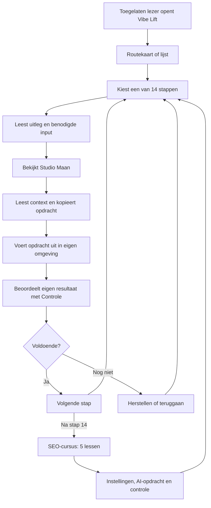

# Application User Operating Model

## 1. Executive summary

**Observatie:** Vibe Lift is een Nederlandstalige leeromgeving voor beginners die met AI een IT-project of website willen opbouwen. De inhoud is verdeeld over veertien stappen en vijf fasen. Lezers kiezen vrij een stap en wisselen tussen Uitleg, Voorbeeld, Opdracht en Controle. De fictieve Studio Maan verbindt de uitleg. Alle 28 genummerde bouwopdrachten en vijf SEO-opdrachten zijn leesbaar en kopieerbaar. Iedere hoofdles heeft toolhulp; de aanvullende SEO-cursus heeft vijf vrij toegankelijke lessen met instellingen en bronlinks.

Er is één appgebruikersrol: lezer. De site-eigenaar onderhoudt de bron buiten de website. Sites regelt de besloten toegang. De applicatie beheert geen accounts of leerlingprojecten. Ze verzendt geen aanvragen en voert geen AI-opdrachten uit.

**[AFGELEID]:** de vaste lesstructuur helpt beginners oriënteren; nog niet met de doelgroep getoetst. **Open punt:** visuele browsercontrole en daadwerkelijk gebruik door beginners zijn niet uitgevoerd.

## 2. Product scope

Status PASS betekent hier geïmplementeerd en voor de genoemde broncontracten gecontroleerd; geen volledige browsercertificering.

| Onderdeel | Status | Bronbestand(en) | Opmerking | Risico | Actie |
|---|---|---|---|---|---|
| Routekaart/lijst | PASS | app.js, content.js, styles.css | Alle stappen direct bereikbaar | Kaart kan voor sommige lezers minder overzichtelijk zijn | Lijstalternatief behouden |
| Veertien lessen | PASS | content.js, app.js | Vier onderdelen per les | Didactische duidelijkheid niet gemeten | Test met beginner |
| Voorbeeldproject | PASS | content.js, app.js | Fictief, zonder echte verwerking | Illustratie als echt resultaat opvatten | Fictieve status zichtbaar |
| Opdrachten | PASS | prompts.js, app.js | 28 teksten uit de lezerseditie + losse context | Gebruiker plakt zonder documenten | Context vóór de opdracht |
| Werkwijze en tools | PASS | app.js, tools.js | 12 tools, per stap concrete inzet en officiële verwijzingen | Externe omgeving kan wijzigen | Laat gebruiker actuele beschikbaarheid checken |
| SEO-cursus | PASS | seo.js, app.js | Vijf lessen, toolhulp, werkbladen en copy/fallback gecontroleerd | Externe schermen kunnen wijzigen | Officiële bronlinks behouden |
| Deeltjesveld | PASS | air.js, lift.css | Cursorrespons, pauze, visibility en reduced motion met harness gecontroleerd | Geen visuele browsermeting | Effect achter inhoud; systeemvoorkeur respecteren |
| Bronhandboek | PASS | downloads/handboek.md | Bewerkte lezerseditie | Lang naslagwerk voor beginner | Lessen als hoofdingang |
| Appregistratie/voortgang | Niet in scope | app.js | Geen appaccounts of opslag | Onterechte verwachting van voortgang | Geen voortgangsscore tonen |
| Browser QA | Nog niet uitgevoerd | validation.json | Bron- en handlerchecks wel uitgevoerd | Layout/echte bediening onbekend | Afzonderlijk controleren |

Bronpaden in dit document zijn ten opzichte van `dist/`, tenzij anders genoemd.

## 3. Applicatietype en domeinmodel

| Observatie | Waarde | Bron | Zekerheid | Opmerking |
|---|---|---|---|---|
| Type | Statische interactieve leeromgeving | index.html, app.js | Hoog | Hashnavigatie, geen serverfuncties |
| Inhoud | 5 fasen → 14 lessen → 4 lesonderdelen; aanvullend 5 SEO-lessen | content.js, app.js | Hoog | Vrije navigatie |
| Opdrachten | 28 bouwteksten + 5 SEO-opdrachten | prompts.js, seo.js | Hoog | Geen AI-uitvoering |
| Voorbeeld | Eén fictieve keramiekstudio | content.js | Hoog | Geen klant of verkochte dienst |
| Leereffect | Waarschijnlijk eenvoudiger dan een lang document | Plan | [AFGELEID] | Geen gebruikersonderzoek |

Werkelijk model: fase → les → uitleg/voorbeeld/opdracht/controle → resultaat in het eigen project buiten Vibe Lift. Een les verwijst naar één of meer bronopdrachten en procescodes. Er zijn geen leerlingprojectrecords.

## 4. Gebruikersrollen en rechtenmodel

| Rol | Lezen/navigeren | Kopiëren/downloaden | Lesinhoud wijzigen | Appgebruikers beheren | Opslaan/verwijderen | Bron |
|---|---|---|---|---|---|---|
| Toegelaten lezer | Ja | Ja, eigen apparaat | Nee | Nee | Geen leerlingdata | app.js |
| Site-eigenaar buiten app | Ja | Ja | Via bronproject | Via Sites, niet in Vibe Lift | Bronversies beheren | README.md, hostingconfig |

De inhoud verschilt niet per lezer. Er zijn geen app-authroutes, redirects na login of administratorpanelen. De gepubliceerde toegang wordt vóór de site door Sites gehandhaafd. De eerste publicatie is uitsluitend voor de eigenaar. Clientcode zelf kan toegang niet afdwingen.

## 5. Hoofdobjecten en datarelaties

| Object | Aangemaakt door | Velden | Relaties | Route | Bron |
|---|---|---|---|---|---|
| Fase | Auteur | id, naam, toelichting, kleur, symbool | Bevat lessen | #route | content.js |
| Les | Auteur | id, fase, uitleg, input, output, taken, flow, casus, criteria, prompts | Fase en opdrachten | #stap/1–14 | content.js |
| Bronopdracht | Extractiescript | id, titel, tekst | Eén les; aanvullende context | #opdrachten; lesonderdeel | prompts.js |
| Casus | Auteur | Studio Maan-voorbeeld per les | Les | #voorbeeld; lesonderdeel | content.js |
| Tijdelijke UI-staat | Lezer | hashroute, kaart/lijst, kopieermelding, beweging gepauzeerd | Huidige weergave | Alle routes | app.js |

| Object/veld | Persoonsgegeven? | Waar gebruikt | Risico | Actie |
|---|---|---|---|---|
| Les/casus/opdracht | Geen leerlinggegevens | Browser en download | Tekst voor werkelijk onderzoeksresultaat aanzien | Fictieve voorbeelden benoemd |
| Route/hash | Geen ingevulde persoonsgegevens | URL/browsergeschiedenis | URL kan lokaal onthouden worden door browser | Geen leerlinginput in URL |
| Klembord | Alleen bronopdracht | Eigen apparaat | Vorige klembordinhoud vervangen | Alleen na expliciete knopdruk |
| Hostingtoegang | Door Sites beheerd | Buiten eigen appcode | Niet door dit bronproject te beoordelen | Bestaande besloten toegang behouden |

## 6. End-to-end applicatieflow

Vibe Lift slaat het externe resultaat niet op en kent geen voltooide-lesstatus. De beoordelingsbeslissing is van de leerling.

## 7. Toegang, registratie, uitnodigingen en activatie

Geen zelfregistratie, uitnodigingsformulier, appaccount of eigen login aanwezig. Sites levert de toegangslaag voor de besloten publicatie. Deze website bevat geen knoppen waarmee de lezer anderen toegang kan geven. Accountactivatie, e-mailverificatie en wachtwoordherstel zijn daarom geen eigen Vibe Lift-flows.

## 8. Onboarding per rol

| Rol | Stap | Actie | Verplicht? | Opslag | UX-risico | Bron |
|---|---|---|---|---|---|---|
| Lezer | 1 | Open routekaart | Startpunt | Geen | Begrippen onbekend | renderHome |
| Lezer | 2 | Begin bij idee of kies gewenste stap | Vrije keuze | Hash | Overzicht kan groot lijken | renderLesson |
| Lezer | 3 | Bekijk gereedschappen/Werkwijze indien nodig | Contextafhankelijk | Geen | Projectafspraken ontbreken | renderMethod |
| Lezer | 4 | Lees voorbeeld en neem opdracht mee | Naar behoefte | Eigen klembord | Context vergeten | promptCard |

Er zijn geen profielvelden, organisatiekoppelingen of gedwongen rondleidingen. Succes is een begrepen volgende handeling, niet een geautomatiseerde voortgangsbadge.

## 9. Dashboard per gebruiker

| Rol | Startroute | Primaire taak | Secundair | CTA's | Data | Bron |
|---|---|---|---|---|---|---|
| Lezer | #route | Een stap kiezen | Kaart/lijst, casus, tools, Werkwijze | Begin bij je idee; alle stapkaarten | Vaste inhoud | renderHome |

Desktop: vijf fasekolommen. Smallere schermen: fasen onder elkaar; op telefoons kaarten per fase. Lessen gebruiken op brede schermen een zijbalk en op kleine schermen een selectielijst. De kaart/lijstkeuze leeft alleen in geheugen en wordt bij herladen teruggezet. Er zijn geen lege projectdashboards of serverlaadstates. Onbekende routes tonen een herstelpagina; bij niet-ladend JavaScript blijft de handboekfallback beschikbaar.

## 10. Kernfeatures en modules

| Module | Doel | Routes | Acties | Status | Bron |
|---|---|---|---|---|---|
| Route | Oriëntatie | #route | Kaart/lijst, stap openen | Gebouwd | renderHome, routeMarkup |
| Les | Begrijpen en uitvoeren | #stap/n/onderdeel | Tabs, vorige/volgende, directe stap | Gebouwd | renderLesson |
| Voorbeeld | Concrete samenhang | #voorbeeld | Naar casus van iedere stap | Gebouwd | renderExample |
| Opdrachten | Bronprompts meenemen | #opdrachten, #stap/n/opdracht | Openklappen, lezen, kopiëren | Gebouwd | promptCard |
| Gereedschappen | Begrippen en rollen | #tools | Officiële site openen | Gebouwd | renderTools |
| Werkwijze | Praktische werkwijze | #werkwijze | Uitleg lezen, handboek ophalen | Gebouwd | renderMethod |
| SEO | Vindbaarheid en meting | #seo, #seo/1–5 | Les wisselen, prompt kopiëren, bronnen openen | Gebouwd | renderSEO |
| Achtergrond | Decoratief cursorveld | Alle routes | Beweging pauzeren of hervatten | Gebouwd | air.js |
| Naslag | Bewerkte lezerseditie | downloads/handboek.md | Download/openen | Gebouwd | index.html |

## 11. Kernobjectbeheer

De lezer maakt geen kernobjecten in deze applicatie aan. De eigenaar beheert de vaste inhoud via bronbestanden.

| Object | Actie | Rol | Velden/validatie | Resultaat | Foutstate |
|---|---|---|---|---|---|
| Les | Bekijken | Lezer | id 1–14, bekende tab | Lesweergave | Ongeldige route → herstelpagina |
| Bronopdracht | Bekijken/kopiëren | Lezer | Bestaand id 1–28 | Klembordtekst | Weigering → tekst selecteren |
| Les | Wijzigen | Eigenaar buiten app | Vast inhoudscontract | Nieuwe bronversie | Validator stopt bij ontbrekende inhoud |
| SEO-opdracht | Lezen/kopiëren | Lezer | Bestaand SEO-id 1–5 | Klembordtekst | Weigering → tekstselectie |
| Opdracht | Opnieuw extraheren | Eigenaar buiten app | 28 genummerde tekstblokken | prompts.js | Extractie stopt bij ontbrekend blok |
| Versie | Publiceren/herstellen | Eigenaar buiten app | Gecontroleerde bron en huidige toegang | Sites-versie | Publicatiefout volgens Sites |

Zoeken, dupliceren, archiveren en toewijzen zijn geen appfuncties voor lezers.

## 12. Workflowbeschrijving per kernflow

| Flow | Startpunt/trigger | Stappen en CTA | Input | Output/status | Foutstate | Open punt |
|---|---|---|---|---|---|---|
| Oriënteren | Site openen | Kies kaart/lijst; klik stap | Keuze | Betreffende les | Onbekende hash → overzichtlink | Echte beginnerstest |
| Les volgen | #stap/n | Uitleg → Voorbeeld → Opdracht → Controle | Tabkeuze | Gekozen onderdeel in URL | Ongeldige tab → herstelpagina | Echte keyboard/screenreadertest |
| Tabtoetsen | Focus op tab | Pijlen, Home, End | Toets | Tab en route veranderen | Geen mutatie bij andere toets | Handler getest, browser nog niet |
| Stap wisselen | Sidebar/select of onderaan les | Kies stap of vorige/volgende | Geldig nummer | Les, titel en navigatie worden bijgewerkt | Nummer buiten bereik afgewezen | Mobiele layout nog niet visueel getest |
| Opdracht meenemen | Details geopend | Lees context; kopieer | Expliciete klik | Bronopdracht op klembord + melding | Geen toegang → selectie en uitleg | Platformklembord kan verschillen |
| Casus volgen | #voorbeeld | Kies een van 14 casuslinks | Stapkeuze | Voorbeeldtab van die les | Geen externe verwerking | Casus is fictief |
| Extern gereedschap | #tools | Officiële link openen | Klik | Nieuwe tab naar leverancier | Leverancier kan onbereikbaar zijn | Actuele functies/kosten daar controleren |
| SEO volgen | #seo of einde stap 14 | Kies een van 5 lessen, werkblad, opdracht en controle | Leskeuze | Gekozen SEO-les in URL | Ongeldige SEO-id → herstelpagina | Geen echte Google-accountinrichting uitgevoerd |
| Beweging regelen | Footer | Pauzeren/hervatten | Knop of systeemvoorkeur | Alleen tijdelijke animatiestatus | Geen canvas → decoratie vervalt | Geen opgeslagen voorkeur |
| Naslag ophalen | Footer of Werkwijze-pagina | Download handboek | Klik | Bewerkte Markdown-lezerseditie | Browserdownloadinstelling | Geen interne documenteditor |

Geen flow verstuurt berichten, publiceert leerlingprojecten of slaat resultaten op. De tijdelijke kopieermelding is de enige appnotificatie. De leerling rondt de werkelijke projecttaak buiten Vibe Lift af.
