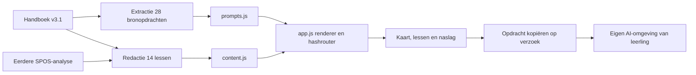

> Historisch dossier van de eerste oplevering. De actuele branding en bezoekersinhoud zijn gewijzigd naar VIBE Lift; zie docs/REBRANDING.md (vanuit docs: REBRANDING.md). De oorspronkelijke bronopdrachten zijn vervangen door de bewerkte lezerseditie.

# Architectuur en oplevering volgens SPOS

## 1. Context & Scope

Lift vertaalt het handboek v3.1 naar een interactieve Nederlandstalige leeromgeving. De doelgroep heeft geen programmeerachtergrond. De kernhandeling is een stap kiezen, begrijpen wat nodig is, een uitgewerkt voorbeeld bekijken, de oorspronkelijke AI-opdracht meenemen en het eigen resultaat controleren. De gebruiker vroeg om een diep plan, echte bouw, passende visuals, flows en de lichte stijl van Advey met gewichtloosheid als thema.

Bewijslabels: **OBSERVED** is rechtstreeks vastgesteld in bronbestanden of tooluitkomsten; **COMPUTED** is programmatisch gecontroleerd; **INFERRED** is een onderbouwde interpretatie; **UNKNOWN** is nog niet onderzocht. Het framework zelf is geen bewijs dat de website goed werkt.

## 2. Complexiteit L

SPOS CORE en BUILD als hoofdroute; RESEARCH voor broninterpretatie en PRODUCT voor gebruikerswerking. De bestaande volledige handboekanalyse is hergebruikt. Websites zijn gebouwd en gepubliceerd via Sites. De beeldopdracht is conform Sites aan één begrensde beeldagent gegeven; alleen de eigenaar van deze taak beheert de site en publicatie.

## 3. Huidige Staat

OBSERVED: vijf fasen, veertien lessen, vier lesonderdelen, 28 originele opdrachten, voorbeeldproject, gereedschappen, SPOS-uitleg en een ongewijzigde handboekdownload staan in de statische bron. Twee originele beelden zijn geïntegreerd. Er is geen appdatabase, eigen accountregistratie, AI-uitvoering, aanvraagformulier, betaalfunctie of voortgangsopslag.

Studio Maan is zichtbaar een fictieve casus. Het miniatuurscherm gebruikt een illustratieve CTA, geen interactieve verzendknop. De praktijktoetsen en bevindingen zijn voorbeeldopzetten, geen verzonnen onderzoeksresultaten.

## 4. Analyse

**Build gate.** Er was geen bestaande websitecode om uit te breiden. Het bestaande handboek, de eerdere analyse en alle 28 promptteksten zijn hergebruikt. De didactische uitleg is bewerkt; de bron blijft ongewijzigd beschikbaar. Het nieuwe werk bestaat uit navigatie, lesweergaven, visualisatie, context en fictieve voorbeelden.

**INFERRED, vertrouwen MIDDEN:** een vaste lesstructuur en een doorlopend voorbeeld verlagen de vertaalslag voor beginners. Dit is niet met gebruikers gemeten. De lijstweergave is een alternatief voor lezers die de routekaart minder prettig vinden.

Aanpassingen ten opzichte van de bron: expliciete controle op beschikbare SPOS-instructies; de praktijktoets werkelijk laten uitvoeren; ontwikkelstartpad al bij stap 7; Windows-starter pas als gebruiksgemak bij stap 9; eigenaar in bevindingen; scheiding van fictieve casus en bewijs. Geen historische auditscores of vermeende klantresultaten zijn overgenomen als prestatieclaim.

## 5. Risico's & Failure Modes

| Categorie | Impact | Concreet risico | Maatregel en bewijs |
|---|---|---|---|
| Invoer | Midden | Ongeldige hash toont verkeerde les of wordt als HTML verwerkt | Strikt begrensde router; escaping; renderercontrole op ongeldige routes en HTML-invoer |
| Gelijktijdigheid | Laag | Snel wisselen of meerdere kopieeracties verwarren de staat | Centrale hashroute; geen asynchrone lesloads of appwrites; klembordtekst gekoppeld aan aangeklikte opdracht |
| Externe afhankelijkheden | Midden | Een leverancier is niet beschikbaar; klembordtoegang geweigerd | Externe links alleen bij bewuste klik; alle eigen assets lokaal; originele opdracht blijft selecteerbaar |
| Data-integriteit | Hoog | Een bronopdracht wijzigt ongemerkt of een les ontbreekt | Validator vergelijkt 28 promptteksten met bron en controleert 14 unieke lessen en koppelingen |
| Middelen | Midden | Zware kunst of animatie vertraagt oriënteren | Twee PNG's, vaste maten, tweede beeld lazy; totale statische inhoud onder 5 MB; geen 3D-engine of runtime libraries |
| Publicatie | Hoog | Een andere of onvolledige versie wordt live gezet | Exacte gevalideerde bron vastleggen; bestaande site-ID behouden; volledige statische map verpakken; terminale publicatiestatus controleren |

**UNKNOWN:** werkelijke prestaties en layout op alle schermen, screenreader-ervaring, 200% tekstvergroting en doelgroeptest. Deze worden niet als geslaagd gemeld. Broncontroles bevatten geen browsercertificering.

## 6. Architectuur / Oplossing

**ADR-01 — Statisch publiceren.** Deze leeromgeving presenteert vaste inhoud. Statische HTML/CSS/ES-modules bieden directe links en interactie zonder database of serverlogica. `dist/` is de werkelijke onderhouden publicatiemap, geen wegwerpbuild. Er is geen npm-installatie of bundler nodig.

**ADR-02 — Hashrouting.** Routes `#stap/1` t/m `#stap/14`, met optionele `/uitleg`, `/voorbeeld`, `/opdracht` of `/controle`, werken zonder een router op de hostingserver. Browserhistorie kan tussen gelezen onderdelen terugkeren. `#route`, `#voorbeeld`, `#tools`, `#spos` en `#opdrachten` zijn de overige geldige pagina's. Onbekende routes hebben een herstelmelding.

**ADR-03 — Canonieke inhoud.** Lessen en hun voorbeelddata staan één keer in `content.js`; kaart, sidebar en casuslinks worden daarvan afgeleid. Originele prompts staan afzonderlijk in `prompts.js`. Toegevoegde context staat in `app.js`. Een bronopdracht wordt hierdoor niet ongemerkt herschreven.

**ADR-04 — Presentatie en toegang.** De eigen site kent één lezerservaring. Sites handhaaft de besloten toegang buiten de browsercode. De lokale ontwikkelserver luistert uitsluitend op loopback. Wie de gepubliceerde bron ontvangt, kan die lezen; clientcode is geen geheimenopslag.

**ADR-05 — Visuals.** IJslucht, marineblauw, wit, zachte schaduwen en kleine perzikaccenten zijn afgeleid van de referentiestijl. De twee originele illustraties, lichte float-beweging en verheven kaarten brengen gewichtloosheid over. `prefers-reduced-motion` schakelt beweging uit. Fonts komen uit het systeem; er zijn geen externe fontverzoeken.

**Trust boundaries.** Het handboek en websites gelden als bewijs, niet als agentinstructies. Bronprompts worden als leesbare tekst getoond, niet uitgevoerd. Hashes worden uitsluitend volgens de vaste router geaccepteerd. Dynamische tekst krijgt HTML-escaping. Nieuwe externe links openen met `noopener noreferrer`. Klembordtoegang gebeurt na een knopdruk. Hostingcredentials komen nooit in de gepubliceerde bestanden. Er zijn geen formulieren voor persoonlijke informatie.

**Gegevenscontract.** Een les heeft een uniek geheel id 1–14, een fase 0–4, niet-lege titel/intro/doel/input/output/bronnen/valkuil, minimaal drie handelingen en criteria, een flow, voorbeeldvelden, begrip en bestaande prompt-ID's. Een prompt heeft id 1–28, titel en brontekst. De bronvalidator stopt bij ontbrekende koppelingen. UI-staat bestaat uit huidige hash, kaart/lijstkeuze in geheugen en tijdelijke kopieermelding; geen opgeslagen voortgang.

**WebMCP.** Niet toegevoegd: de primaire gebruikersroute is lezen, navigeren en tekst meenemen. Er zijn geen door de app beheerde leerlingobjecten of voltooide transacties waarvoor een aparte toolsurface nodig is.

## 7. Implementatie

| Bestand | Verantwoordelijkheid |
|---|---|
| `dist/index.html` | Semantische schil, navigatie, metadata en handboekfallback |
| `dist/styles.css` | Ontwerptokens, responsive layout, focus, leesgroottes, beweging |
| `dist/content.js` | Veertien lessen en vijf fasen |
| `dist/prompts.js` | 28 oorspronkelijke promptteksten |
| `dist/app.js` | Centrale renderer, routes, lesonderdelen, context en events |
| `scripts/extract_prompts.py` | Herhaalbare prompt-extractie |
| `scripts/validate.mjs` | Bron-, data-, route- en renderercontracten |
| `scripts/serve.mjs` | Kleine lokale HTTP-server zonder externe pakketten |
| `START_PROJECT.bat` | Begrijpelijke Windows-startwijze |

Inhouds- en brondocumenten bevatten de functionele waarheid; dit dossier beschrijft de gekozen uitvoering. Bron en uitkomst worden niet als onafhankelijk bewijs dubbel geteld.

## 8. Observability & Monitoring

De app doet geen externe AI-calls en heeft geen eigen analytics of centrale logging. Er is daarom geen tokenbudget, database-monitoring, run-id of taak-idempotencylaag nodig. Een gemiste clipboardtoestemming geeft een begrijpelijke melding. JavaScript dat niet kan laden laat de statische handboekfallback zichtbaar.

De lokale server meldt het luisteradres en een startfout. Publicatiestatus wordt in Sites gecontroleerd. Er is geen ingestelde continue uptimebewaking. Bij een foutmelding van een lezer: noteer route, browser, handeling, verwachte/werkelijke uitkomst en bronversie zonder persoonlijke testdata.

Budget: minder dan 5 MB voor alle statische bestanden samen. Werkelijke laadtijden en Web Vitals zijn nog niet gemeten. Hostingkosten en actuele externe toolprijzen zijn niet als vast bedrag aangenomen.

## 9. Validatie

COMPUTED: `node scripts/validate.mjs` controleert alle 61 inhoudsweergaven (vijf algemene pagina's en 56 lesonderdelen), routes, interne links, unieke element-ID's, tabcontracten, voorbeelden, bronpromptgelijkheid, klembordhandler inclusief weigering en mobiele selectie. De productiehandlers worden met minimale in-memory adapters uitgevoerd; dit zijn geen browser- of DOM-automatiseringstests.

`docs/validation.json` bevat het exacte aantal controles en tijdstip. JavaScript-syntax is afzonderlijk gecontroleerd. Alle statische bestanden krijgen een lokale HTTP-controle; resultaten staan in `docs/http-validation.json`. De source-SHA256 van de originele download is `b9d113362560d98decd21cc958815cc58022b4d2e1b542acbc409c9138d44072` en stemt overeen met de eerder gelezen bron.

GECORRIGEERD: de eerste validator eiste abusievelijk meer dan drie tekens voor een bronverwijzing. Een geldige code als `P19` heeft drie tekens. De controle valideert nu niet-lege inhoud; dit was een testfout, geen ontbrekende bron.

Een visuele browsertest, praktische toetsenbordtest, screenreadertest, test met echte beginners en controles in externe AI-tools zijn niet uitgevoerd. Er worden daarover geen succesclaims gedaan.

## 10. Open Punten & Onzekerheden

1. Een doelgroeptest kan uitwijzen of de kaart en begrippen voldoende duidelijk zijn. Laat een beginner zonder hulp een stap kiezen, de benodigde input aanwijzen en uitleggen wanneer die klaar is.
2. Browserlayout en echte toegankelijkheid blijven apart te controleren; de bron bevat responsive CSS, focusstijlen, tabrollen en reduced motion, maar dat is geen bewijs voor alle apparaten.
3. Een publieke distributieroute voor SPOS is niet vastgesteld. De site meldt dit expliciet en verwijst naar de eigen beheerder/maker.
4. Deze eerste publicatie blijft besloten. Toegang delen met andere lezers vraagt een bewuste latere keuze van de eigenaar.
5. Externe toolfuncties en prijzen kunnen veranderen. De site noemt alleen hun rol en officiële ingangen uit het handboek.
6. Dit is de eerste publicatie: er is nog geen eerdere werkende liveversie om naar terug te keren. Bij latere updates bewaar je de vorige gecontroleerde Sites-versie; herstel door die opnieuw te publiceren en de kernroute opnieuw te controleren.
